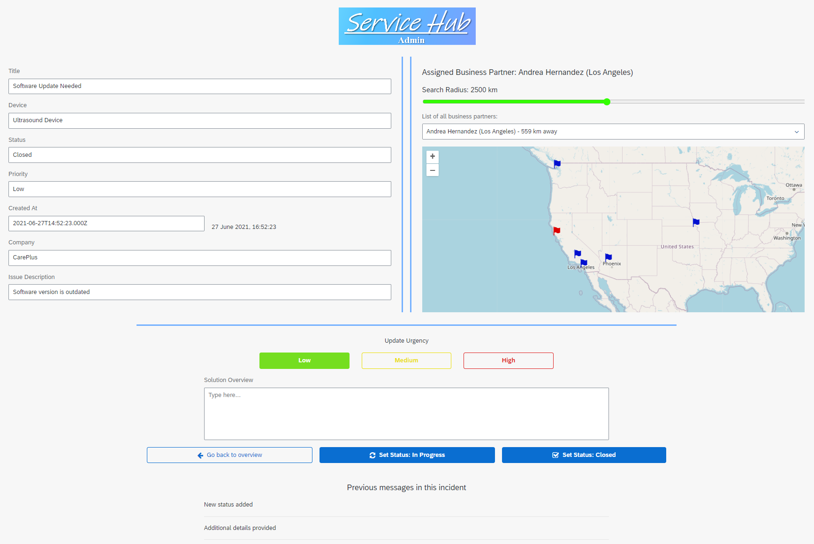

# Mastering SAP S/4HANA Extension with SAP Build, SAP Build Code and SAP BTP ABAP 

## Description
This scenario showcases the integration of a mobile app developed using SAP Build Apps with two backend services: SAP Build Code with Joule(CAP) and Restful ABAP Programming(RAP). The mobile app, created with a no-code approach, interacts seamlessly with CAP and RAP backends service, offering advanced functionalities and data access.

## Solution Diagram

## Focus Topics 

The tutorial focus on building **Fusion Application** on where professional and citizen developers come together. The following aspects are:

1. Build and Deploy full stack application using [SAP Build Code with Joule](https://www.sap.com/india/products/technology-platform/developer-tools.html)

2. Build and Deploy full stack application using [SAP BTP ABAP Environment(RAP)](https://help.sap.com/docs/abap-cloud/abap-rap/abap-restful-application-programming-model).

3. Build and Deploy mobile application using [SAP Build](https://www.sap.com/products/technology-platform/low-code.html)

## Business Scenario

1. Suzan, a dedicated medical technician at SBA Medical clinic,, diligently inspected the vital equipment ensuring the highest standards of patient care. As she meticulously examined each device, her keen eye caught a minor glitch in one of the medical instruments.

2. Without hesitation, Suzan reached for her trusted companion in the digital realm – the Service Hub mobile app. With swift taps on her smartphone screen, she raised an incident report detailing the issue encountered with the medical equipment.

3. Meanwhile, in the heart of the digital infrastructure, the Cloud Application Programming (CAP) application, powered with Joule, seamlessly sprang into action. The incident reported by Suzan was swiftly captured and recorded within the CAP application, ensuring a centralized repository for all service-related matters.

4. As the incident popped up on the radar of the Service Hub Admin, Alex, the seasoned service manager at Heath Tech Devices, took charge. With a few deft clicks within the Service Hub Admin interface, Alex assessed the incident, evaluated its priority level, and swiftly assigned a proficient processor to address the issue.

5. In the background, the robust Restful ABAP Programming (RAP) application, built using the Business Technology Platform (BTP) ABAP environment, came into play. Leveraging its capabilities, RAP seamlessly calculated the precise geographical location of the assigned processor by fetching latitude and longitude details from the CAP system.

6. Armed with this vital geo-location information, Suzan could now track the progress of the assigned processor in real-time. With a sense of reassurance, she monitored the processor's journey and estimated arrival time, ensuring minimal disruption to the clinic's operations.

## Where to Start?

* Follow the below steps for quick start.

    |  **Step**  |  **Description** | 
    | ----------- | ----------- | 
    | **Step 1**: [SAP Build Code with Joule](./documentation/buildcode/Readme.md) | Build and Deploy Full Stack CAP Application on Cloud Foundry using Ai Enabled Joule |
    | **Step 2**: [RESTful ABAP Service](./documentation/rap/README.md) | Build and Deploy Full Stack Restful ABAP Application | 
    | **Step 3**: [Integration](./documentation/integration/README.md)  | Configure SAP BTP Destination for CAP and RAP Service |
    | **Step 4**: [SAP Build Apps](./documentation/buildapps/Readme.md)  | Configure SAP Build Apps and Build **Service Hub** and  **Service Hub Admin** web application |
    | **Step 5**: [Test Service Hub](./documentation/buildapps/Service%20Hub%20Client%20App/4_Test%20your%20application/Readme.md)| Create a new incident using **Service Hub** Application |
    | **Step 6**: [Test Service Hub Admin](./documentation/buildapps/Service%20Hub%20Admin%20App/6_Test%20your%20application/Readme.md)| Get the incidents created from Service Hub, assign the processor, update the priority and status using **Service Hub Admin** Application |

## How to obtain support
[Create an issue](https://github.com/SAP-samples/btp-s4hana-buildcode-rap-buildapps/issues/new) in this repository if you find a bug or have questions about the content.
 
For additional support, [ask a question in SAP Community](https://answers.sap.com/questions/ask.html).

## Contributing
If you wish to contribute code, offer fixes or improvements, please send a pull request. Due to legal reasons, contributors will be asked to accept a DCO when they create the first pull request to this project. This happens in an automated fashion during the submission process. SAP uses [the standard DCO text of the Linux Foundation](https://developercertificate.org/).

## License
Copyright (c) 2024 SAP SE or an SAP affiliate company. All rights reserved. This project is licensed under the Apache Software License, version 2.0 except as noted otherwise in the [LICENSE](LICENSE) file.
