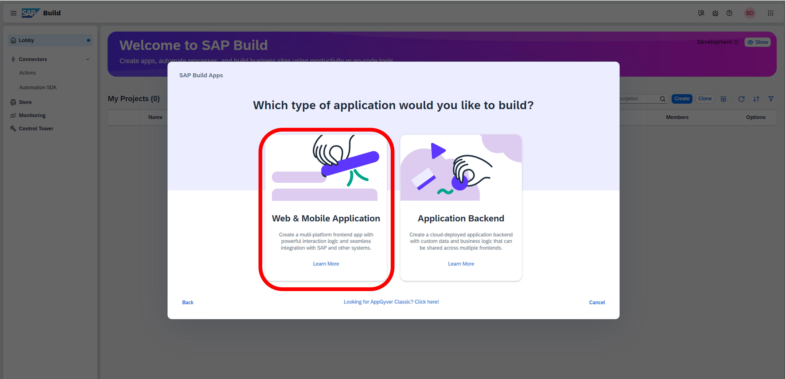

# Module 3 - Unit 2_1: Import your template application

1. Create a new project using SAP Build Lobby.

2. Select Build an Application

3. Select SAP Build Apps

4. Web & Mobile Application

5. Give a name for your project and Create

6.  Download the template application and save it to your PC

7. Click on the 3 dots on the top-right corner and select Replace

8. Click on Select file and find the template that you saved to your PC: Service Hub Admin_UI Template.zip.gpg

9. Click on Replace after you find the template

10. Make sure to have Fullscreen from the preview options 

**[Next Module 3 - Unit 2_2: Data connection](../2_Data%20connection/Readme.md) >**
