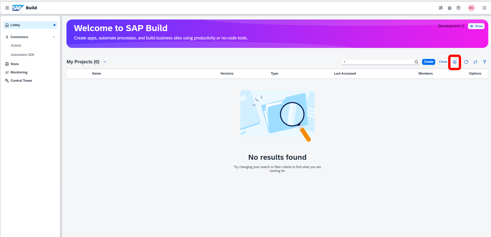

# Module 3 - Unit 2_1: Import your template application

1. Download the template application and save it to your PC.

2. Select **Import** button in SAP Build Lobby.

3. Choose **Browse Files** button and find the template that you saved to your PC: **Service Hub Admin_UI Template.mtar**.

4. Select the project and then choose **Import** button.

5. Choose **Rename Project** item from the project menu. 

6. Enter a name (e.g. **Service Hub Admin**) and then choose **Save**.

7. Go to your project by selecting its name.

8. Make sure to have **Fullscreen** view from the preview options.

**[Next Module 3 - Unit 2_2: Data connection](../2_Data%20connection/Readme.md) >**
