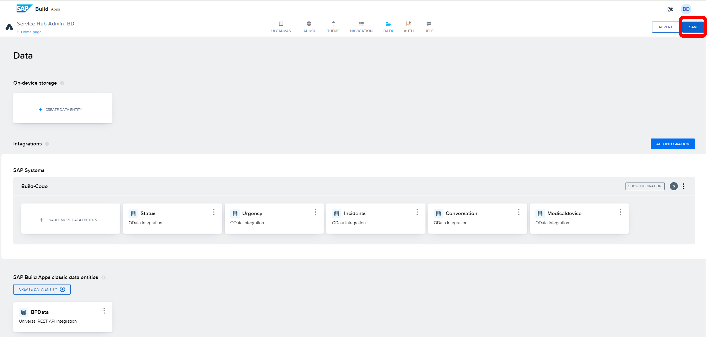

# Module 3 - Unit 2_2: Data connection

1. Go to Data tab. Then Add integration

2. Select BTP Destinations

3. Find the BTP destination that you created using SAP Build Code: Build-Code

4. Install Integration

5. Select data entity Incidents. Enable data entity. Then, enable Expand function for all data entites as it is shown below

6. Enable all other data entities. Save your project and Click on Exit

7. Click on Create data entity. Select SAP BTP Destination REST API Integration

8. Type the Data entity name: BPData. Select your BTP destination. In this exercise, we are using RAP-Geo

9. Go to list and enable it. Paste the formula below to the relative path

~~~
/getInRadius?radius=10000000&point_lat='50'&point_lon='10'
~~~

10. Go to test. Run the test. When you get the Status: OK, then click on the Autodetect schema from response

11. Go to config tab and click on the ABC icon under relative path

12. Go to Formula

13. Click on the Formula Bar

14. Paste the formula below and save it

~~~
"/getInRadius?radius="+query.additionalInputs.radius+"&point_lat='"+query.additionalInputs.pointLat+"'&point_lon='"+query.additionalInputs.pointLon+"'"
~~~

15. Go to Base. Here you can see that Resource schema was created after your test in Step 10

16. Click on "Add new" but please be careful that you should be adding under "Additional Inputs"

17. Paste the field name below. Field type: number

~~~
radius
~~~

18. Paste the field name below. Field type: text

~~~
point_lat
~~~

19. Paste the field name below. Field type: text

~~~
point_lon
~~~

20. Save data entity

21. Save your project

**[Next Module 3 - Unit 2_3: Configuration for UI Components in Overview Pages](../3_Configuration%20for%20UI%20Components%20in%20Overview%20Pages/Readme.md) >**
