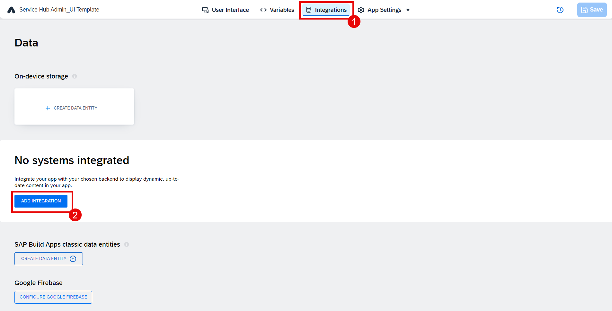
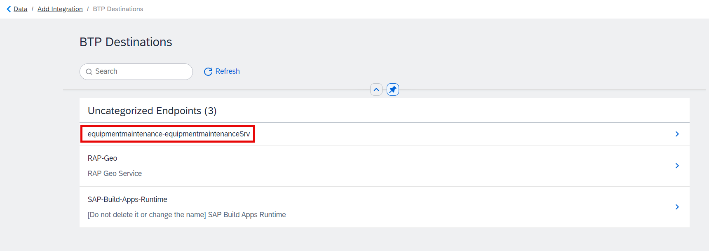
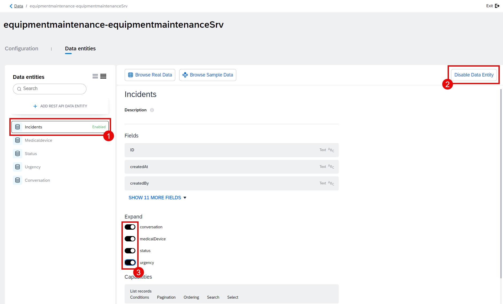
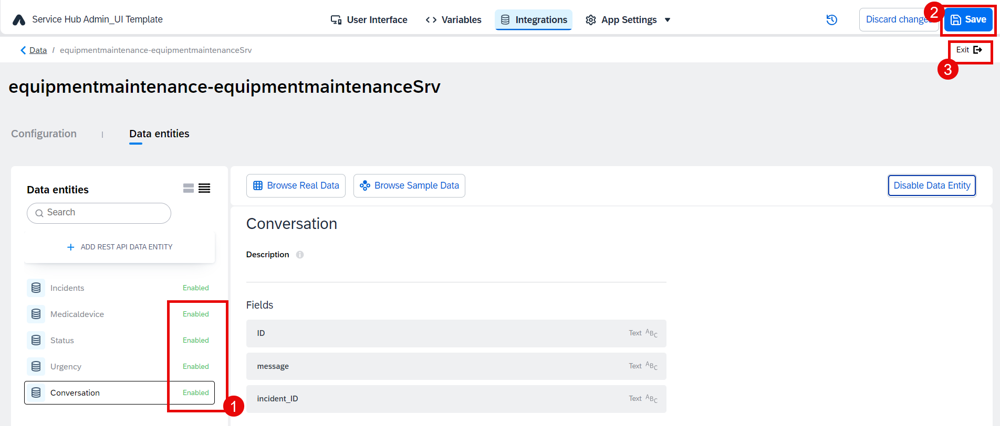

# Data Connection

1. Go to **Data** tab. Then choose **Add integration**.

2. Select **BTP Destinations**.

3. Find the destination **equipmentmaintenance-equipmentmaintenanceSrv** that has been created via SAP Build Code (see [here](../../../buildcode/deploy/README.md)).

4. Choose **Install Integration**.

5. Select data entity **Incidents**. Choose **Enable data entity**. Then, enable **Expand** function for all data entites as it is shown below.

6. Enable all other data entities. Choose **Save** to save your project and then choose **Exit**.

7. Select **Create data entity**. Choose **SAP BTP Destination REST API Integration** item in the popup menu.

8. Type **BPData** in the **Data entity name** field. Select your BTP destination. In this exercise, we are using **RAP-Geo**.

9. Enable **list** method on the left side. Paste the formula below to the **Relative path and query** field.

~~~
/getInRadius?radius=10000000&point_lat='50'&point_lon='10'
~~~

10. Select **Test** tab. Choose **Run test** button. When you get the **Status: OK (200)**, choose **Autodetect schema from response**.

11. Select **Config** tab and choose the **ABC** icon under **Relative path and query**.

12. Select **Formula**.

13. Click on the Formula Bar

14. Paste the formula below and then choose **Save**.

~~~
"/getInRadius?radius="+query.additionalInputs.radius+"&point_lat='"+query.additionalInputs.point_lat+"'&point_lon='"+query.additionalInputs.point_lon+"'"
~~~

15. Select **Base** settings. Here you can see that **Resource schema** was created after your test in Step 10

16. Select **Add new** but please be careful that you should be adding under **Additional Inputs**.

17. Enter **radius** in the **Field name** field. Select **number** as the **Field type**. Then choose **Add** button.

18. Repeat steps 16-17 for the field name **point_lat**, field type **text**.
    

19. Repeat steps 16-17 for the field name **point_lon**, field type **text**.

20. Choose **Save data entity**.

21. **Save** your project.

## Next Step

[Configuration for UI Components in Overview Pages](../3_Configuration%20for%20UI%20Components%20in%20Overview%20Pages/Readme.md)
