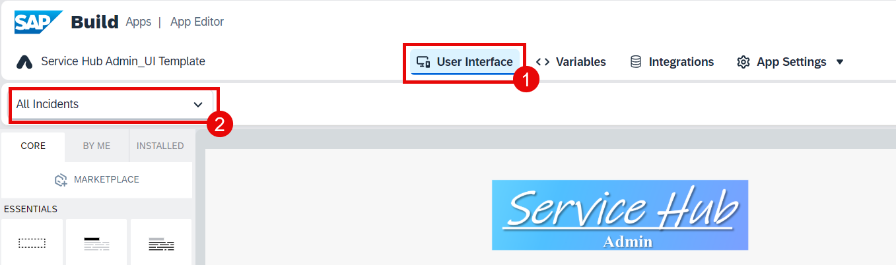

# Configuration for UI Components in Overview Pages

1. Go to the **All Incidents** page.

2. Switch to **Variables**. Go to **Data variables** and choose **Add data variable** for the **Medicaldevice** entity.

> Make sure that the name of the variable is `Medicaldevice1` considering the capital letters (not e.g. `MedicalDevice1` or something else). It's important, because it will be used in the formula later. Change the name if you have it different.
>
> 

3. Add another data variable, this time for **Incidents**.

4. Switch back to **User Interface**. Select the list item and choose the Arrows button under the **Repeat with** title. Follow the path: **Data and Variables** > **Data variable**.

5. Choose **Incidents1** and then choose **Save**.

6. Choose the **ABC** button under **Primary label** and then choose **Formula**. 

> You should have the `List Item 1` selected.

7. Click the Formula bar.

8. Paste the formula below and then choose **Save**.

~~~
repeated.current.title+ "\nID: " + repeated.current.ID
~~~

9. Choose the **ABC** button under **Secondary label** and then choose **Data item in repeat**.

10. Choose **current** and then choose **company** from the list. Then choose **Save**.

11. Go to the **Logic Editor** tab.

12. Select the **Open page** logic component and choose the **X** button under the **IncidentID** page parameter.

Here the **Open Page** logic component redirects the user to the **Incident Detail** page. As there is already a page parameter called **IncidentID** in the **Incident Detail** page, you will be passing the ID of the selected incident in this **Incidents** table while redirecting the user to the next page. 

13. Choose **Data item in repeat**.

14. Choose **current** and then select **ID** and save it.

15. Save your project.

## Next Step

[Configuration for Data Variables in Detail Page](../4_Configuration%20for%20Data%20Variables%20in%20Detail%20Page/Readme.md)
