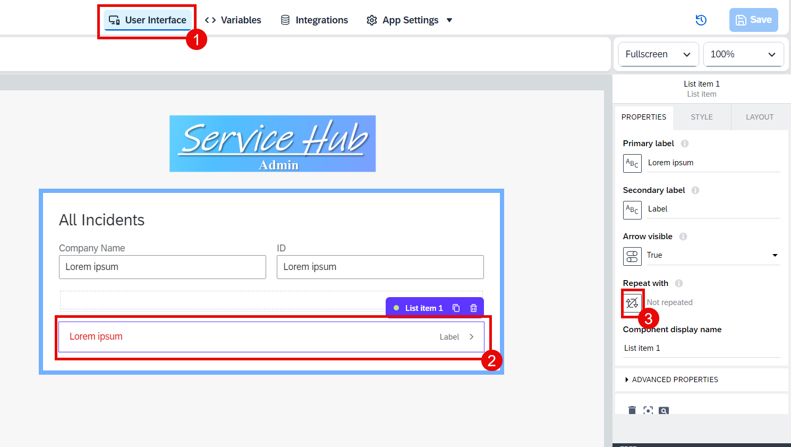

# Module 3 - Unit 2_3: Configuration for UI Components in Overview Pages

1. Go to page **All Incidents**.

2. Switch to **Variables**. Go to **Data variables** and choose **Add data variable** for **Medicaldevice** entity.

3. Add another data variable. This time for **Incidents**.

4. Switch back to **View**. Select the list item and choose arrows button under **Repeat with** title. Follow the path: **Data and Variables** > **Data variable**.

5. Select **Incidents1** and then choose **Save**.

6. Select **ABC** button under the **Primary label** and then choose **Formula**.

7. Click on the Formula bar.

8. Paste the formula below and then choose **Save**.

~~~
repeated.current.title+ "\nID: " + repeated.current.ID
~~~

9. Select **ABC** button under the **Secondary label** and then choose **Formula**.

10. Click on the Formula bar.

11. Paste the formula below and then choose **Save**.

~~~
repeated.current.company
~~~

12. Go to Logic Editor tab.

13. Select **Open page** logic component and choose the **X** button under the **IncidentID** page parameter.

> Here the Open Page logic component redirect user to the Incident Detail page. As there is already a page parameter called **IncidentID** in the Incident Detail page, we will be passing the ID of the selected incident in this Incidents table while redirecting user to the next page. 

14. Select **Data item in repeat**.

15. Select **current**. Then select **ID** and **Save** it.

16. **Save** your project.

**[Next Module 3 - Unit 2_4: Configuration for Data Variables in Detail Page ](../4_Configuration%20for%20Data%20Variables%20in%20Detail%20Page/Readme.md) >**
