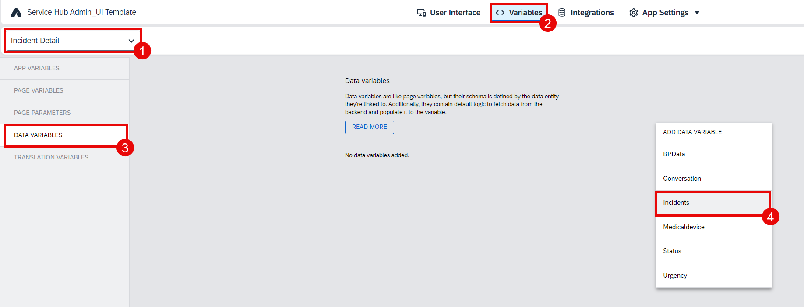
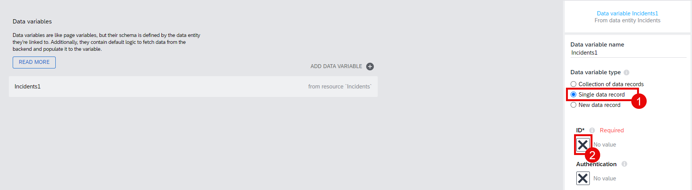
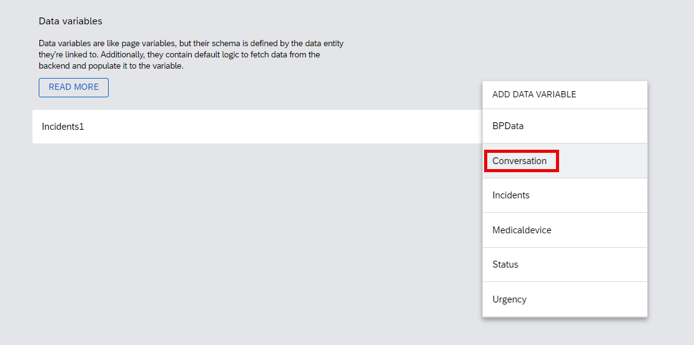
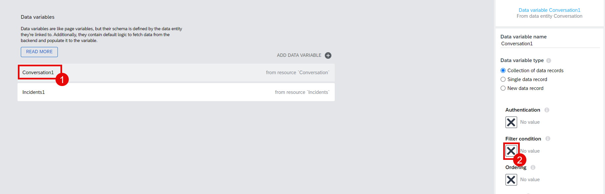
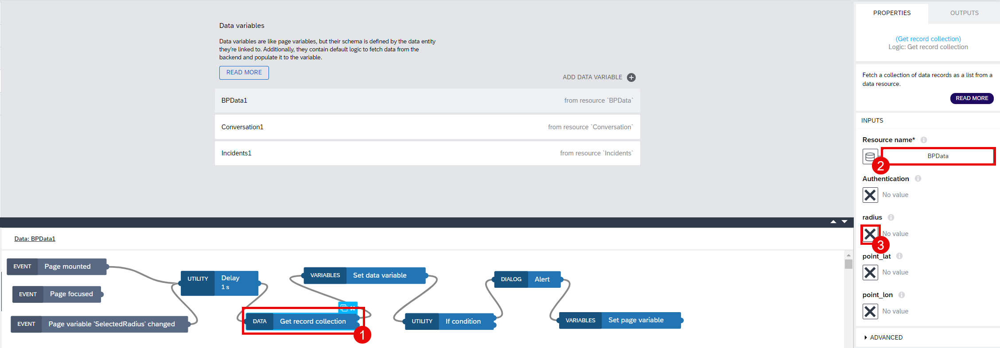
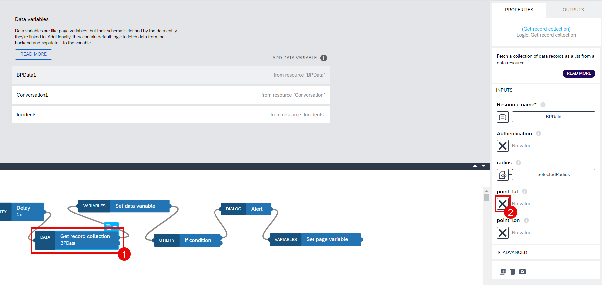

# Configuration for Data Variables in Detail Page

1. Go to the **Incident Detail** page. Switch to **Variables**. Select **Data variables** and create a new data variable for **Incidents**.

2. Change **Data variable type** to **Single data record** and choose the **X** button under **ID**. Then, follow the path: **Data and Variables** > **Page parameter**.

3. Select the **IncidentID** page parameter and then choose **Save**. 

4. Create a new data variable for **Conversation**.

5. Choose the **Conversation1** data variable and choose the **X** button under **Filter condition** to choose **Object with properties**.

6. Choose **Add condition**. Select **incident_ID** from the **Property** dropdown list. Then, choose the **ABC** button under **Compared value** and follow the path: **Data and Variables** > **Page parameter**.

7. Select the **Incident ID** page parameter and then choose **Save**.

8. Add a data variable for **BPData**.

9. Select the **BPData1** data variable and change **Data variable type** to **Single data record**. Then, open **Logic Editor**.

10. Drag and drop the **Receive event** component. Select **Event source**: **Page variable "SelectedRadius" changed**.

11. Remove the **Get record** logic components and **Set data variable**. Click the component to select it and choose the Delete button on your keyboard to remove. 

12. Drag and drop the following logic components and connect them to each other as it is shown in the screenshot. You will find all the components under the **Core** tab on the left.

* Delay
* Get record collection
* Set data variable
* If condition
* Alert
* Set page variable 

13. Choose **Delay**. Configure the delay time to 1 second using the **Time to wait** and **Unit** fields.

14. Choose **Get record collection**. Make sure that selected resource data is **BPData**. Select the **X** button under **radius** and follow the path: **Data and Variables** > **Page variable**.

15. Select the page variable **SalectedRadius** and then choose **Save**.

16. Select the **X** button under **point_lat** and follow the path: **Data and Variables** > **Data variable**.

17. Choose **latitude** and then choose **Save**.

18. Do the same steps for the parameter **point_lon** and assign it to the **Incidents1.longitude** field.

19. Choose the **Set data variable** node. Go to the bound field under **Data variable name**.

20. Select the **BPData1** data variable.

21. Choose the **{}** icon under **data** and then choose **Formula**.

22. Paste the formula below. This formula will get the output from the **Get record collection** component and save it to **BPData1**.

~~~
outputs["Get record collection"].records
~~~

23. Choose the **If condition** node. Then, choose the icon under **Condition** and then select **Formula**.

24. Click the Formula Bar.

25. Paste the formula below and save it. This formula will check if **BPData1** has any result or not. If there is no result, that means there is no Business Partner around based on the given Latitude, Longitude and Radius.

~~~
IS_EMPTY(data.BPData1.d.results)
~~~

26. Select the **Alert** component and paste the message below to the **Dialog title** field. This dialog will be shown to the end user if there is no data in the **BPData1** data variable.

~~~
No Business Partner can be listed within the given range. Radius is set to maximum to list all Business Partners
~~~

27. Choose **Set page variable** and then choose the variable field under **Variable name**.

28. Select the variable: **SelectedRadius** and then choose **Save**.

29. Add the value **9999** to the **Assigned value**. Save your project.

## Next Step

[Configuration for UI and Logic Components in Detail Page](../5_Configuration%20for%20UI%20&%20Logic%20Components%20in%20Detail%20Page/Readme.md)
