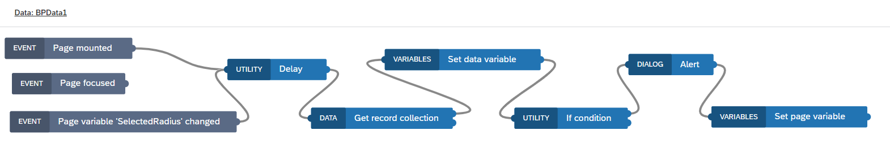
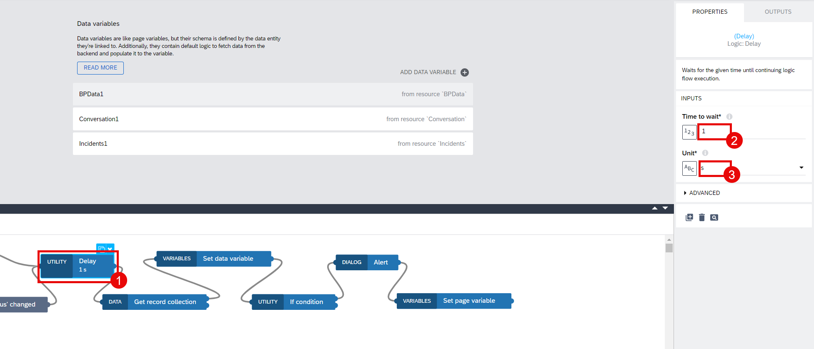
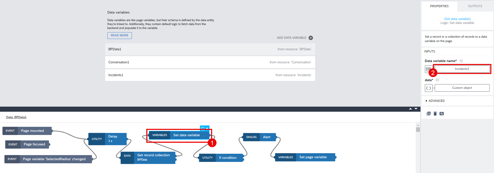
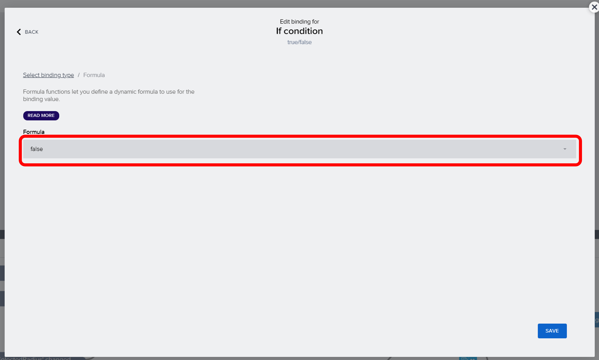
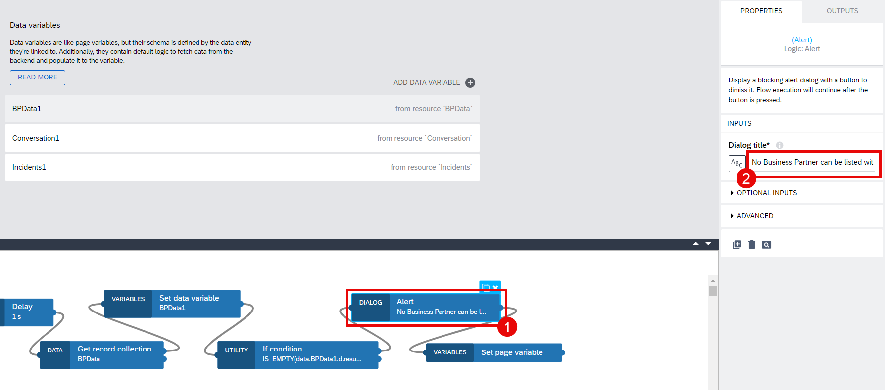

# Module 3 - Unit 2_4: Configuration for Data Variables in Detail Page

1. Go to the page: **Incident Detail**. Switch to **Variables**. Select **Data variables** and create a new data variable for **Incidents**.

2. Change the **Data variable type** to **Single data record** and select **X** button under **ID**. Then follow the path: **Data and Variables** > **Page parameter**.

3. Select the page parameter **IncidentID** and then choose **Save**. 

4. Create a new data variable for **Conversation**.

5. Select **Conversation1** data variable and choose the **X** button under **Filter condition** to select the **Object with properties**.

6. Select **incident_ID** from the dropdown list for **Property**. Then, choose **ABC** button under **Compared value** to follow the path: **Data and Variables** > **Page parameter**

7. Select page parameter **Incident ID** and then choose **Save**.

8. Add a data variable for **BPData**.

9. Select the data variable **BPData1** and change the **Data variable type** to **Single data record**. Then, open the Logic Editor.

10. Drag and drop the **Receive event** component. Select the **Event source**: **Page variable "SelectedRadius" changed**.

11. Remove the logic components **Get record** and **Set data variable**. Click on the component to select and press delete button on your keyboard to remove. 

12. Drag and drop the following logic components and connect them to each other as it is shown in the screenshot. You will find all the components under Core tab on the left.

>Delay>Get record collection>Set data variable>If condition>Alert>Set page variable 

13. Select **Delay**. Configure the delay time to 1 second using **Time to wait** and **Unit** fields.

14. Select **Get record collection**. Select the **X** button under **radius** and follow the path: **Data and Variables** > **Page variable**.

15. Select the page variable **SalectedRadius** and then choose **Save**.

16. Select the **X** button under **point_lat** and follow the path: **Data and Variables** > **Data variable**.

17. Select **latitude** and then choose **Save**.

18. Select the **X** button under **point_lon** and follow the path: **Data and Variables** > **Data variable**.

19. Select **longitude** and then choose **Save**.

 
20. Select **Set data variable** node. Go to the bound field under **Data variable name**.

21. Select the data variable **BPData1**.

22. Select the **{}** icon under **data** and then choose **Formula**.

23. Paste the formula below. This formula will get the output from **Get record collection** component and save it to the **BPData1**.

~~~
outputs["Get record collection"].records
~~~

24. Select **If condition** node. Then, choose the icon under **Condition** and then select **Formula**.

25. Click on the Formula Bar.

26. Paste the formula below and **Save** it. This formula will check if the **BPData1** has any result or not. If there is no result, that means there is no Business Partner around based on the given Latitude, Longitude and Radius.

~~~
IS_EMPTY(data.BPData1.d.results)
~~~

27. Select the **Alert** component and paste the message below to the **Dialog title** field. This dialog will be shown to the end user if there is no data in **BPData1** data variable.

~~~
No Business Partner can be listed within the given range. Radius is set to maximum to list all Business Partners
~~~

28. Select the **Set page variable** and then choose the variable field under **Variable name**.

29. Select the variable: **SelectedRadius** and then choose **Save**.

30. Add the value **9999** to the **Assigned value**. **Save** your project.

**[Next Module 3 - Unit 2_5: Configuration for UI & Logic Components in Detail Page](../5_Configuration%20for%20UI%20&%20Logic%20Components%20in%20Detail%20Page/Readme.md) >**
