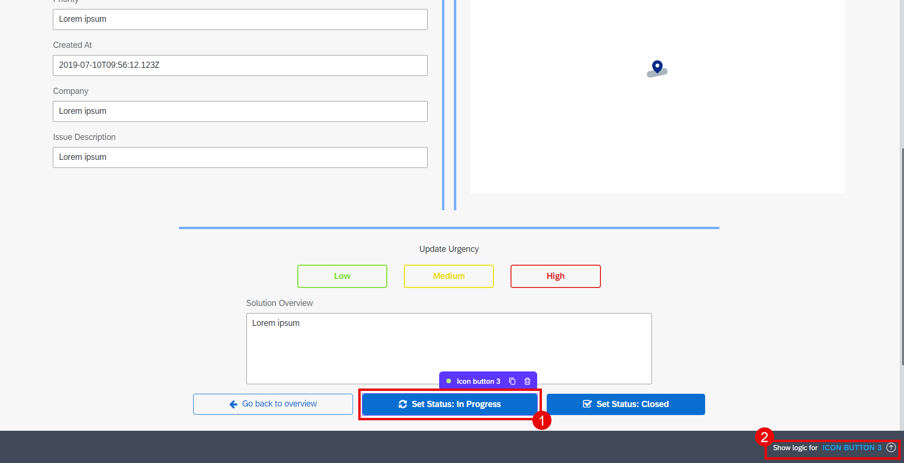
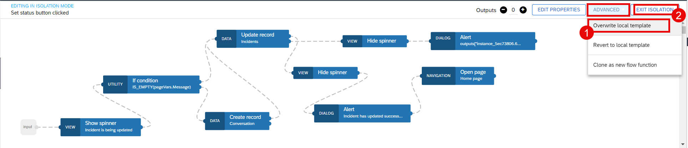

# Configuration for UI and Logic Components in Detail Page

1. Make sure that you are on the **Incident Detail** page and you are in the **User Interface** view. No screen component should be selected. Open the **Logic Editor** tab.

2. Select the first **Set page variable** logic component and choose the **ABC** icon under **Assigned value**. Follow the path: **Data and Variables** > **Data Variable** > **Incidents1**.

> Make sure that the **Logic Editor** tab is showing **Page: Incident Detail** (that is shown with the red arrow below). This means you are in the **Logic Editor** for the whole page, not for any single UI component. 

3. Choose **urgency_code** and then choose **Save**.

4. Select the second **Set page variable** logic component and choose the **ABC** icon under **Assigned value**. Follow the path: **Data and Variables** > **Data Variable** > **Incidents1**. 

5. Select **processor** and then choose **Save**.

> In this logic flow, the urgency and processor information will be saved to the respective page variables 1 second after the page is loaded. By saving this information to the page variable, you can easily interact with it using UI components such as drop-down list or urgency buttons. These components will be added later in this chapter. 

6. Hide the **Logic Editor** tab and save your project.

7. Select the drop-down component. Choose the button under the **Option List** field.

8. Paste the following formula and save it.

~~~js
MAP(data.BPData1.d.results, {label: item.PartnerName+ " " + "    -    " + item.Distance + " km away", value:item.PartnerName})
~~~

9. Select the map component. Choose the button under the **Markers to render** field.

10. Paste the following formula and save it.

~~~js
CONCAT(MAP(data.BPData1.d.results, {iconName: {set: "fiori", name: "flag"}, iconSize: 20, latitude: NUMBER(item.Latitude), iconColor: "#0010cf", labelFont: "72", longitude: NUMBER(item.Longitude), calloutTitle: item.Partner, calloutDescription: item.PartnerName}), [{iconName: {set: "fiori", name: "flag"}, iconSize: 20, latitude: NUMBER(data.Incidents1.latitude), iconColor: "#dd0000", labelFont: "72", longitude: NUMBER(data.Incidents1.longitude), calloutTitle: "Current Incident", calloutDescription: data.Incidents1.title}])
~~~

> The formula can look complicated from the first view. But basically it's simple as following: it concatenates two arrays with the geo markers information. One array is made of the information from ABAP RAP service being called every time the user changes the search radius field. And another array is one item array with the incident data (to show the marker where the incident has happened).

11. Select the button **Set Status: In Progress**. Open the **Logic Editor** tab.

12. Double click on the custom flow function **Set status button clicked**. 

13. Select the **Update record** logic component. Choose the **X** button under **Resource name** and then choose **Data Entity**. 

14. Select **Incidents** and choose **Save**.

15. Choose the **ABC** icon under **ID**. Follow the path **Data and Variables** > **Page parameter**.

> As the record will be updated in the **Incidents** data entity, you need to provide the ID of the single record that will be updated.

16. Select **IncidentID** and then choose **Save**.

17. Choose **Custom object** under the **Record** field.

18. Choose the **X** button under **processor**. Follow the path **Data and Variables** > **Page variable**.

19. Select **SelectedPartner** and then choose **Save**.

> Here, when the Service Admin assigns a Business Partner, this info will be saved to SelectedPartner page variable. So, we will be using this page variable to update the record for processor  

20. Choose the **X** button under **status_code**.

21. Choose **Flow function input**.

22. Choose **Set status button clicked** and then choose **Status**. Then save the binding.

> The same flow function is called on both buttons: **Set Status: In Progress** and **Set Status: Closed**. During the flow function call the necessary status is passed. Then you use it as shown above.

23. Choose the **X** button under **urgency_code**. Follow the path **Data and Variables** > **Page variable**.

24. Select **SelectedUrgency** and then choose **Save**.

> When the client creates a new incident from the client application, the client will select one of the urgency level: Low, Medium or High. And in this admin application, the Service Admin will be able to change this urgency level if it is needed. If the admin changes it, this information will be saved under the page variable **SelectedUrgency**. So, you will be using this page variable to update the record for urgency. 

25. Save the object.

26. Select the **Create record** node and then choose the **X** button under **Resource name**. Then choose **Data entity**.

27. Select the **Conversation** data entity and then choose **Save**.

> All the incident conversations will be saved under this data entity.

28. Choose the **{}** icon under **record**. Then choose **Formula**.

29. Paste the following formula and save it.

> This formula assigns the **IncidentID** page parameter to the **incident_ID** data field in the **Conversation** data entity. And then, it saves the message of the admin to the respective data field. 

~~~js
{"incident_ID": params.IncidentID, message: pageVars.Message}
~~~

30. Save the changes in the function flow by selecting **Advanced** > **Overwrite local template**. Then choose **Exit isolation**.

31. Choose **Conversation Main Container**. Click the formula field under **Advanced properties**.

> If the SAP Build Apps project has many UI components, it will be easier to select them using UI Component tree. So this is how you have just selected the Conversation Main Container.

> This Conversation Main Container should be visible only if there is already any conversation.

32. Paste the following formula and save it.

> This formula checks if the **Conversation1** data variable is empty.

>  Example 1 (data variable is empty): IS_EMPTY will return true and the formula will become NOT(true) then the whole formula will return false. In this case, the visibility will be false. So, when the data variable is empty, this component will not be visible.

>  Example 2 (data variable is not empty): IS_EMPTY will return false and the formula will become NOT(false) then the whole formula will return true. In this case, the visibility will be true. So, when the data variable has some data, this component will be visible.

~~~
NOT(IS_EMPTY(data.Conversation1))
~~~

33. Select **Record of Conversation** using the component tree. Then, follow the path **Repeat with** > **Data and Variables** > **Data variable**.

34. Select **Conversation1** and then choose **Save**.

35. Select **Text 11** component using the component tree. Then, choose the **ABC** icon under **Content**.

36. Select the **Data item in repeat** option.

37. Select **message** under **current** and then choose **Save**.

38. Save your project.

You have successfully completed the application! 

## Next Step

[Test Your Application](../6_Test%20your%20application/Readme.md)
