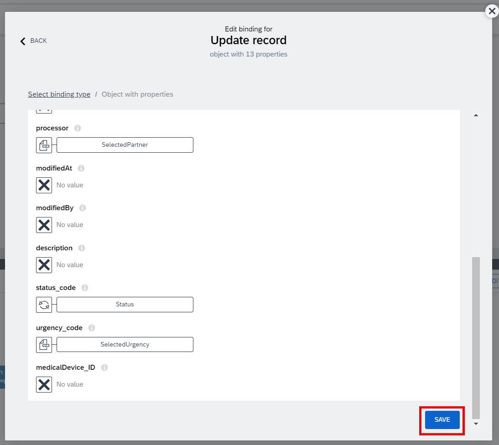

# Module 3 - Unit 2_5: Configuration for UI & Logic Components in Detail Page

1. Make sure that you are in the page Incident Detail and you are in the UI Canvas view. Open the logic editor tab

2. Select the first Set page variable logic component and click on the ABC icon under assigned value. Follow the path: Data and Variables > Data Variable

> Make sure that the logic editor tab is showing "Page:Incident Detail" (that is shown with the red arrow below). This means you are in the logic editor for the whole page, not for any single UI component. 

3. Select urgency_code and Save it

4. Select the second Set page variable logic component and click on the ABC icon under assigned value. Follow the path: Data and Variables > Data Variable. 

5. Select processor and Save it

> In this logic flow, the urgency and processor information will be saved to the respective page variables 1 second after the page is loaded. By saving those information to the page variable, we can easily interact with them using UI components such as drop down list or urgency buttons that you will in this chapter. 

6. Hide the logic editor tab and save your project.

7. Select the Incident Title component. Go to the content field.

8. Paste the following formula and save it

~~~
"Title: " + data.Incidents1.title
~~~

9. Select the Incident Device Code component. Go to the content field.

10. Paste the following formula and save it 

~~~
"Device: " + data.Incidents1.medicaldevice.description
~~~

11. Select the Incident Status component. Go to the content field.

12. Paste the following formula and save it

~~~
"Status: " + data.Incidents1.status.description
~~~

13. Select the Priority component. Go to the content field.

14. Paste the following formula and save it

~~~
"Priority: " + data.Incidents1.urgency.description
~~~

15. Select the Created at component. Go to the content field.

16. Paste the following formula and save it

~~~
"Created at: " + data.Incidents1.createdAt
~~~

17. Select the Company component. Go to the content field.

18. Paste the following formula and save it

~~~
"Company: " + data.Incidents1.company
~~~

19. Select the Issue Description component. Go to the content field.

20. Paste the following formula and save it

~~~
"Issue Description: " + data.Incidents1.description
~~~

21. Select the Assigned Business Partner component. Go to the content field.

22. Paste the following formula and save it

~~~
"Assigned Business Partner: " + data.Incidents1.processor
~~~

23. Select the drop-down component. Go to option list field.

24. Paste the following formula and save it

~~~
MAP(data.BPData1.d.results, {label: item.PartnerName+ " " + "    -    " + item.Distance + " km away", value:item.PartnerName})
~~~

25. Select the button Set Status: In Progress. Open the Logic editor tab.

26. Select Update record logic component. Click on the X under Resource name. 

27. Select Incidents and Save it

28. Click on ABC icon under ID. Go to Data and Variables > Page parameter

>As the record will be updated in Incidents data entity, we need to provide the ID of the single record that will be updated.

29. Select IncidentID and Save it

30. Go to Custom object

31. Click on X under processor. Go to Data and Variables > Page variable

32. Select SelectedPartner and Save it

> Here, when the Service Admin assigns a Business Partner, this info will be saved to SelectedPartner page variable. So, we will be using this page variable to update the record for processor  

33. Click on X under status_code. Go to Static Value

34. Type A

> When the client creates a new incident from the client app, the incident will have the value "O" that corresponds to "Open". Now, when the Service Admin assigns a Business Partner and sets the status to In Progress, the status code will be "A" that corresponds to "Assigned".

35. Click on X under urgency_code. Go to Data and Variables > Page variable

36. Select SelectedUrgency and Save it

> When the client creates a new incident from the client app, the client will select one of the urgency level: Low, Medium or High. And in this admin app, Service Admin will be able to change this urgency level if it is needed. If admin changes it, this information will be saved under the page variable SelectedUrgency. So, we will be using this page variable to update the record for urgency. 

37. Save the object

38. Select Create record and Click on X under Resource name

39. Select Conversation data entity and Save it

> All the conversations will be saved under this data entity

40. Click on the {} icon under record. Go to Formula

41. Paste the following formula and save it

> This formula assigns the page parameter IncidentID to the data field incident_ID in the Conversation data entity. And then, it saves the message of the admin to the respective data field. 

~~~
{"incident_ID": params.IncidentID, message: pageVars.Message}
~~~

42. Select the next button: Set Status: Closed. Select Update record and go to X under Resource name

43. Select Incidents and Save it

44. Click on ABC icon under ID. Go to Data and Variables > Page parameter

>As the record will be updated in Incidents data entity, we need to provide the ID of the single record that will be updated.

45. Select IncidentID and Save it

46. Go to Custom object

47. Click on X under processor. Go to Data and Variables > Page variable

48. Select SelectedPartner and Save it

> Here, when the Service Admin assigns a Business Partner, this info will be saved to SelectedPartner page variable. So, we will be using this page variable to update the record for processor 

49. Click on X under status_code. Go to Static Value

50. Type C

> When the client creates a new incident from the client app, the incident will have the value "O" that corresponds to "Open". Now, when the Service Admin assigns a Business Partner and sets the status to Closed, the status code will be "C".

51. Click on X under urgency_code. Go to Data and Variables > Page variable

52. Select SelectedUrgency and Save it

> When the client creates a new incident from the client app, the client will select one of the urgency level: Low, Medium or High. And in this admin app, Service Admin will be able to change this urgency level if it is needed. If admin changes it, this information will be saved under the page variable SelectedUrgency. So, we will be using this page variable to update the record for urgency. 

53. Save the object

54. Select Create record and Click on X under Resource name

55. Select Conversation data entity and Save it

> All the conversations will be saved under this data entity

56. Click on the {} icon under record. Go to Formula

57. Paste the following formula and Save it

> This formula assigns the page parameter IncidentID to the data field incident_ID in the Conversation data entity. And then, it saves the message of the admin to the respective data field. 

~~~
{"incident_ID": params.IncidentID, message: pageVars.Message}
~~~

58. Select the Conversation Main Container. Click on the formula field under Advanced properties

> If your Build Apps project has many UI components, it will be easier to select them using UI Component tree. So this is how we just selected the Conversation main Container

> This Conversation Main Container should be visible only if there is already any conversation

59. Paste the following formula and Save it

> This formula checks if the data variable Conversation1 is empty

>  Example 1 (data variable is empty): IS_EMPTY will return true and the formula will become NOT(true) then the whole formula will return false. In this case, visibility will be false. So, when the data variable is empty, this component will not be visible

>  Example 2 (data variable is not empty): IS_EMPTY will return false and the formula will become NOT(false) then the whole formula will return true. In this case, visibility will be true. So, when the data variable has some data, this component will be visible

~~~
NOT(IS_EMPTY(data.Conversation1))
~~~

60. Select Record of Conversation using component tree. Then, go to Repeat with > Data and Variables > Data variable

61. Select COnversation1 and Save it

62. Select Text 11 component using component tree. Then, click on the ABC icon under Content

63. Select data item in repeat

64. Select message under current and Save it

65. Save your project

You have successfully completed the application! 

**[Next Module 3 - Unit 2_6: Test your application](../6_Test%20your%20application/Readme.md) >**