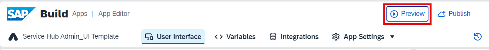
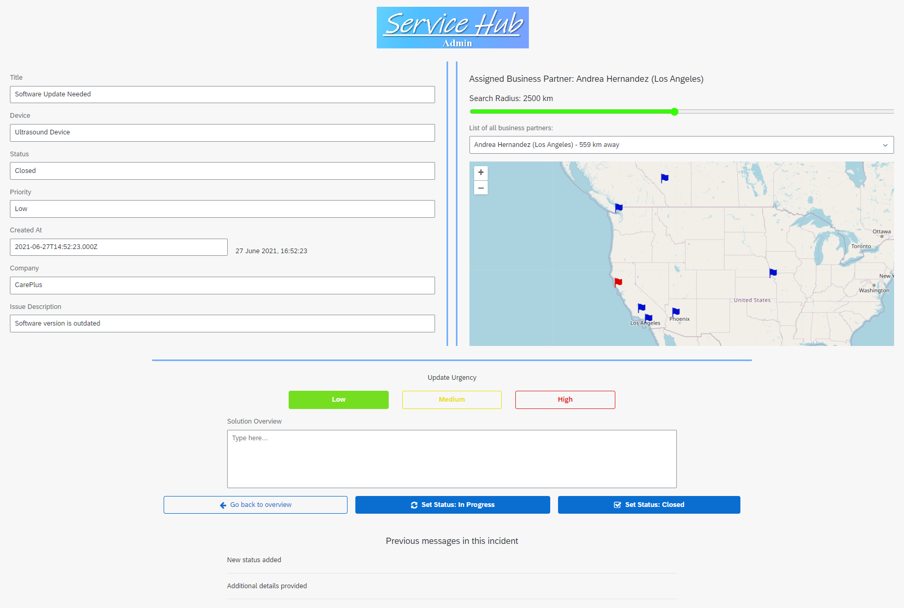

# Test Your Application

1. Choose **Preview** on the top tab of the application.

2. Choose **Open web preview**.

3. Choose **Open** under your project. 

4. Go to the incidents, check the details, update the details and so on.

Now, you can build and deploy your application.

[Build and Deploy Web Applications](https://help.sap.com/docs/build-apps/service-guide/build-and-deploy-web-applications)
