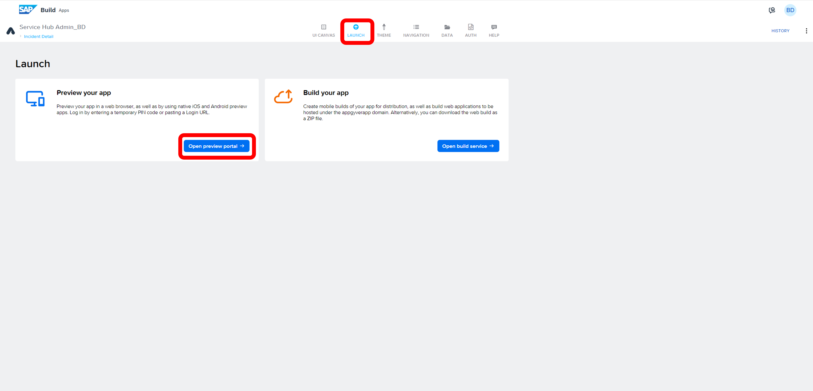
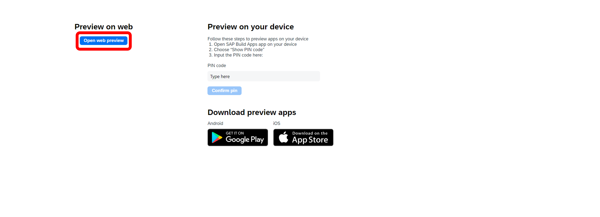
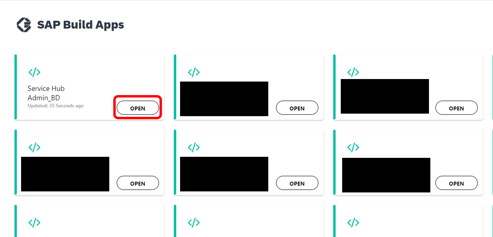
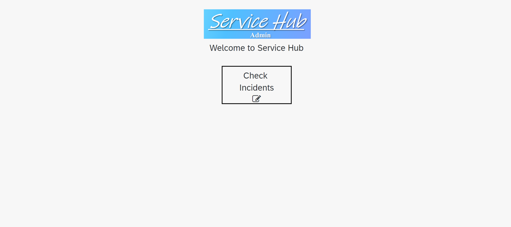

# Module 3 - Unit 2_6: Test your application

1. Go to **Launch** tab and then choose **Open preview portal**.

2. Select **Open web preview**.

3. Choose **Open** button under your project. 

4. Here you can test! Go to the incidents, check the details, update the details etc.

Now, you can build and deploy your application

[Build and Deploy Web Applications](https://help.sap.com/docs/build-apps/service-guide/build-and-deploy-web-applications)
