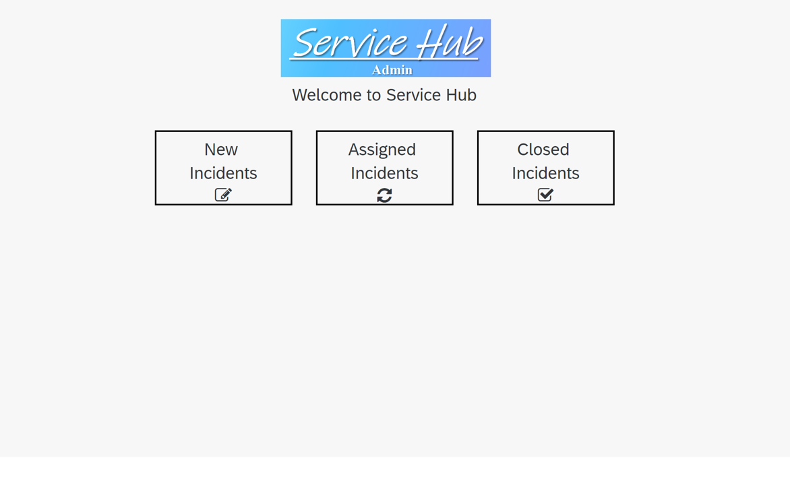

# Module 3 - Unit 2: Service Hub Admin App 

In this unit:
1. [Import Your Template Application](./1_Import%20your%20template%20application/Readme.md)
2. [Data Connection](./2_Data%20connection/Readme.md)
3. [Configuration for UI Components in Overview Pages](./3_Configuration%20for%20UI%20Components%20in%20Overview%20Pages/Readme.md)
4. [Configuration for Data Variables in Detail Page](./4_Configuration%20for%20Data%20Variables%20in%20Detail%20Page/Readme.md)
5. [Configuration for UI & Logic Components in Detail Page](./5_Configuration%20for%20UI%20&%20Logic%20Components%20in%20Detail%20Page/Readme.md)
6. [Test Your Application](./6_Test%20your%20application/Readme.md)

## Next Step

[Import Your Template Application](./1_Import%20your%20template%20application/Readme.md)
