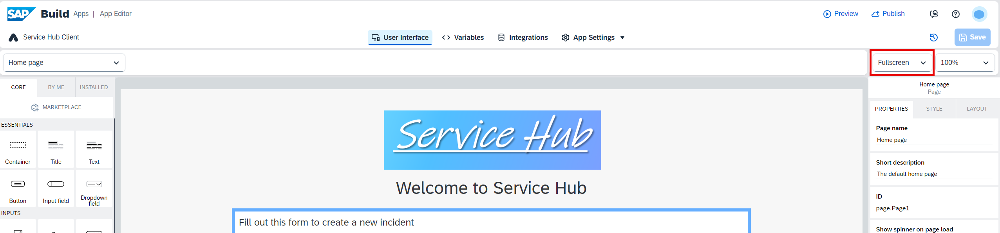

# Import Your Template Application 

1. Download the template application and save it locally.

    [Project File](./Service%20Hub%20Client_UI%20Template.mtar)

2. In the SAP Build Lobby, choose **Import**.

3. Choose **Browse Files** and find the **Service Hub Client_UI Template.mtar** template that you saved locally.

4. Select the project and choose **Import**.

5. Choose **Rename Project** in the project menu. 

6.  Enter a name, for example **Service Hub Client**, and then choose **Save**.

7. Go to your project by selecting its name.

8. Make sure to have the **Fullscreen** view switched on.

## Next Step

[Data Connection](../2_Data%20connection/Readme.md)
