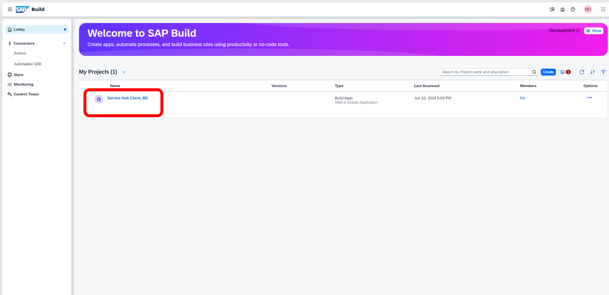

# Module 3 - Unit 1_1: Import your template application 

1. Download the template application and save it to your PC

2. Select **Import** button in SAP Build Lobby.

3. Select **Browse Files** and find the template that you saved to your PC: **Service Hub Client_UI Template.mtar**

4. Select the project and choose **Import** button.

5. Choose **Rename Project** item in the project menu. 

6.  Enter a name (e.g. **Service Hub Client**) and then choose **Save** button.

7. Go to your project by selecting it's name.

8. Make sure to have **Fullscreen** view from the preview options 

**[Next Module 3 - Unit 1_2: Data connection](../2_Data%20connection/Readme.md) >**
