# Data Connection 

In this part, you will integrate the destination in SAP BTP that you have created in SAP Build Code. 

1. Go to the **Auth** tab and choose **Enable Authentication**.

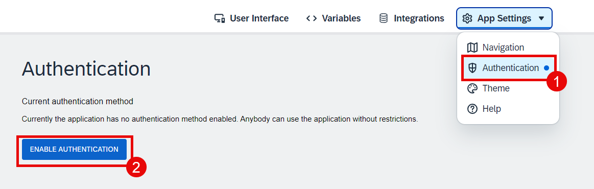

2. Choose **SAP BTP Authentication** and then choose **OK** in the popup window.

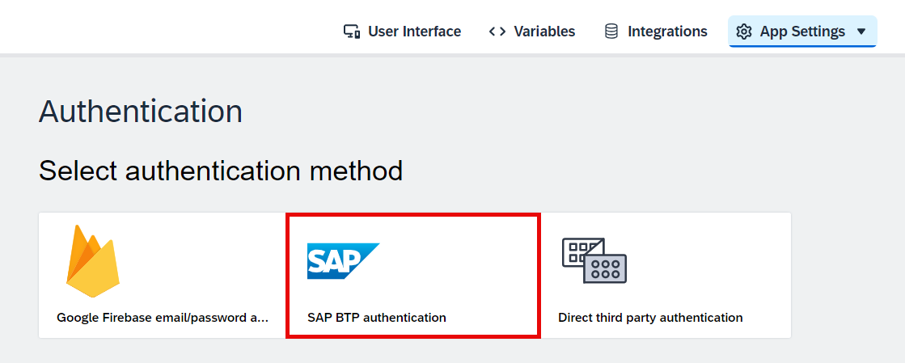

3. Go to the **Data** tab and choose **Add Integration**.

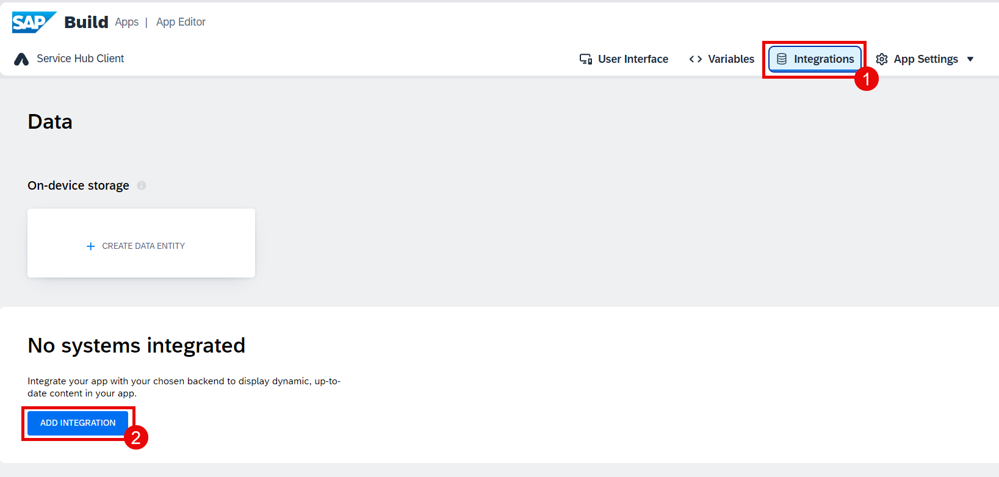

4. Choose **BTP Destinations**.

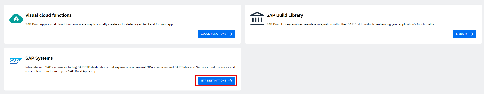

5. Find the destination **equipmentmaintenance-equipmentmaintenanceSrv** that has been created via SAP Build Code (see [here](../../../buildcode/deploy/README.md)).

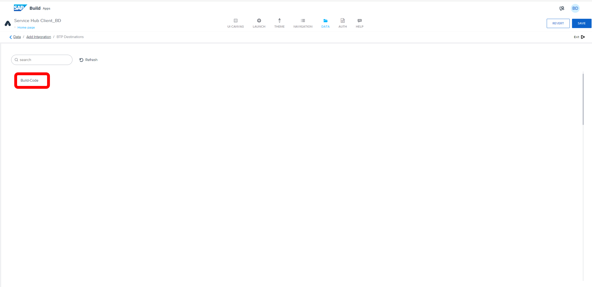

6. Choose **Install Integration**.

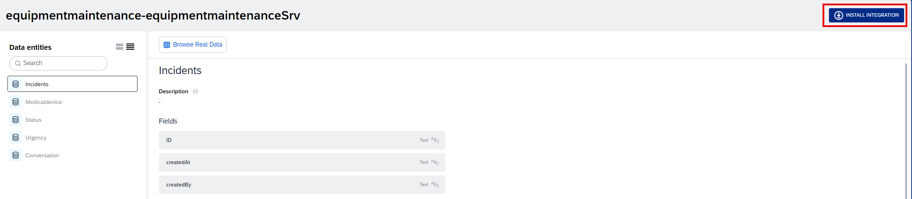

7. Select the **Incidents** data entity and then choose **Enable Data Entity**.

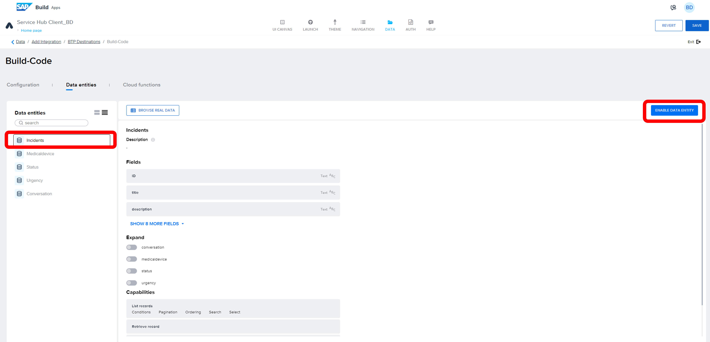

8. Select the **Medicaldevice** data entity and then choose **Enable Data Entity**.

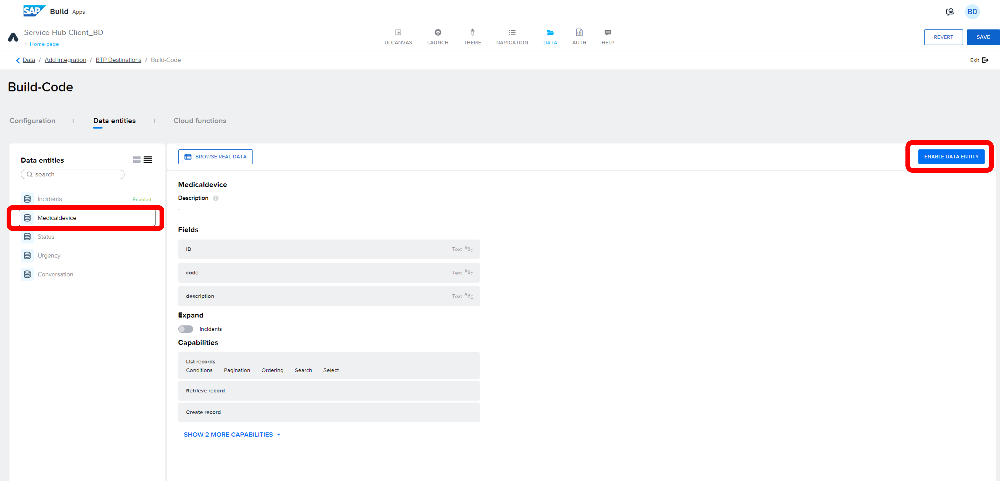

9. Choose **Browse real data**. 

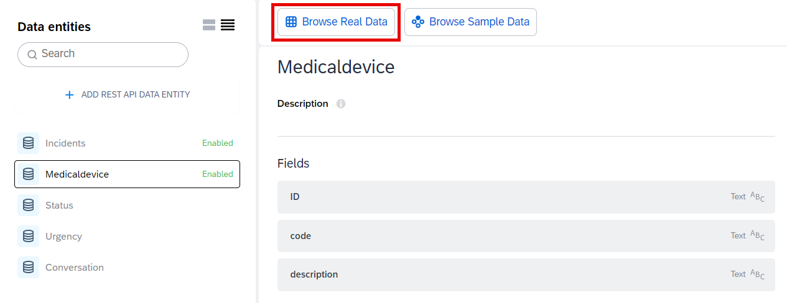

10. You can see the data is coming from your backend system that you have created using Joule in SAP Build Code.

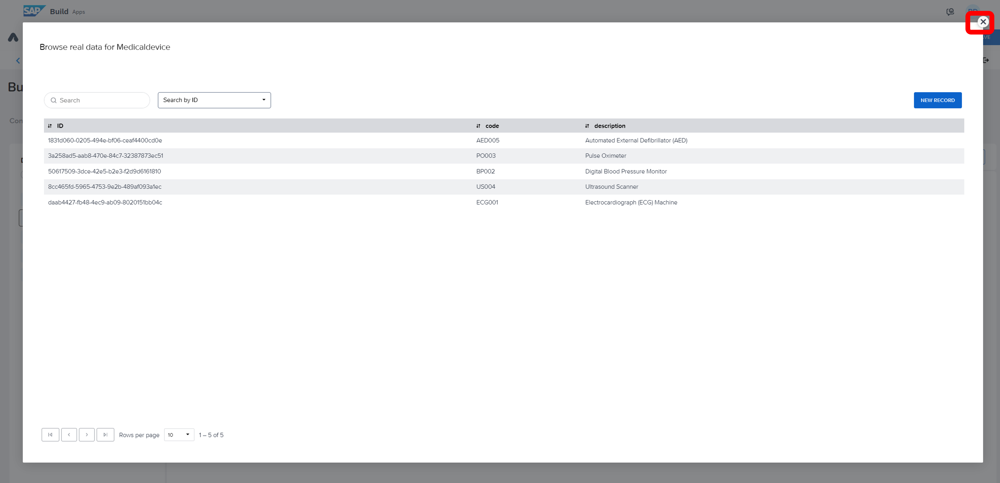

11. Save your project and go to **UI Canvas**.

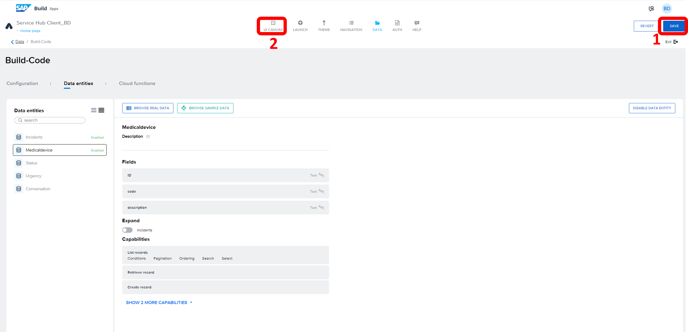

12. Switch to **Variables**. Go to **Data variables** and add a new data variable by choosing the **"+"** button.

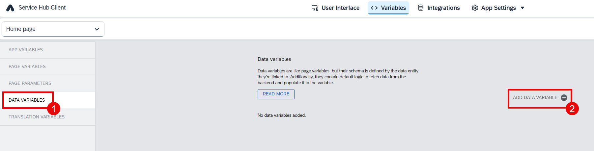

13. Choose **Incidents**.

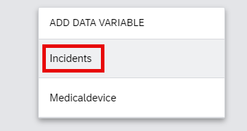

14. Select **New data record** for the variable type.

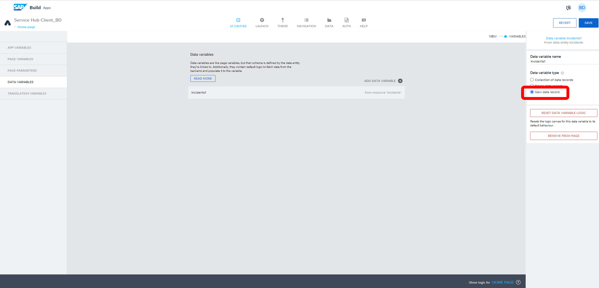

15. Add a new data variable by choosing **Medicaldevice**.

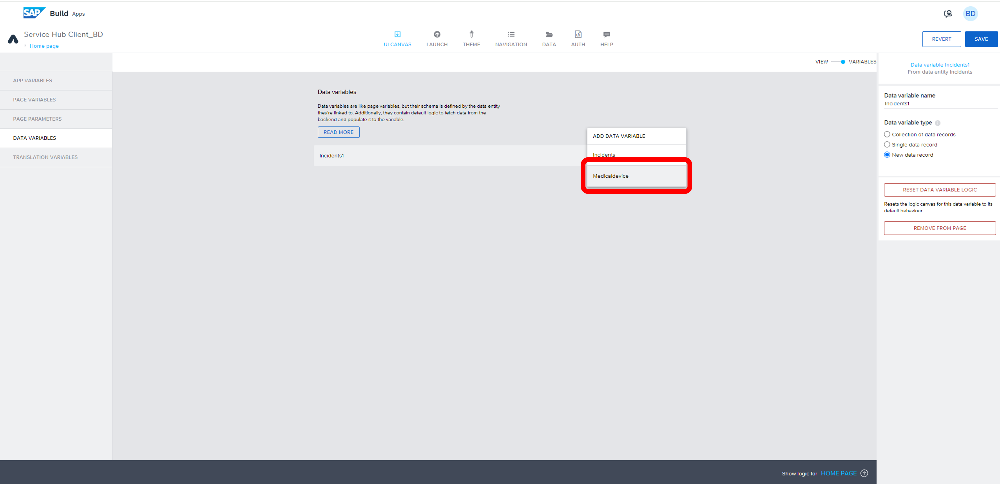

16. Switch back to **View**. Save your project.

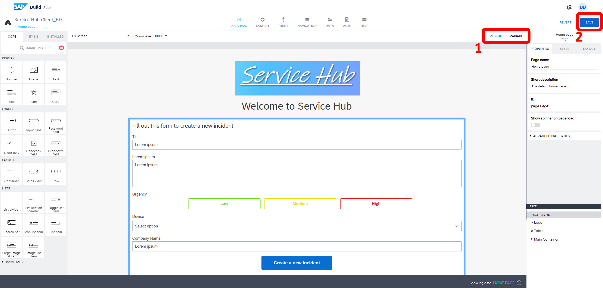

## Next Step

[Build the Application Logic](../3_Logic%20building/Readme.md)
