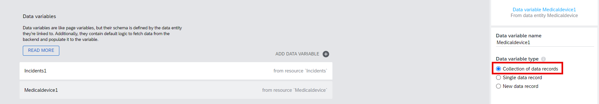
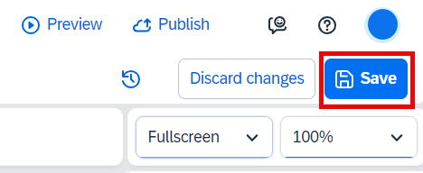

# Data Connection 

In this part, you will integrate the destination in SAP BTP that you have created in SAP Build Code. 

1. Go to the **Auth** tab and choose **Enable Authentication**.

2. Choose **SAP BTP Authentication** and then choose **OK** in the popup window.

3. Go to the **Data** tab and choose **Add Integration**.

4. Choose **BTP Destinations**.

5. Find the destination **equipmentmaintenance-equipmentmaintenanceSrv** that has been created via SAP Build Code (see [here](../../../buildcode/deploy/README.md)).

6. Choose **Install Integration**.

7. Select the **Incidents** data entity and then choose **Enable Data Entity**.

8. Select the **Medicaldevice** data entity and then choose **Enable Data Entity**.

9. Choose **Browse real data**. 

10. You can see the data is coming from your backend system that you have created using Joule in SAP Build Code.

11. Save your project and go to **UI Canvas**.

12. Switch to **Variables**. Go to **Data variables** and add a new data variable by choosing the **"+"** button.

13. Choose **Incidents**.

14. Select **New data record** for the variable type.

15. Add a new data variable by choosing **Medicaldevice**.

16. Switch back to **View**. Save your project.

## Next Step

[Build the Application Logic](../3_Logic%20building/Readme.md)
