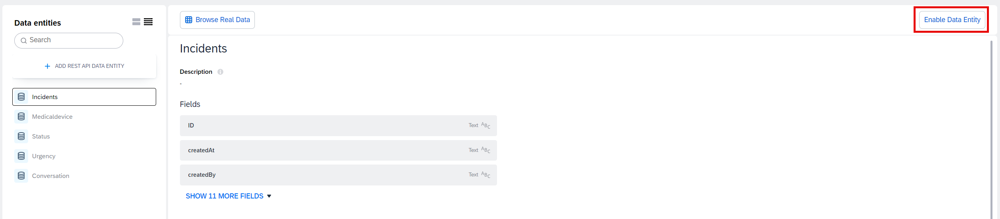
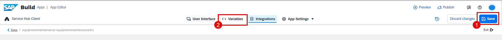
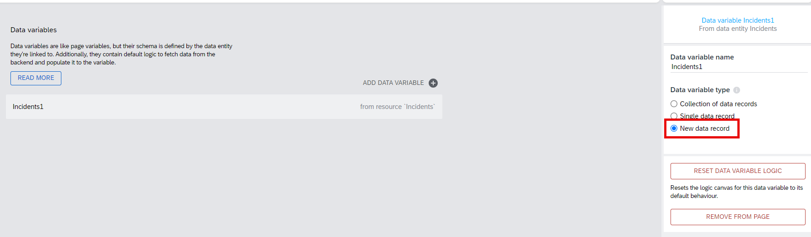

# Module 3 - Unit 1_2: Data connection 

In this part, you will integrate the BTP destination that you created in SAP Build Code. 

1. Go to **Auth** tab and select **Enable Authentication** button.

2. Select **SAP BTP Authentication** and choose **OK** in the popup window.

3. Go to **Data** tab and choose **Add Integration**.

4. Select **BTP Destinations**.

5. Find the destination that you created via Build Code in the previous Module in this exercise.

6. Choose **Install Integration**.

7. Select the **Incidents** data entity and then choose **Enable Data Entity**.

8. Select the **Medicaldevice** data entity and then choose **Enable Data Entity**.

9. Choose **Browse real data**. 

10. You can see the data is coming from your backend system that you created using Joule in SAP Build Code

11. **Save** your project and go to **UI Canvas**.

12. Switch to **Variables**. Go to **Data variables** and add a new data variable by choosing **"+"** button.

13. Select **Incidents**.

14. Select **New data record** for the variable type.

15. Add a new data variable by selecting **Medicaldevice**.

16. Switch back to **View**. **Save** your project.

**[Next Module 3 - Unit 1_3: Logic building](../3_Logic%20building/Readme.md) >**
