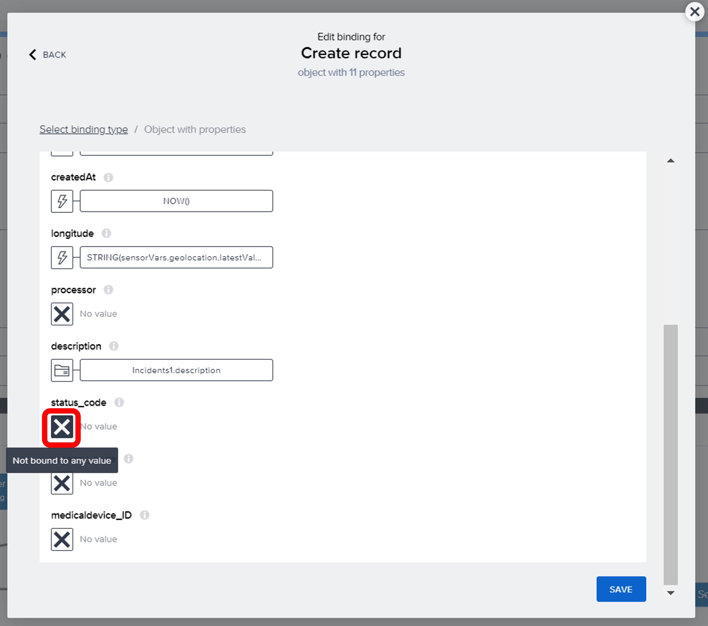
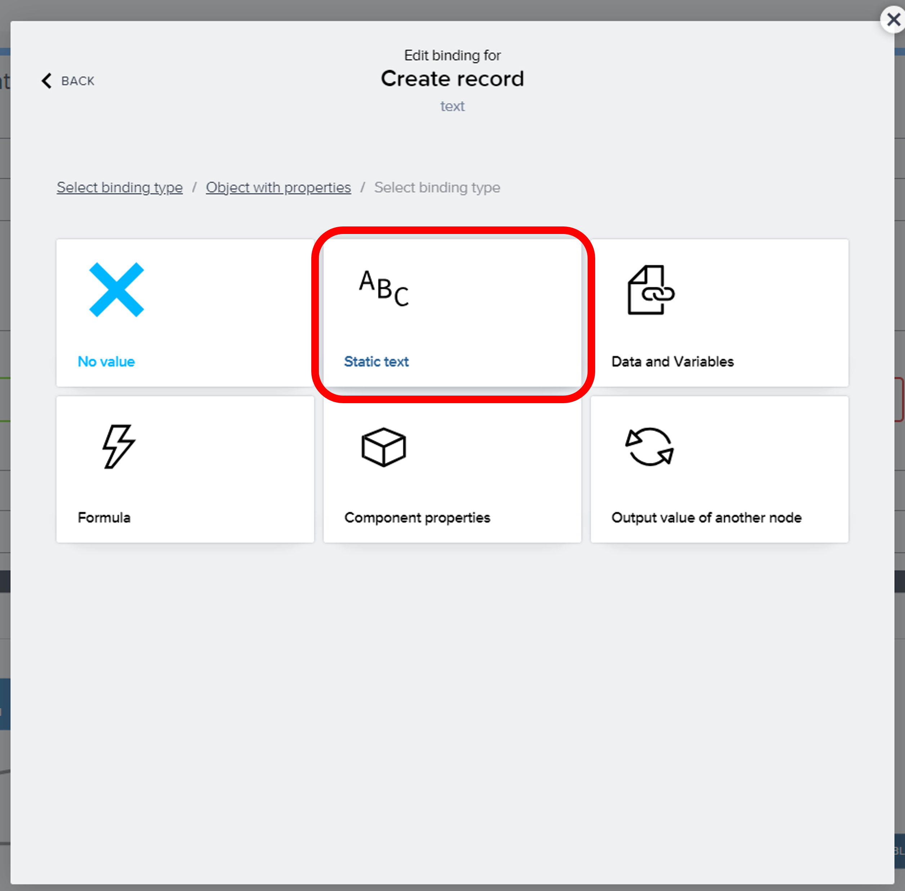
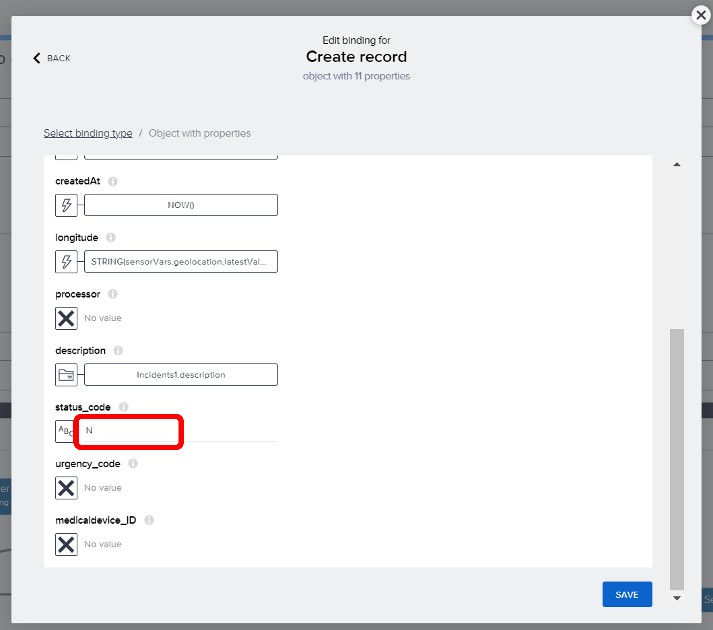
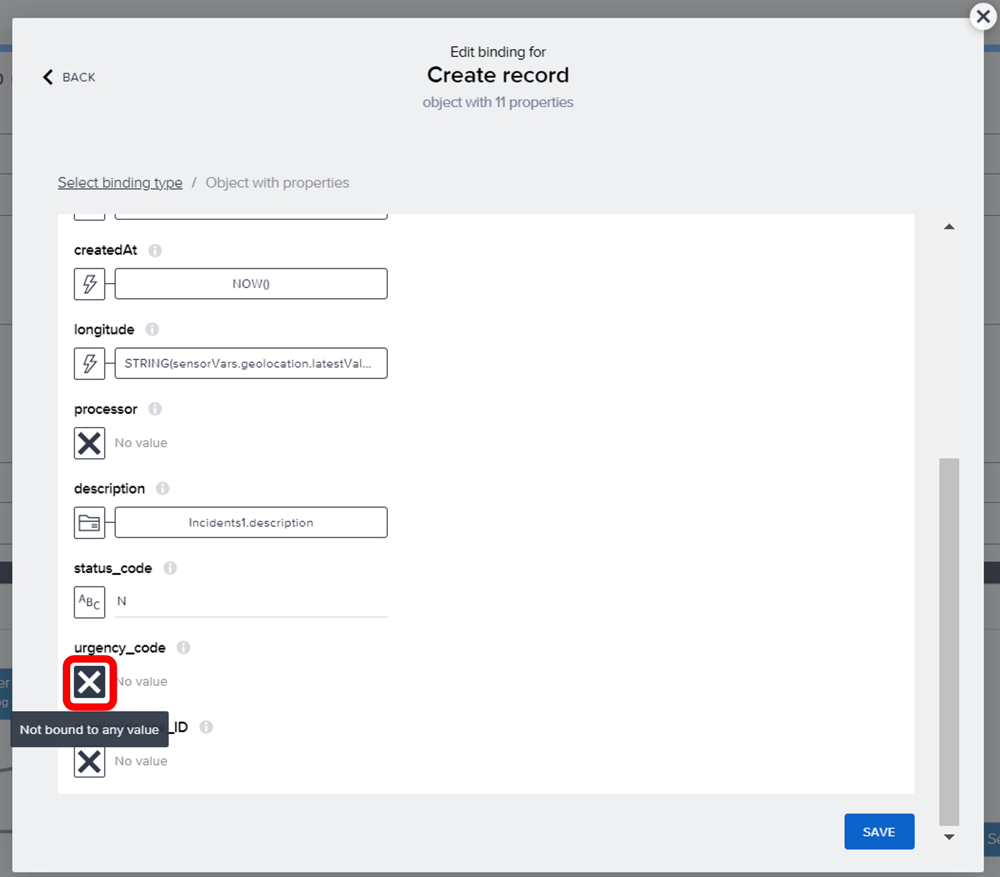
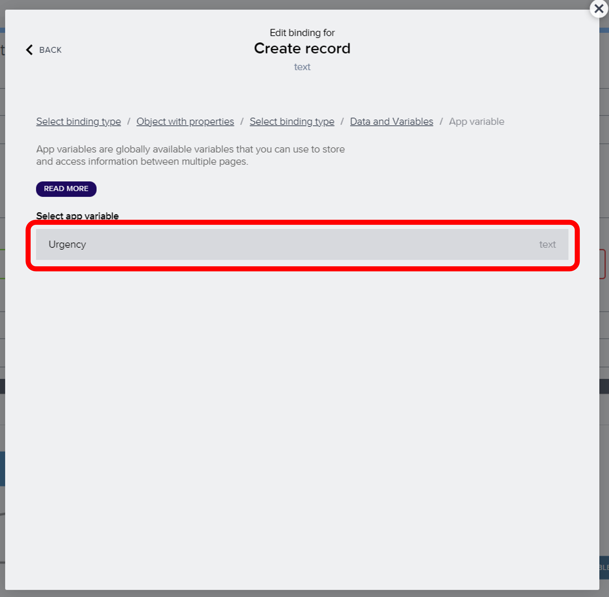
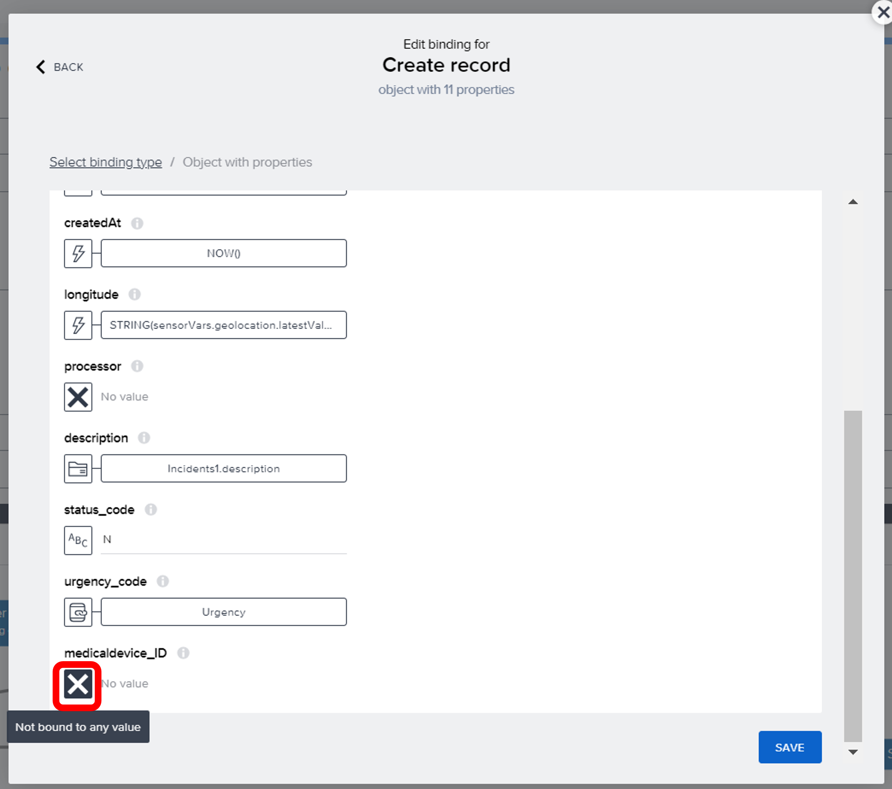
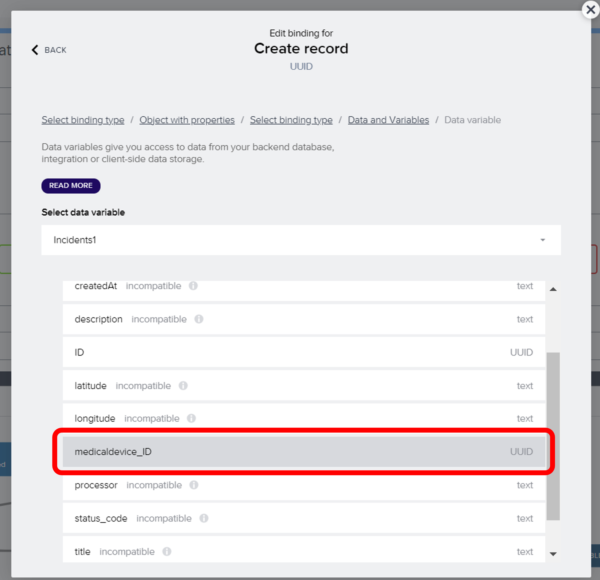
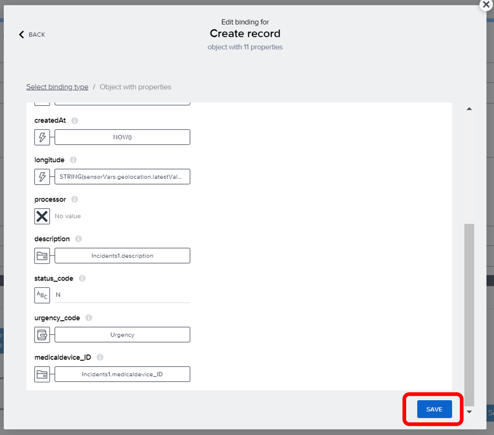

# Module 3 - Unit 1_3: Logic building 

1. You can see that each input field in the form that you imported using template application has a value that is already bounded. Here is an example for the first input field (Title) is bounded to Incidents1.title. That means, the value of the title will be saved into this data variable after user`s input

2. Now, we will configure the logic for the button at the end of this form. So that, user can create a new incident by clicking it. Select the button and open the logic editor tab from the bottom of your page.

3. Let´s check the preconfigured logic to understand the whole process. Once the component (button) is tapped, a spinner will be shown to user to notify them the record creation process has started. Here the spinner will also show a text that can be adjusted by the developer: Incident is being created

4. Select Create record logic component. Click on the X icon to select a resource and select data entity

5. Select the data entity: Incidents. Save it. Now, the record will be created in the Incidents data entity

6. Click on Custom Object

7. Click on the ABC icon under ID and go to Formula

8. Click on the formula bar

9. Paste the formula below and save it

~~~
GENERATE_UUID()
~~~

10. Click on the X icon under title and Follow the path: Data and Variables > Data variable > Incidents1

11. Select title and Save it

12. Click on the X icon under company and Follow the path: Data and Variables > Data variable > Incidents1

13. Select company and Save it

14. Click on the X icon under latitude and go to Formula

15. Click on the formula bar

16. Paste the formula below and save it. This formula gets the latitude data that Build Apps stores in the sensor variables.

~~~
STRING(sensorVars.geolocation.latestValue.latitude)
~~~

17. Click on the X icon under createdAt and go to Formula

18. Click on the formula bar

19. Paste the formula below and save it. This formula gets current date and time.

~~~
NOW()
~~~

20. Click on the X icon under longitude and go to Formula

21. Click on the formula bar

22. Paste the formula below and save it. This formula gets the longitude data that Build Apps stores in the sensor variables.

~~~
STRING(sensorVars.geolocation.latestValue.latitude)
~~~

23. Click on the X icon under description and Follow the path: Data and Variables > Data variable > Incidents1 

24. Select description and Save it

25. Click on the X icon under status_code

26. Select Static text

27. Type N to the status_code field. That is the short form for "New Incidents"

28. Click on the X icon under urgency_code and Follow the path: Data and Variables > App variable 

29. Select Urgency

30. Click on the X icon under medicaldevice_ID and Follow the path: Data and Variables > Data variable > Incidents1 

31. Select medicaldevice_ID and Save it

32. Save the object

33. Save your project

> After create record process is successfuly completed, the spinner will be hiden. Therefore, "Hide Spinner" component is connected to the first node* of "Create Record" component. A Popup window will be shown to user via Alert logic component.

> *First nodes are always the success node for logic components in SAP Build Apps while the second nodes are the fail nodes. If there are 3 nodes for the logic component, third nodes are the fail nodes.

34.  We want to see a blank form after the incident is created. To do that, click on the last logic component called Set Data Variable and click on the X icon under data variable name to select one 

35. Select Incidents1 and Save it

36. Click on Custom object

37. Here you can see that none of the data fields has a value. That means, the user input data will be removed after the incident is submitted by the user. You can simply close this window.

38. Save your project 

You have successfully completed the application! 

**[Next Module 3 - Unit 1_4: Test your application](../4_Test%20your%20application/Readme.md) >**

