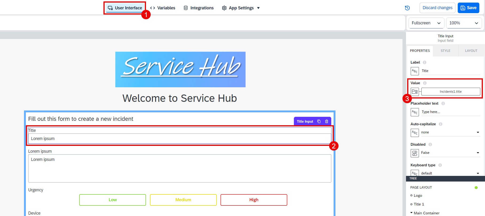
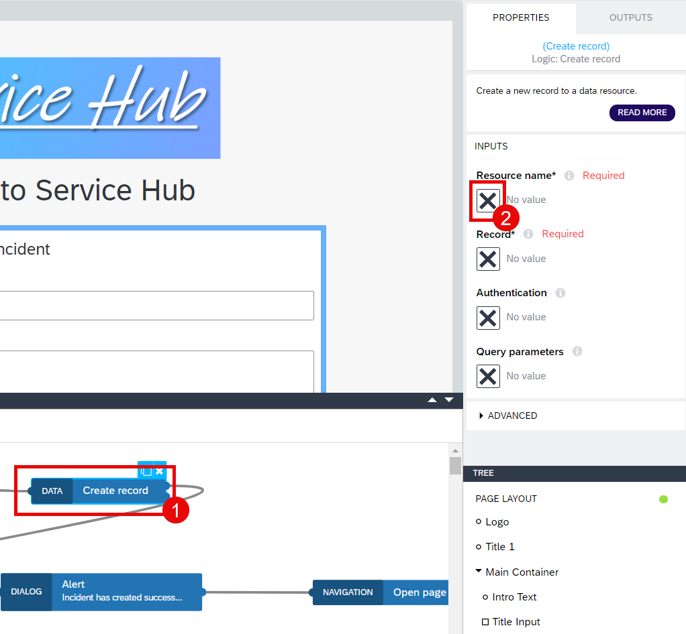
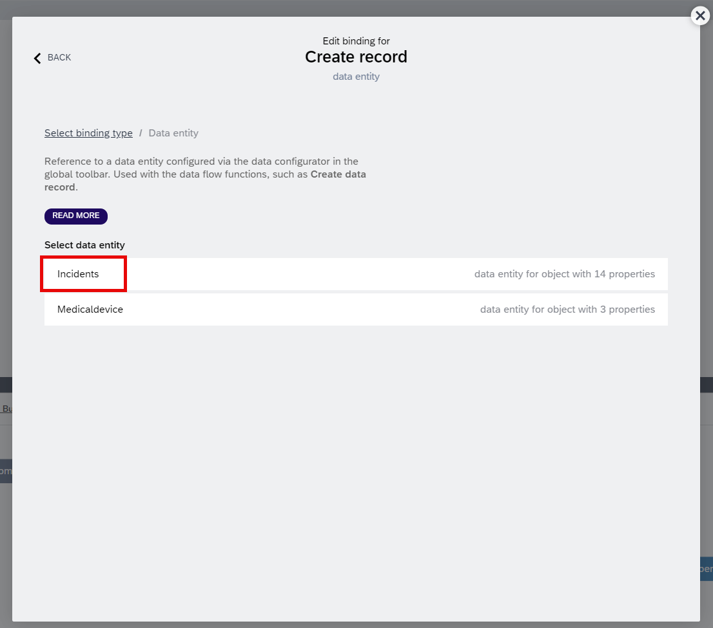
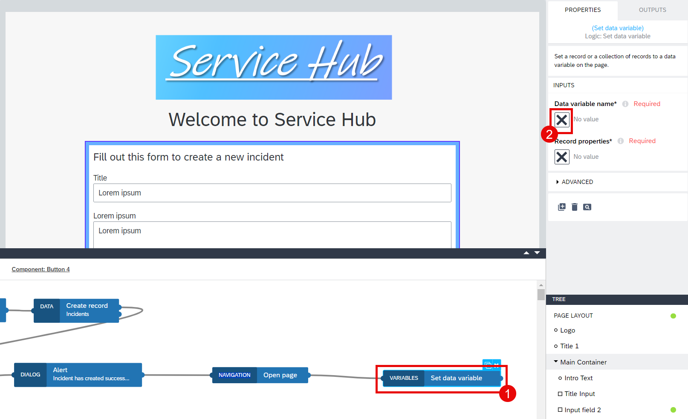

# Build the Application Logic 

You can see that each input field in the form that you have imported using application template has a value that is already bounded. Here is an example of the first input field (Title) that is bounded to Incidents1.title. That means that the value of the title will be saved into this data variable after a user's input.

1. Configure the logic for the button at the end of this form, so that a user can create a new incident by clicking it. Choose **Create a new incident** and open the logic editor tab at the bottom of your page.

2. Check the preconfigured logic to understand the whole process. Once the component (button) is tapped, a spinner will be shown to a user to notify them that the record creation process has started. Here the spinner will also show a text that can be adjusted by the developer: Incident is being created.

3. Choose the **Create record** logic component. Choose the **X** icon to select a resource and then choose **Data entity**.

4. Choose the **Incidents** data entity and then choose **Save**. The record will be created in the **Incidents** data entity.

5. Choose **Custom Object**.

6. Choose the **ABC** icon under ID and then choose **Formula**.

7. Click the formula bar.

8. Paste the formula below and then choose **Save**.

~~~
GENERATE_UUID()
~~~

9. Choose the **X** icon under title and follow the path: **Data and Variables** > **Data variable** > **Incidents1**.

10. Choose **title** and then choose **Save**.

11. Choose the **X** icon under company and follow the path: **Data and Variables** > **Data variable** > **Incidents1**.

12. Choose **company** and then choose **Save**.

13. Choose the **X** icon under latitude and then choose **Formula**.

14. Click the formula bar.

15. Paste the formula below and then choose **Save**. This formula gets the latitude data that SAP Build Apps stores in the sensor variables.

~~~
STRING(sensorVars.geolocation.latestValue.latitude)
~~~

16. Choose the **X** icon under createdAt and then choose **Formula**.

17. Click the formula bar.

18. Paste the formula below and then choose **Save**. This formula gets the current date and time.

~~~
NOW()
~~~

19. Choose the **X** icon under longitude and then choose **Formula**.

20. Click the formula bar.

21. Paste the formula below and then choose **Save**. This formula gets the longitude data that SAP Build Apps stores in the sensor variables.

~~~
STRING(sensorVars.geolocation.latestValue.longitude)
~~~

22. Choose the **X** icon under description and follow the path: **Data and Variables** > **Data variable** > **Incidents1**. 

23. Choose **description** and then choose **Save**.

24. Choose the **X** icon under urgency_code and follow the path: **Data and Variables** > **App variable**. 

25. Choose **Urgency**.

26. Select the **X** icon under medicaldevice_ID and follow the path: **Data and Variables** > **Data variable** > **Incidents1**. 

27. Choose **medicaldevice_ID** and then choose **Save**.

28. Save the object.

29. Save your project.

> After the create record process is successfuly completed, the spinner will be hidden. Therefore, the **Hide Spinner** component is connected to the first node of the **Create Record** component. A Popup window will be shown to the user via the **Alert logic** component.

> First nodes are always the success nodes for logic components in SAP Build Apps while the second nodes are the fail nodes. If there are three nodes for the logic component, the third nodes are the fail nodes.

30. You want to see a blank form after the incident is created. To do that, select the last logic component called **Set Data Variable** and then choose the **X** icon under **Data variable name** to select one. 

31. Choose **Incidents1** and then choose **Save**.

32. Choose **Custom object**.

33. Here you can see that none of the data fields has a value. That means, the user input data will be removed after the incident is submitted by the user. You can simply close this window.

34. Save your project.

You have successfully completed the application! 

## Next Step

[Test Your Application](../4_Test%20your%20application/Readme.md)

