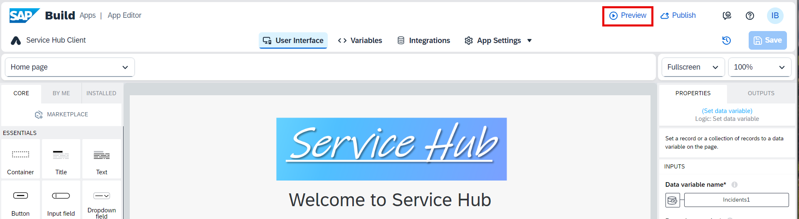
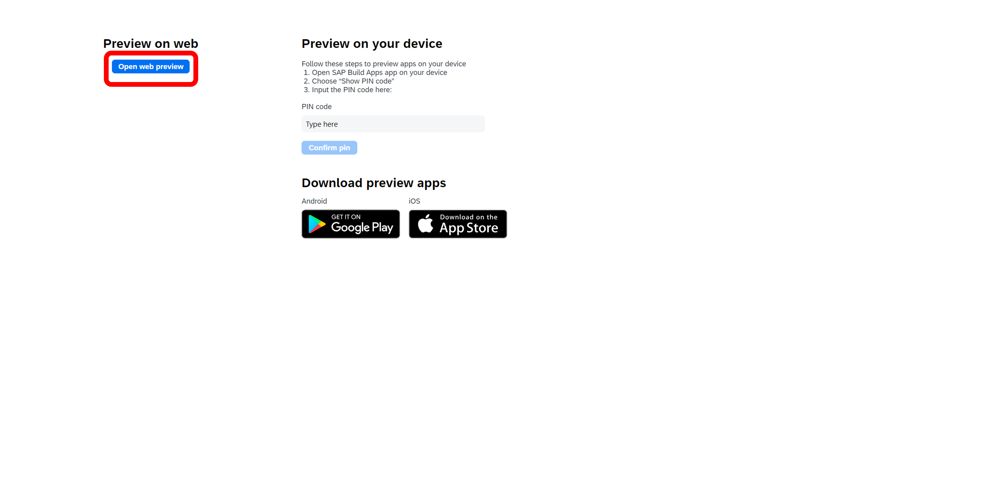
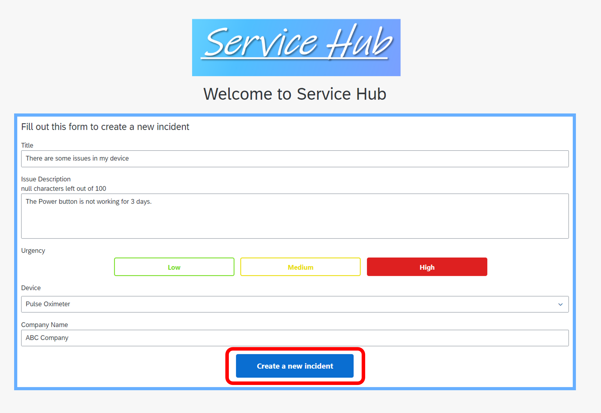
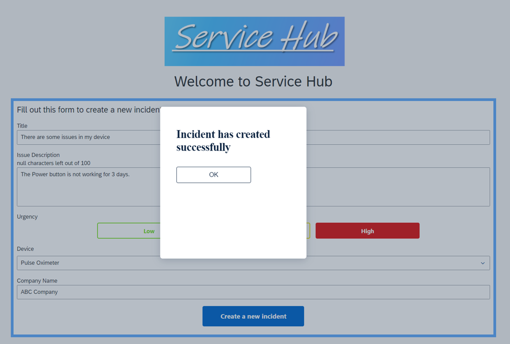

# Test Your Application 

1. Choose **Preview** button on the top bar of the window. 

2. Choose **Open web preview**.

3. Choose **Open** under your project. 

4. Fill out the form with some test data and then choose **Create a new incident**.

5. This is how the successful result should look like:

Now you've successfully tested your application. Alternatively you can build and deploy your application. See [Build and Deploy Web Applications](https://help.sap.com/docs/build-apps/service-guide/build-and-deploy-web-applications).

## Next Step

[Module 3 - Unit 2: Service Hub Admin App](../../Service%20Hub%20Admin%20App/Readme.md)

