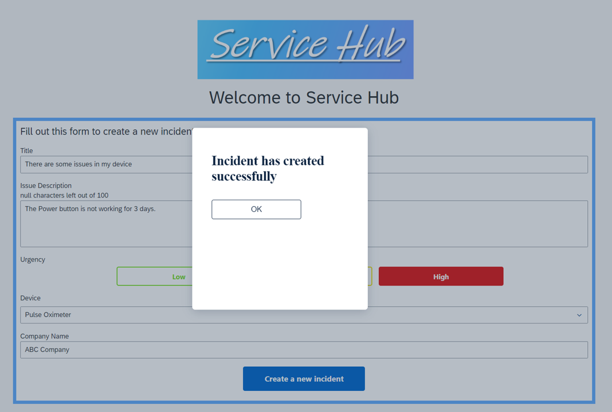

# Module 3 - Unit 1: Service Hub Client App

In this unit:
1.  [Import your Template Application](./1_Import%20your%20template%20application/Readme.md)
2.  [Data Connection](./2_Data%20connection/Readme.md)
3.  [Build the Application Logic](./3_Logic%20building/Readme.md)
4.  [Test your Application](./4_Test%20your%20application/Readme.md)

## Next Step

[Import your Template Application](./1_Import%20your%20template%20application/Readme.md)
