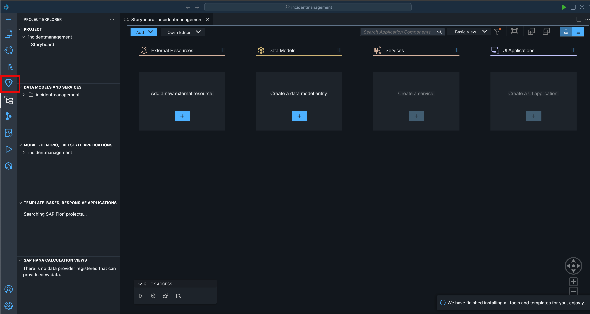
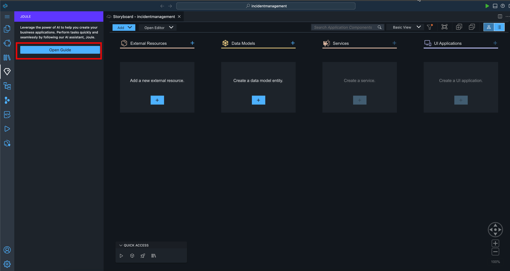
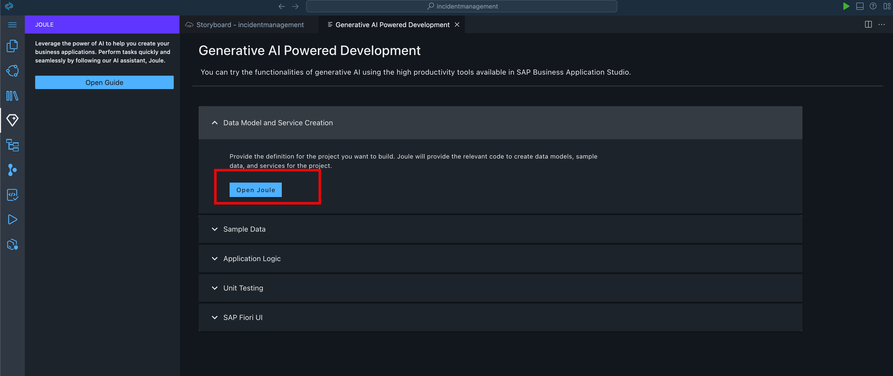
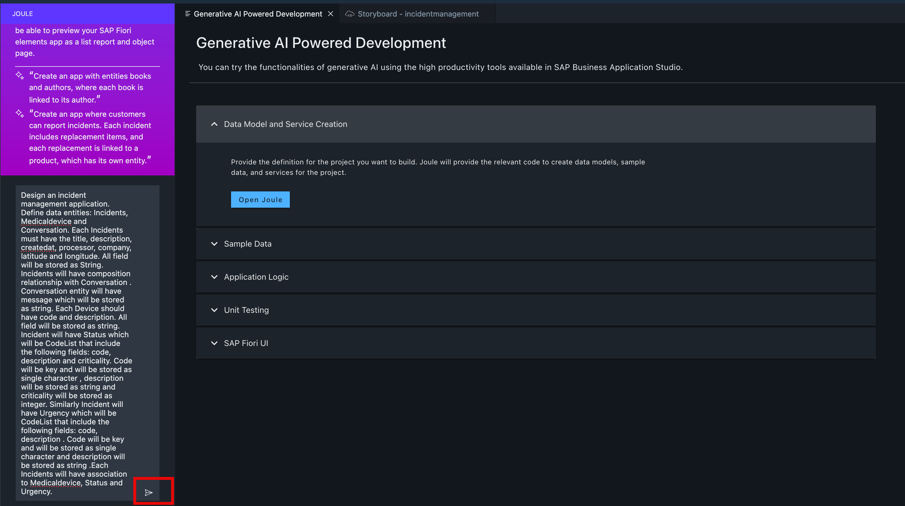
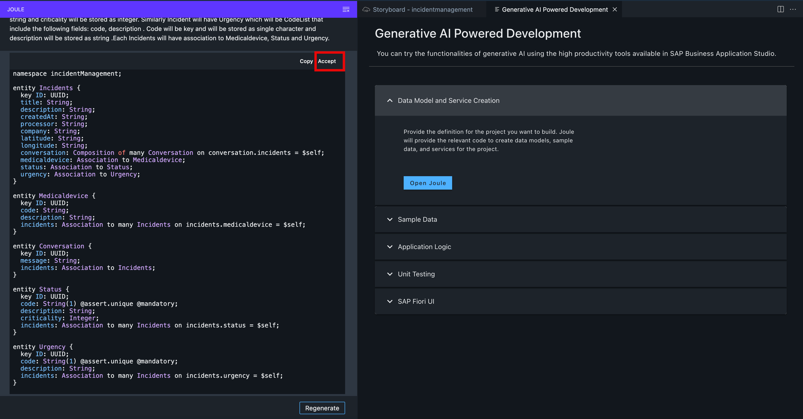
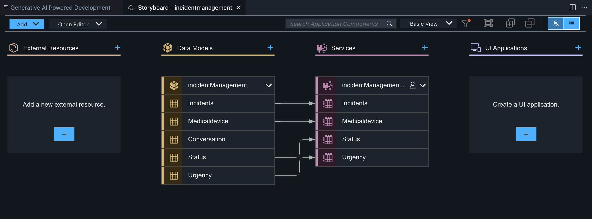

# Create Data Entities with Joule

Let’s create an application for a incident management application.

> Note: Joule is a Generative AI assistant that will create code for you. The code might be different every time you trigger the prompt, so the examples shown in the tutorial might not be exactly the same as what you see in your system.

1. In the SAP Build Code development environment, open the digital assistant, **Joule**, from the activity bar.


2. Click **Open Guide**.


3. Expand the **Data Model and Service Creation** section, and click **Open Joule**.


4. Copy the prompt below.

```
Design an incident management application. Define data entities: Incidents, Medicaldevice and Conversation. Each Incidents must have the title, description, createdat, processor, company, latitude and longitude. All field will be stored as String. Incidents will have composition relationship with Conversation . Conversation entity will have message which will be stored as string. Each Device should have code and description. All field will be stored as string. Incident will have Status which will be CodeList that include the following fields: code, description and criticality. Code will be key and will be stored as single character , description will be stored as string and criticality will be stored as integer. Similarly Incident will have Urgency which will be CodeList that include the following fields: code, description . Code will be key and will be stored as single character and description will be stored as string .Each Incidents will have association to Medicaldevice, Status and Urgency.
```

5. Paste the code in the text field, and click the arrow send arrow to send the prompt to Joule.


> The code is generated and is displayed below your prompt.

6. Accept the code.


7. Depending on the server, it may take a few moments for Joule to create the data models and services for you.
Once you accept the code, you will see the update on the right side in the Storyboard tab.


> **Tip**: To open the Storyboard, navigate to the **Project Explorer**, expand your project, and select **Storyboard**.

