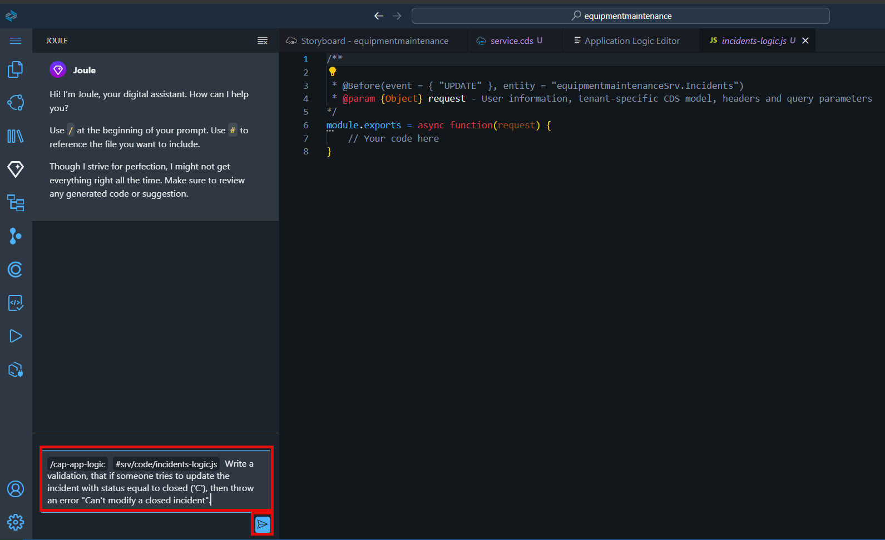

# Create Application Logic with Joule

You have already created the data model, service, and initial/sample data with Joule. Now, you want to create some logic for your service. The goal is to prevent the change of the incident with the status *Closed*.

1. In the **Storyboard** tab, choose the **Incidents** entity under **Services**, and then choose **Open in Graphical Modeler**.

  

2. Choose the **Incidents** entity by clicking the title. Then, choose **Add Logic**.

  

3. In the **Add Application Logic** dialog, leave the default values, and choose **Add**.

  

4. In the **Phase** section, choose **Before**. In the **Standard Event** section, choose **Update**. That means that this logic will be automatically executed before the OData update operation is requested.

  

5. Choose **Open Code Editor**, and then choose **Application Logic**. This will open Joule again to allow you to send a prompt to Joule to create the logic for you.

  

6. Copy the following prompt at the Joule's pane and then choose **Send**.

```
Write a validation, that if someone tries to update the incident with status equal to closed ('C'), then throw an error "Can't modify a closed incident".
```

  

7. Accept the code.

  

> **Note**: Joule typically generates different code each time for the same prompt. If yours is different to what you can see here, that’s fine as long as it does the same job. If there are no obvious errors, just keep working on the exercise. If you aren’t sure, you can ask Joule to try again by choosing **Regenerate**.

8. Go back to the **service.cds** tab.

9. Choose the **Incidents** entity by clicking the title. Then, choose **Add Logic**.

  

10. In the **Add Application Logic** dialog, in the **Name** field, enter **incidents-status-logic** and choose **Add**.

  

11. In the **Phase** section, choose **Before**. In the **Standard Event** section, choose **Create**. That means that this logic will be automatically executed before the OData create operation is requested.

  

12. Choose **Open Code Editor**, and then choose **Application Logic**. This will open Joule again to allow you to send a prompt to Joule to create the logic for you.

  

13. Copy the following prompt at the Joule's pane and then choose **Send**.

```
Always assign the Status code value to 'N' before creating a new incident.
```

  

14. Accept the Code.

  

## Next Step

[Adapt the Service Domain](../service/README.md)


