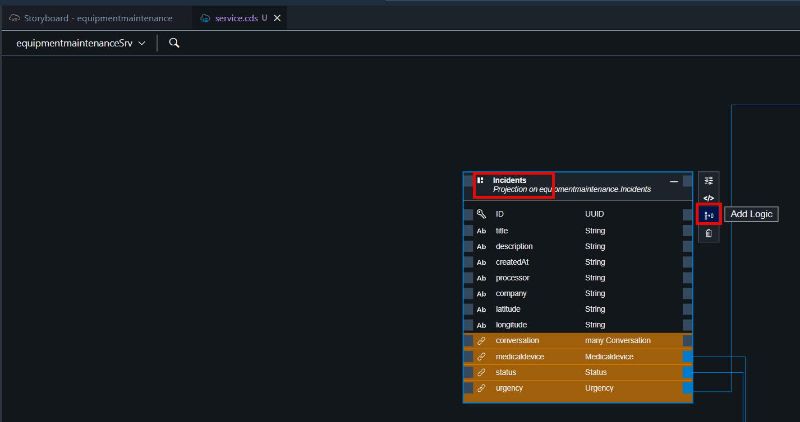
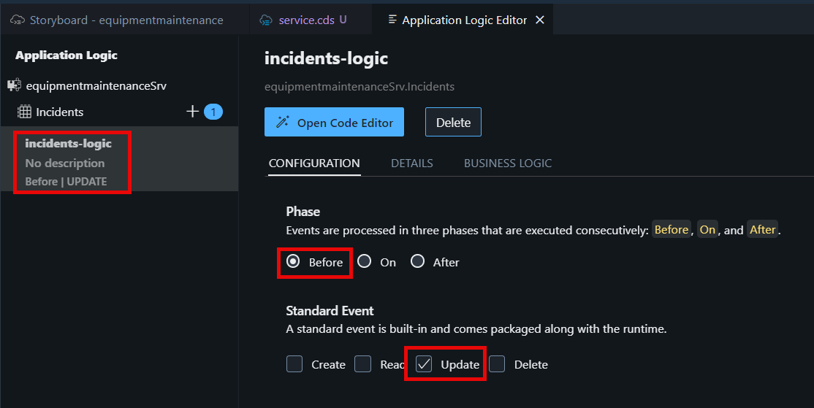
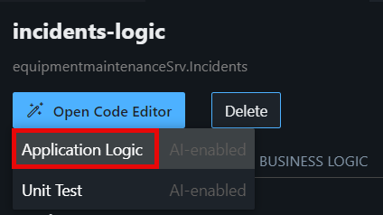
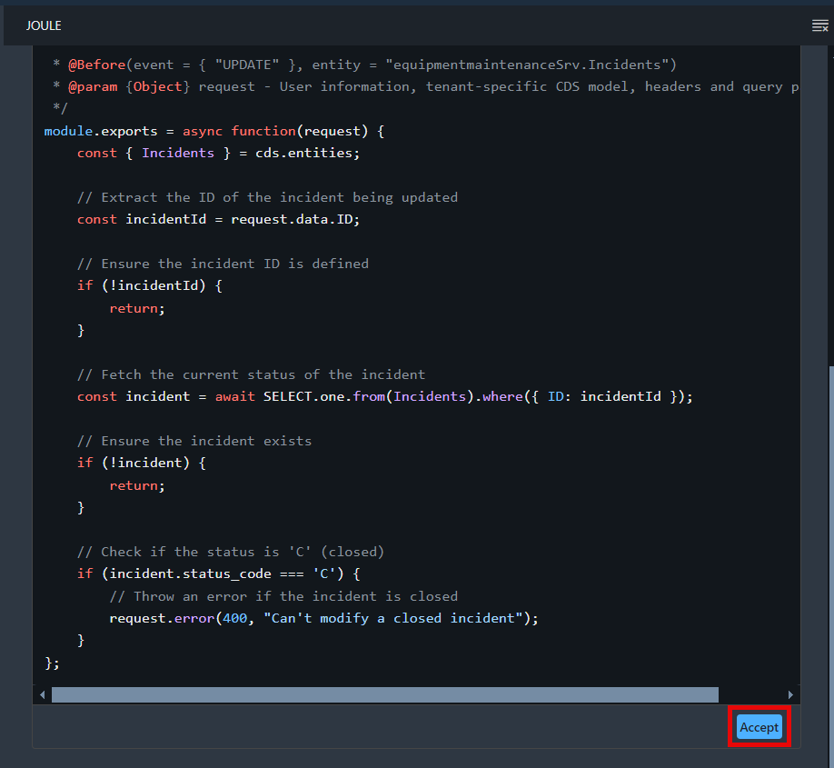
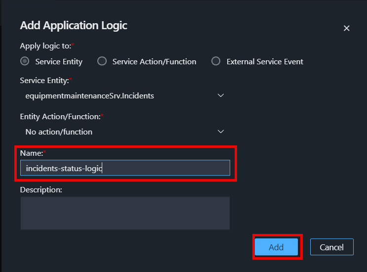
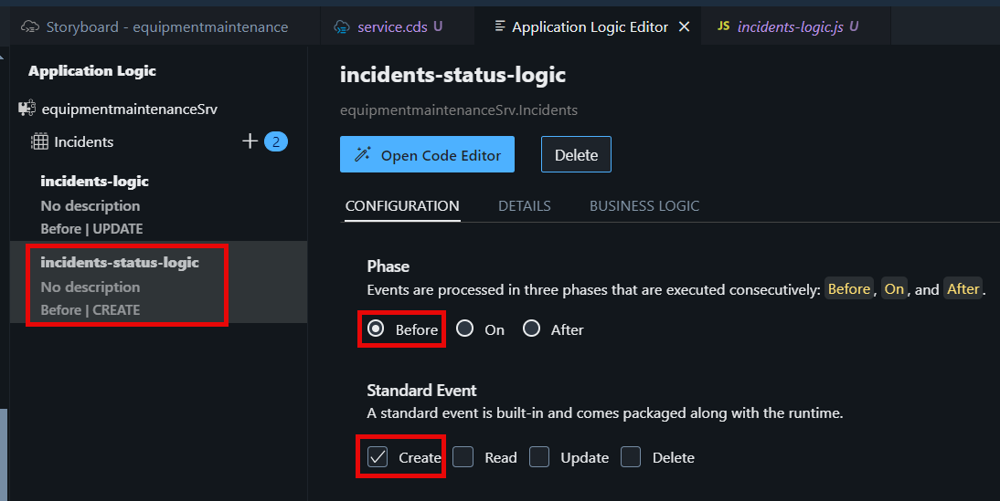
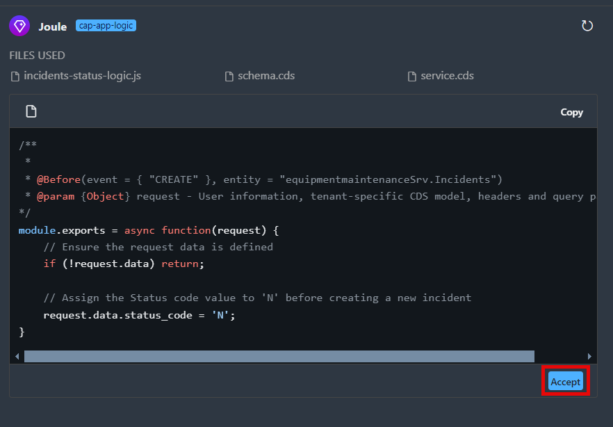

# Create Application Logic with Joule

We already have created the data model, service, and sample data with Joule. Now we want to create some logic for our service. We would like to calculate the bonus points automatically when a customer makes a purchase. Additionally, we want to provide logic for customers to redeem these bonus points.

1. In the Storyboard, click on the **Incidents** entity under **Services**, and select **Open in Graphical Modeler**.


2. Select the **Incidents** entity by clicking on the title. Then, click **Add Logic**.



3. In the **Add Application Logic** dialog, leave the default values, and click **Add**.


4. In the **Phase** section, choose **Before**. In the **Standard Event** section, choose **Update**. That means that this logic will be automatically executed before the OData update operation is requested.



5. Click **Open Code Editor**, and select **Application Logic**. This will open Joule again to allow us to send a prompt to Joule to create the logic for us.



6. Copy the prompt below:

```
Write a validation , that if someone tries to update the incident with status equal to closed ('C') , then throw an error "Can't modify a closed incident".
```

7. Choose **Generate**.


8. Accept the code.



> **Note**: Joule typically generates different code each time for the same prompt. If yours is different to what you can see here, that’s fine as long as it does the same job.If there are no obvious errors, just keep working on the exercise. If you aren’t sure, you can ask Joule to try again by clicking **Regenerate**

10. Go back to the **service.cds** tab.

11. Select the **Incidents** entity by clicking on the title. Then, click **Add Logic**.


12. In the **Add Application Logic** dialog, enter **Name** as **incidents-status-logic** and choose **Add**.



13. In the **Phase** section, choose **Before**. In the **Standard Event** section, choose **Create**. That means that this logic will be automatically executed before the OData create operation is requested.



14. Click **Open Code Editor**, and select **Application Logic**. This will open Joule again to allow us to send a prompt to Joule to create the logic for us.


15. Copy the prompt below:

```
Always assign the Status code value to 'N' before creating new incident
```

15. Accept the Code.



[Next: Adapt the Service Domain](../service/README.md)


