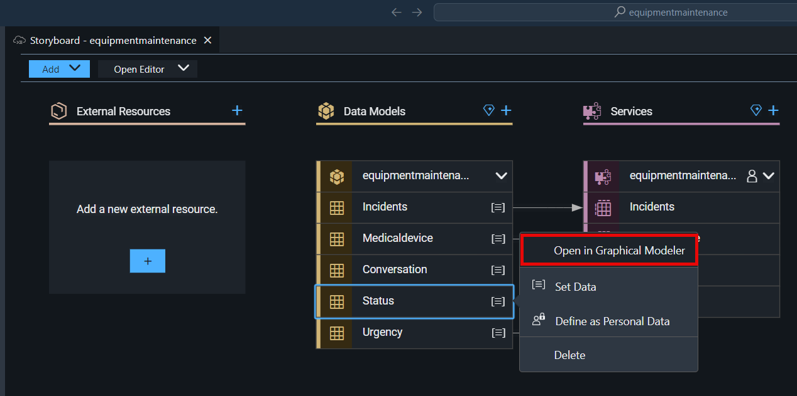
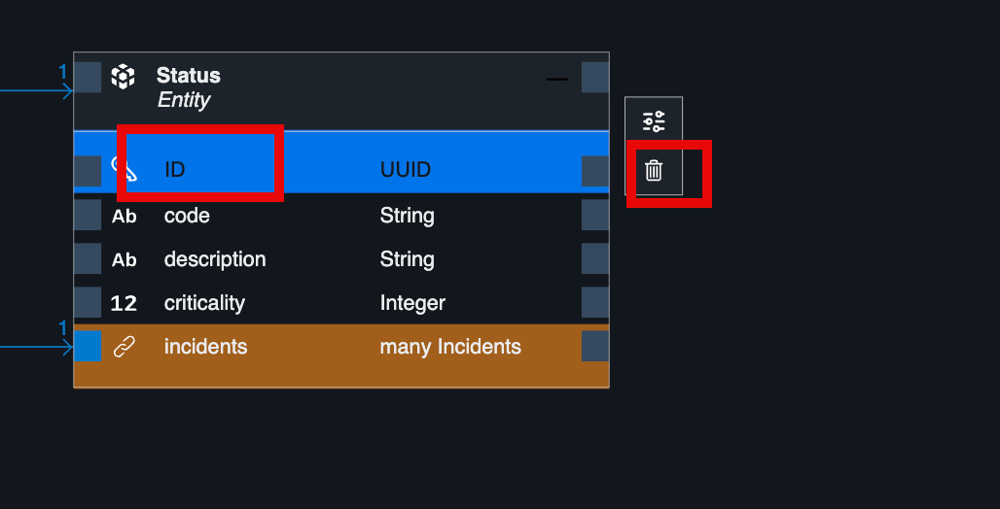
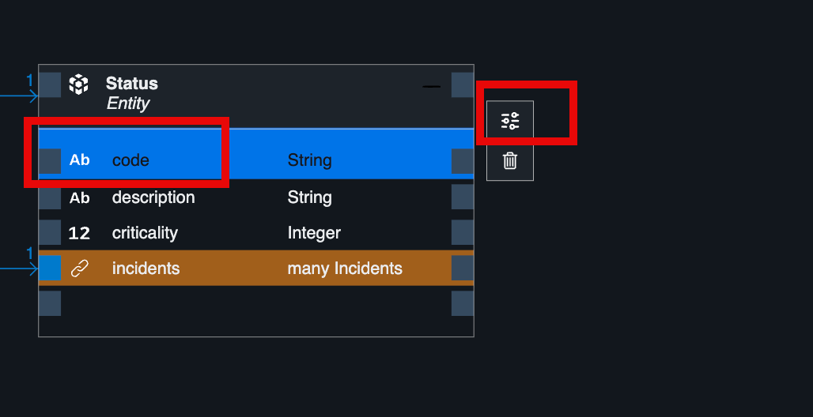
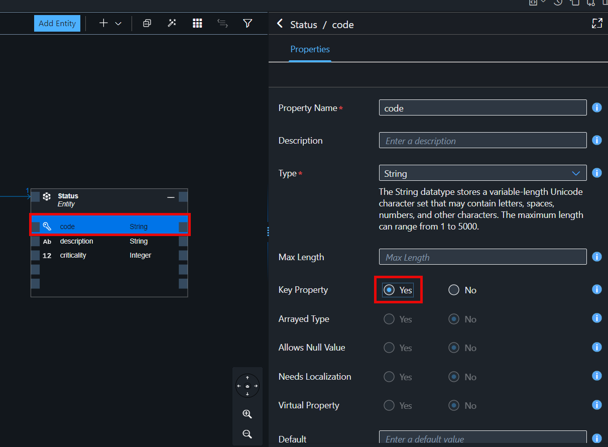
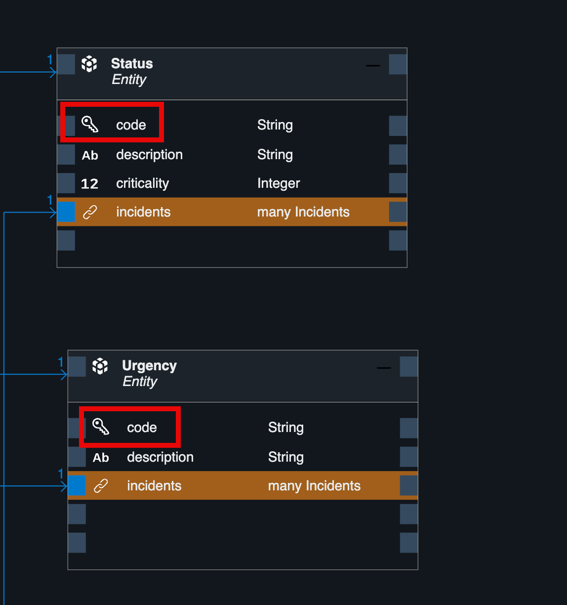

# Adapt Schema for Status and Urgency

In incident managment application, we will remove ID for both Status and Urgency and make code as key. We will adapt the schema using graphical modeler UI.

1. In the **Data Model**, choose **Status** and click.

2. Choose **Open in Graphical Modeler**.

3. Choose **ID** and then choose **Delete** icon to remove it from schema.

4. Choose **code** and then choose **Show Details** icon.

5. In the properties of **Key Properties**, choose **Yes**. this will make code as key field for Status schema.

Repeat the whole steps for **Urgency** model as well. The final look of schema for both data model are below.

