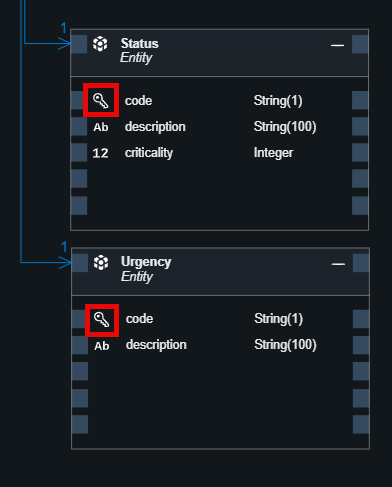

# Adapt Schema for Status and Urgency

In the Equipment Maintenance application, we will remove ID for both **Status** and **Urgency** and make **code** as key. We will adapt the schema using graphical modeler UI.

1. In the **Storyboard** tab of the application, under the **Data Models** choose **Status**.

2. Choose **Open in Graphical Modeler** in the popup menu.

  

3. Select the header of the entity and then choose **Show Details** icon.

  

4. In the right pane select the **Aspects** tab and then uncheck the **cuid** checkbox. It will remove the **ID** key field from the entity.

  

5. In the entity choose the **code** field and in the right pane choose **Yes** against the **Key Properties** option. This will make the code as key field for the **Status** schema.

  

6. Accept the changes with the **Save** button.

  

Repeat the steps for the **Urgency** model as well. The final look of schema for both data models should look like this:

  

## Next Step

[Enhance the Sample Data Using Joule](../sampledata/README.md)

