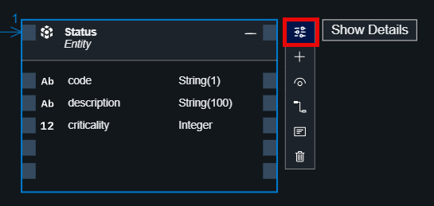
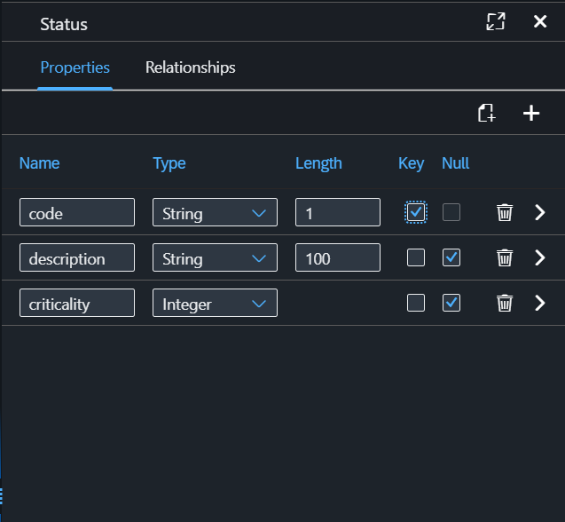

# Adapt Schema for Status and Urgency

In the Equipment Maintenance application, we will remove ID for both **Status** and **Urgency** and make **code** as key. We will adapt the schema using graphical modeler UI.

1. In the **Storyboard** tab of the application, under the **Data Models** choose **Status**.

2. Choose **Open in Graphical Modeler** in the popup menu.

  

3. Select the header of the entity and then choose **Include Aspects** icon.

  

4. Uncheck the **cuid** checkbox. It will remove the **ID** key field from the entity.

  

5. Select the header of the entity again and then choose **Show Details** icon.

  

6. On the right pane on the **Properties** tab check the **Key** checkbox for the **code** field. This will make the code as key field for the **Status** schema.

  

Repeat the steps for the **Urgency** entity as well. The final look of schema for both data entities should look like this:

  

## Next Step

[Enhance the Sample Data Using Joule](../sampledata/README.md)

