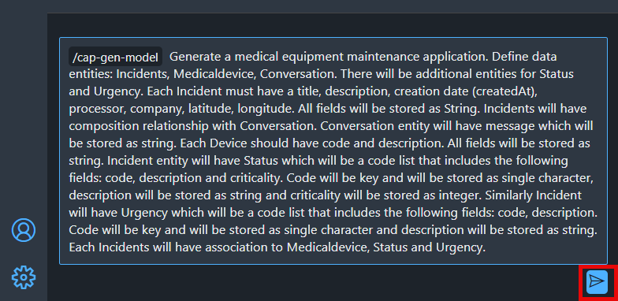
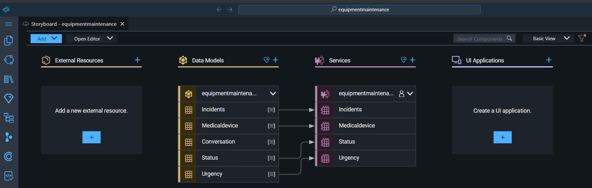

# Create Data Entities with Joule

Let’s create an application for the Equipment Maintenance application.

> Note: Joule is a Generative AI assistant that will help you to create the code. The code might be different every time you trigger the prompt, so the examples shown in the tutorial might not be exactly the same as what you see in your system.

1. In the SAP Business Application Studio, from the activity bar, open the digital assistant **Joule**.


2. In the Joule tab select the **/cap-gen-app Generate a CAP application** option.


3. Copy the prompt below. This prompt define basic data model for the future application. The more detailed it is, the more expected the outcome will be.

```
Generate a medical equipment maintenance application. Define data entities: Incidents, Medicaldevice, Conversation. There will be additional entities for Status and Urgency. Each Incident must have a title, description, creation date (createdAt), processor, company, latitude, longitude. All fields will be stored as String. Incidents will have composition relationship with Conversation. Conversation entity will have message which will be stored as string. Each Device should have code and description. All fields will be stored as string. Incident entity will have Status which will be a code list that includes the following fields: code, description and criticality. Code will be key and will be stored as single character, description will be stored as string and criticality will be stored as integer. Similarly Incident will have Urgency which will be a code list that includes the following fields: code, description. Code will be key and will be stored as single character and description will be stored as string. Each Incidents will have association to Medicaldevice, Status and Urgency. 
```

4. Paste the prompt in the text field, and click the send arrow to send the prompt to Joule.

  

> The code is generated and is displayed below your prompt.

5. Accept the code.

  

6. Depending on the server, it may take a few moments for Joule to create the data models and services for you.
Once you accept the code, you will see the update on the right side in the **Storyboard** tab.

  

> **Tip**: To open the **Storyboard** tab, navigate to the **Project Explorer**, expand your project, and select **Storyboard**.

## Next Step

[Adapt Schema for Status and Urgency](../changes/README.md)

