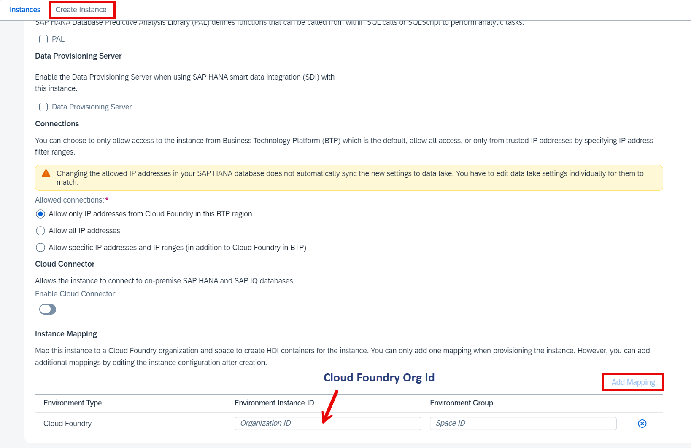
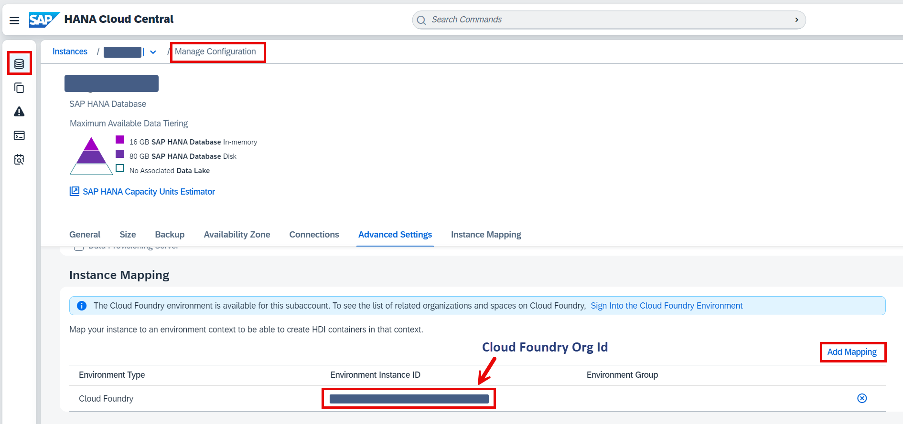
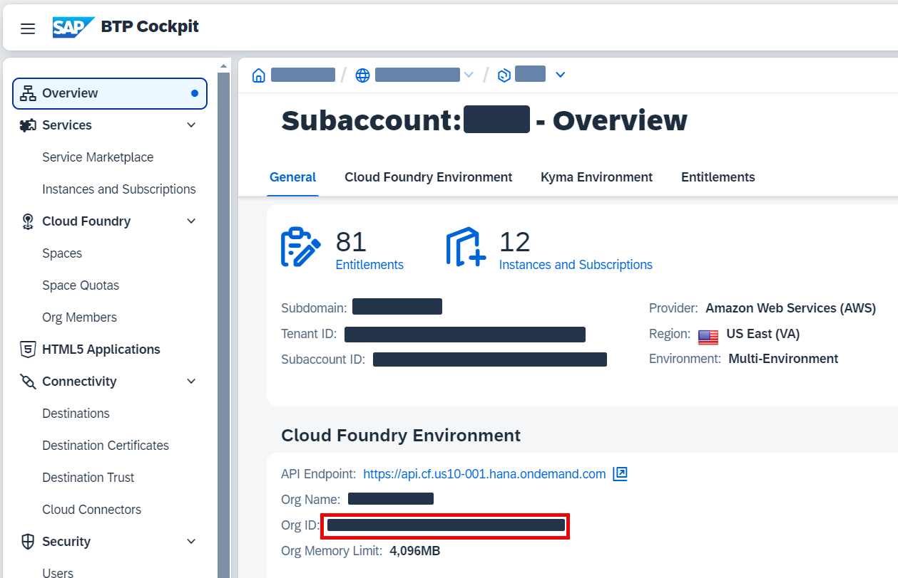
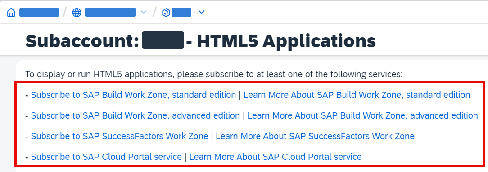

# Deploy the Application Using One-Click Deployment

The last step in SAP Build Code is to deploy the application in the SAP BTP, Cloud Foundry runtime. This includes the destinations that are created automatically and the OData services that can be consumed by other tools like SAP Build Apps as well.

## Prerequisites

To deploy the application in Cloud Foundry environment you should have a Cloud Foundry space in your subaccount. If you don't have it yet, follow this [documentation](https://help.sap.com/docs/btp/sap-business-technology-platform/creating-cloud-foundry-organization-and-space?version=Cloud).

Make sure that you have the following [entitlements](https://help.sap.com/docs/btp/sap-business-technology-platform/configure-entitlements-and-quotas-for-subaccounts):
- **SAP HANA Cloud** - `hana` and `tools` service plans
- **SAP HANA Schemas & HDI Containers** - `hdi-shared` plan
- **Cloud Foundry** - `MEMORIES` plan
- **Authorization and Trust Management Service** - `application` plan

You have to be subscribed for SAP HANA Cloud tools application. More details can be found in the [Start Using SAP HANA Cloud Trial in SAP BTP Cockpit](https://developers.sap.com/tutorials/hana-cloud-mission-trial-2.html) tutorial (trial only).

You should have an SAP HANA Cloud instance in your subaccount. See the [Provision an Instance of SAP HANA Cloud, SAP HANA Database](https://developers.sap.com/tutorials/hana-cloud-mission-trial-3.html) tutorial. 

Remember that your [database instance should be available](https://help.sap.com/docs/hana-cloud/sap-hana-cloud-administration-guide/sap-hana-instance-mapping) from your Cloud Foundry space. You can do it during DB instance creation like shown here:

  

Or later in configuration:

  

The Cloud Foundry Org Id can be found in the subaccount overview:

  

## 1. Deploy the Application

1. In the SAP Business Application Studio navigate to the **Activity Bar** and select **Task Explorer**. Then choose the **Play** icon next to the **Enable Discovery and Deploy equipmentmaintenance** option.

  

2. Check if the task has been launched in the terminal. You will notice that an MTA build has started. 

  

3. During the deployment, a new page will be opened to ask you to sign in to the SAP BTP, Cloud Foundry runtime. Enter your Cloud Foundry Endpoint (you can find it in your SAP BTP Subaccount overview). Then choose **Open a new browser page to generate your SSO passcode**.

  

4. Afterwards you will be asked to select your organization and development space.

5. After a successful deployment, you will find the link of the **deployed application service url** in the terminal.

  

## 2. Open the Deployed Web Application

1. Go to your subaccount and choose **HTML5 Applications**. You will see the Equipment Maintenance application. 

> Most probably you will need to subscribe to SAP Build Work Zone to access the applications. Follow the documentation provided if you don't see the applications list (for example subscribe to SAP Build Workzone, standard edition).
> 
> 
>
> You can skip this step now and go to the *exercise 3* on this page.

  

2. Choose your application to open it.

  

## 3. Check SAP BTP Destinations

> To access the Equipment Maintenance application from Build Apps you will need a destination. The destination should be generated automatically during the deployment.

1. Open your subaccount and choose **Connectivity** > **Destinations**.

2. Check that you have the destination **equipmentmaintenance-equipmentmaintenanceSrv** in the list.

  

