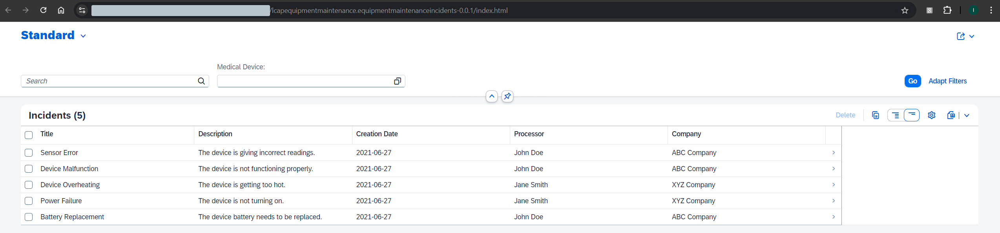

# Deploy the Application Using One Click Deployment

The last step in SAP Build Code is to deploy the application to Cloud Foundry. This includes also that destinations are created automatically that the ODATA services can be consumed also by other tools like SAP Build Apps.

## Prerequisites

You should have a HANA Cloud instance in your subaccount. Please follow [this tutorial](https://developers.sap.com/tutorials/btp-app-hana-cloud-setup.html#3b20e31c-e9eb-44f7-98ed-ceabfd9e586e) if you don't have one yet.

## 1. Deploy the Application.

1. For the deployment go to **Task Explorer** .

2. click on the Play icon next to **Enable Discovery and Deploy option**.

3. Check if the task has launched in the terminal. You will notice that MTA build started. 

4. During the deployment a new page will be opened to to sign into CloudFoundry. Click on Open a new browser page to generate your SSO passcode.

5. After the successful deployment you will find the link of the **deployed application service url** in the terminal. copy the link to try it out!
> This url is very important as you have to configure the destination later to integrate CAP service with Build Apps.

## 2. Open the Deployed Web Application.

1. Goto subaccount and choose **HTML5 Applications**. You will see the incident application. 

2. click to open.

