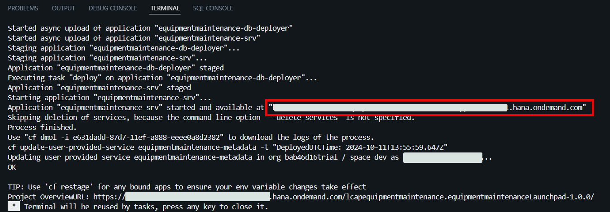

# Deploy the Application Using One-Click Deployment

The last step in SAP Build Code is to deploy the application in the SAP BTP, Cloud Foundry runtime. This includes the destinations that are created automatically and the OData services that can be consumed by other tools like SAP Build Apps as well.

## Prerequisites

You should have an SAP HANA Cloud instance in your subaccount. See the [Set Up the SAP HANA Cloud Service](https://developers.sap.com/tutorials/btp-app-hana-cloud-setup.html#3b20e31c-e9eb-44f7-98ed-ceabfd9e586e) tutorial.

## 1. Deploy the Application

1. In the SAP Business Application Studio navigate to the **Activity Bar** and select **Task Explorer**. Then choose the **Play** icon next to the **Enable Discovery and Deploy equipmentmaintenance** option.

  

2. Check if the task has been launched in the terminal. You will notice that an MTA build has started. 

  

3. During the deployment, a new page will be opened to ask you to sign in to the SAP BTP, Cloud Foundry runtime. Enter your Cloud Foundry Endpoint (you can find it in your SAP BTP Subaccount overview). Then choose **Open a new browser page to generate your SSO passcode**.

  

4. Afterwards you will be asked to select your organization and development space.

5. After a successful deployment, you will find the link of the **deployed application service url** in the terminal.

  

## 2. Open the Deployed Web Application

1. Go to your subaccount and choose **HTML5 Applications**. You will see the Equipment Maintenance application. 

> Most probably you will need to subscribe to SAP Build Work Zone to access the applications. Follow the documentation provided if you don't see the applications list.

  

2. Choose your application to open it.

  

## 3. Check SAP BTP Destinations

> To access the Equipment Maintenance application from Build Apps you will need a destination. The destination should be generated automatically during the deployment.

1. Open your subaccount and choose **Connectivity** > **Destinations**.

2. Check that you have the destination **equipmentmaintenance-equipmentmaintenanceSrv** in the list.

  

