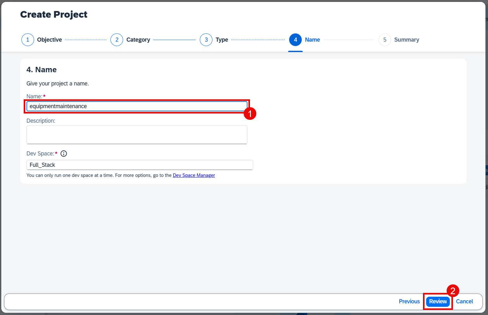

# Introduction into SAP Build Code

SAP Build Code is a turnkey development environment that combines runtime and design-time capabilities with built-in solutions for DevOps and Application Lifecycle Management.

## Benefits of SAP Build Code

- Achieve a clean core by developing side-by-side extensions with SAP Build Code
- Optimize developer efficiency with generative AI, productivity tools, and application lifecycle management
- Enables developers to build and extend powerful end-to-end business applications with programming language of choice
- Leverage interoperability between classic development and low-code development tools 

## Key capabilities of SAP Build Code

- Differentiate cloud solution with stable and future-proof foundation, solution becomes future proof and works with different editions of S/4HANA, and quality assurance options included
- Enable developers to code faster and smarter, code generation based on generative AI, Ease of Application Lifecycle Management 
- Application and extension development, Integrate with SAP and non-SAP systems
- Easy access for all types of developers with centralized Lobby, for Fusion Development

# Create a New Project Using SAP Build Code

1. Navigate to the SAP Build lobby.

2. Click Create to start the creation process.

3. Click the Build an Application tile.

4. Click the **SAP Build Code** tile to develop your project in SAP Business Application Studio, the SAP Build Code development environment, leveraging the capabilities of the services included in SAP Build Code.

5. Click the Full-Stack Application tile. 
 

6. In name field of your project, enter **incidentmanagement**.

7. Select the dev space where you want the project to reside.

8. Click **Create**.

> You can see the project being created in the Project table of the lobby.

9. After you see a message stating that the project has been created successfully, click the project to open it.

The project opens in SAP Business Application Studio, the SAP Build Code development environment.

[Next: Create Data Entities with Joule](../dataentity/README.md)

