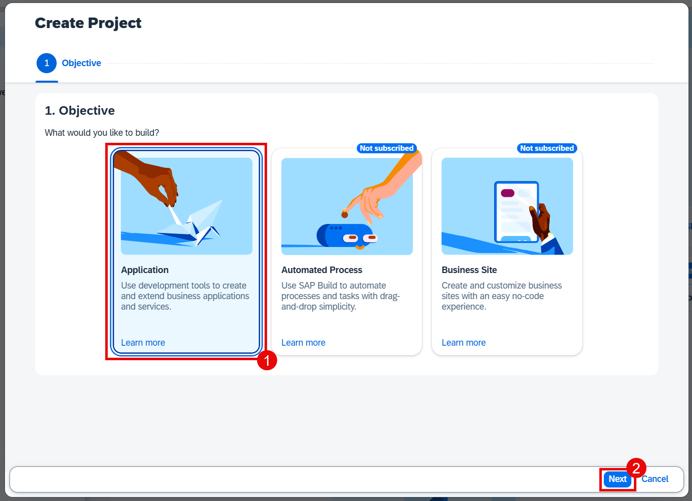
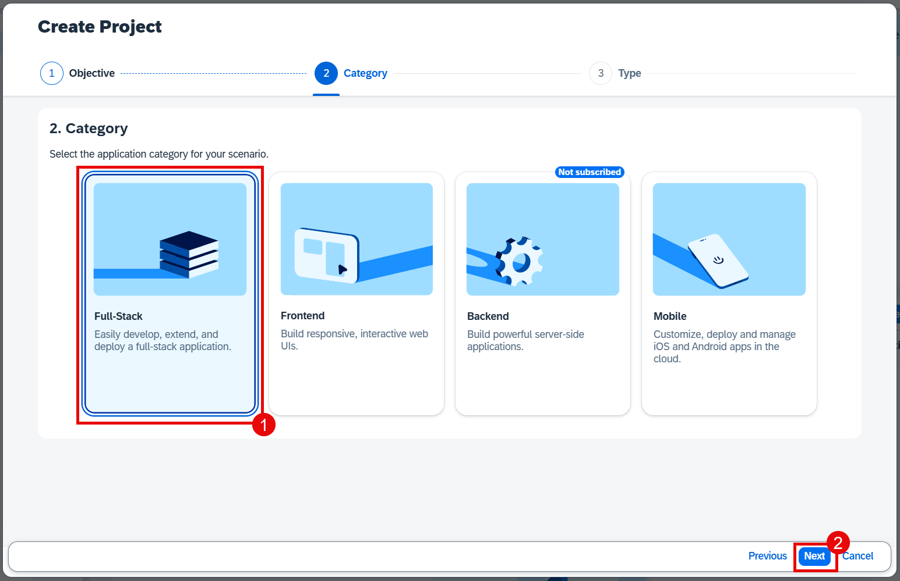

# Introduction to SAP Build Code

SAP Build Code is a turnkey development environment that combines runtime and design-time capabilities with built-in solutions for DevOps and application lifecycle management.

  

## Benefits of SAP Build Code

Thanks to SAP Build Code, you can: 

- Achieve a clean core by developing side-by-side extensions
- Optimize developer efficiency with generative AI, productivity tools, and application lifecycle management
- Build and extend powerful end-to-end business applications with programming language of choice
- Leverage interoperability between classic development and low-code development tools 

## Key Capabilities of SAP Build Code

- Enable developers to code faster and smarter, generate code from natural language descriptions using generative AI 
- Build extension applications, and integrate them with SAP and non-SAP systems
- Use the centralized Lobby for fusion development

# Create a New Project Using SAP Build Code

1. Navigate to the SAP Build Lobby and choose **Create**.

  

2. Choose the **Build an Application** tile.

  

3. Choose the **SAP Build Code** tile to develop your project in SAP Business Application Studio, the SAP Build Code development environment, leveraging the capabilities of the services included in SAP Build Code.

  

4. Choose the **Full-Stack Application** tile. 

   

5. In **Project Name** field, enter **equipmentmaintenance**.

6. Select the dev space where you want the project to reside.

7. Choose **Create**.

  

> You can see the project being created in the **All Projects** table of the lobby.

8. After you see a message stating that the project has been created successfully, choose the project to open it.

  

The project opens in SAP Business Application Studio, the SAP Build Code development environment.

## Next Step

[Create Data Entities with Joule](../dataentity/README.md)

