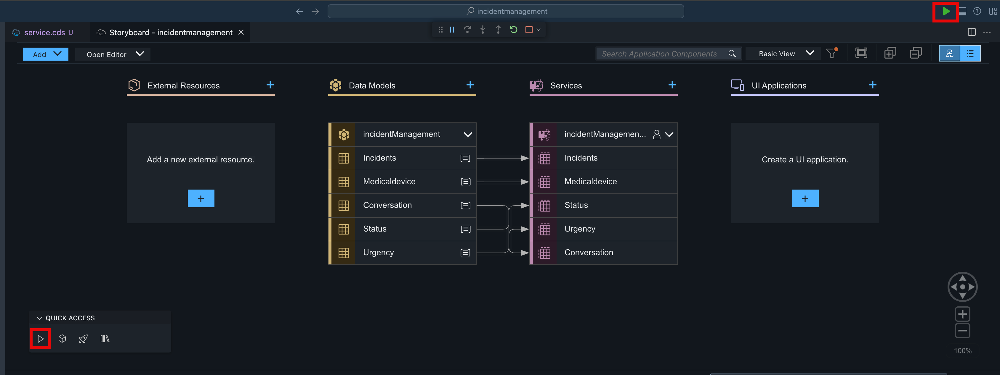
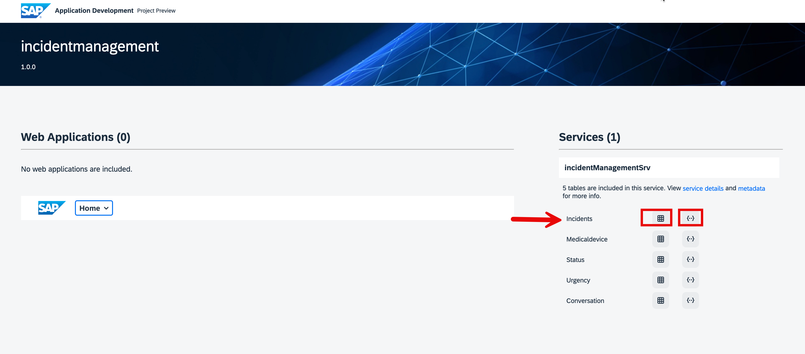
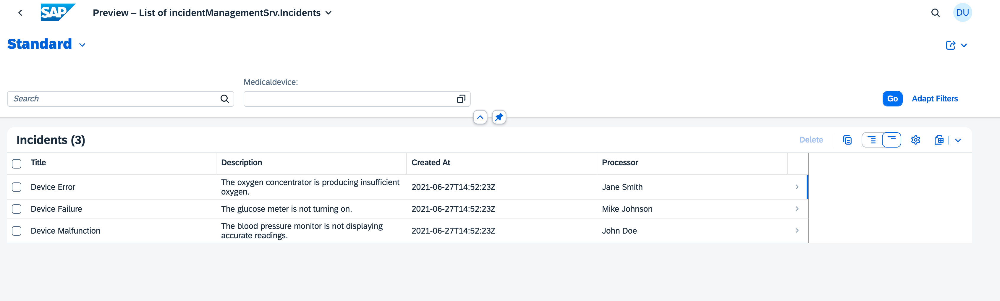
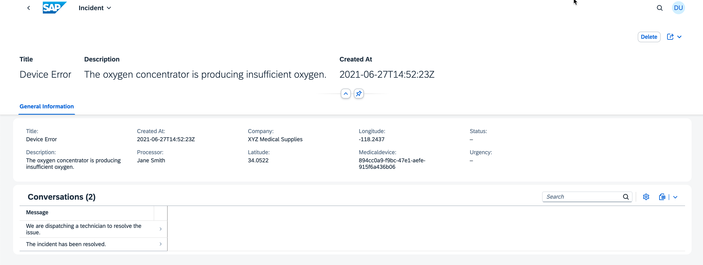
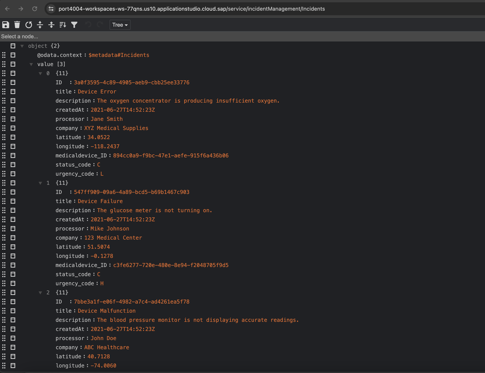
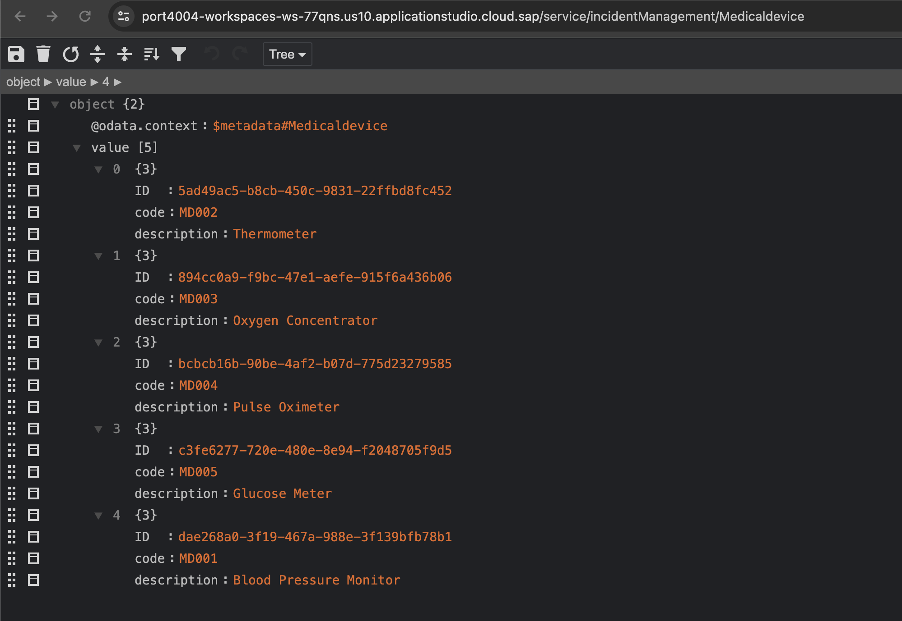

# Test Service locally

Before deploying, it is alwayds better to do the local testing. This will help us to make sure that service is running perfectly.

1. **Run** the application from the icon.

2. You will find that server will start running at **http://localhost:4004**. Open the link and you will find the service running.

3. Choose Preview **incidents**  and then choose **View as table** service. You will see the UI.

> Please note that we are not adding UI model in this scenario as our focus is on building service. Frontend will be handle by Build Apps.
4. Choose Preview **incidents**  and then choose **View as code** service. You will see the UI.

5. SImilarly you can choose **Medicaldevice** and you will find all the equipment.

[Next: Deploy the application using Single-Click Deployment](../deploy/README.md)