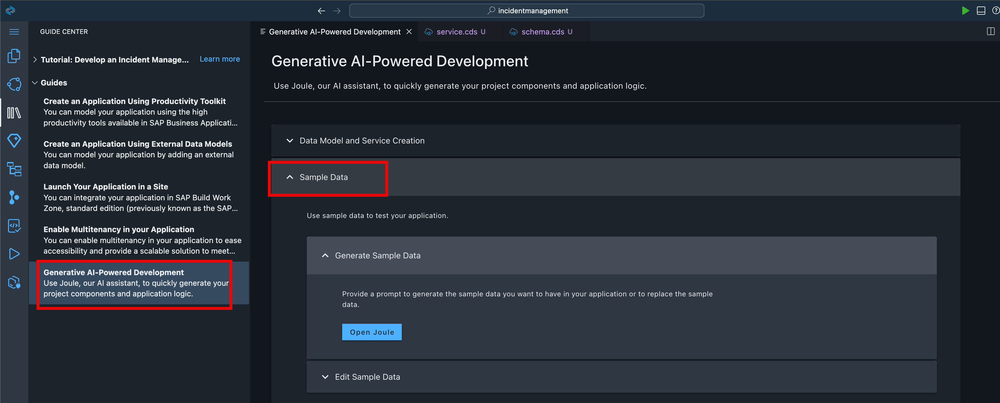
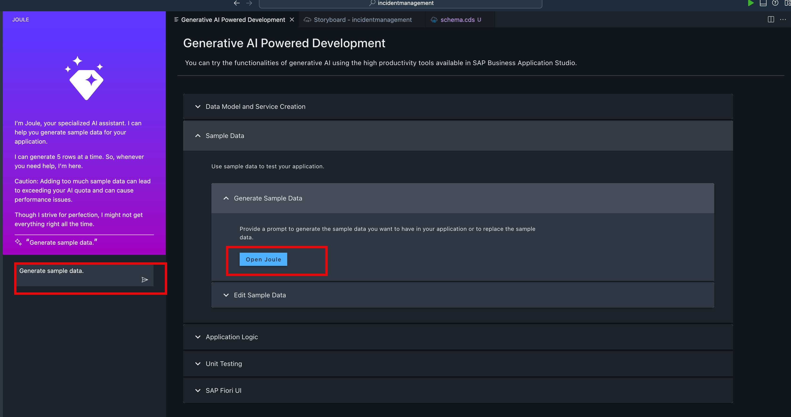
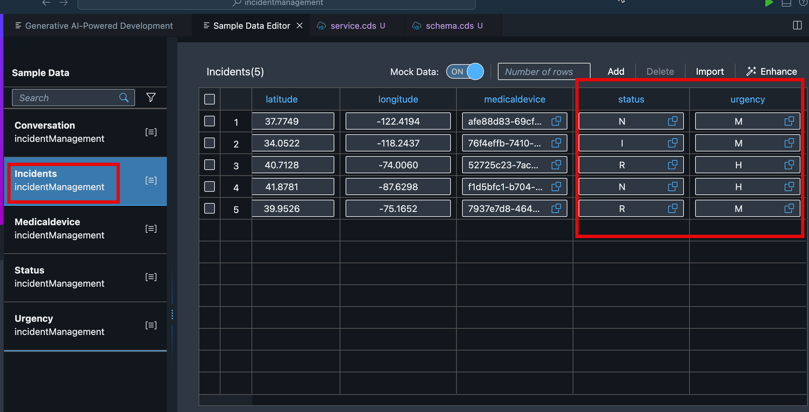

# Enhance the Sample Data Using Joule

Joule created the CAP data model and the OData service. In addition, Joule created some sample data by default. We will now ask Joule to provide additional sample data.

1. Choose **Guide** -> **Sample Data** -> **Generate Sample Data**.

2. Choose **Open Joule**. You will find Joule open wih default prompt **Generate sample data**. Choose **generate**.

3. Accept the default prompt **generated sample data**.This will add the data in all entity.

4. Open **Medicaldevice** entity. You will notice how Ai powered joule return perfect medical equipment.

5. Modify the Status **Code** and **Description** by refering below screenshot.

6. Modify the Urgency **Code** and **Description** by refering below screenshot.

7. Modify the Incident Status and Urgency **Code** by refering below screenshot.

[Next: Create Application Logic with Joule](../applogic/README.md)