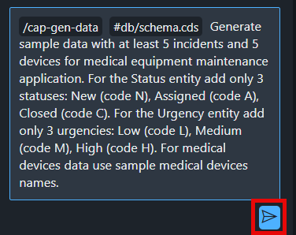

# Enhance the Sample Data Using Joule

Joule created the CAP data model and the OData service. Now, ask Joule to provide additional sample data.

1. Choose **Joule** > **/cap-gen-data Generate CAP sample data**.

  

2. Enter the following prompt and then choose **Send** icon.

```
Generate sample data with at least 5 incidents and 5 devices for medical equipment maintenance application. For the Status entity add only 3 statuses: New (code N), Assigned (code A), Closed (code C). For the Urgency entity add only 3 urgencies: Low (code L), Medium (code M), High (code H). For medical devices data use sample medical devices names.
```

  

3. Accept the generated data. This will add the data in all entities.

  

4. Choose **Open Data Editor** button.

  

4. Open the **Medicaldevice** entity. You will notice how AI-powered Joule returns a perfect medical equipment.

  

5. Check the Status **Code** and **Description** by refering the following screenshot. Change if necessary.

  

6. Check the Urgency **Code** and **Description** by refering the following screenshot. Change if necessary.

  

7. The sample data will never be used during the deployment. In the production scenarios you should use initial data if necessary. In this tutorial we can move the generated sample data to the inital data for demonstration purposes. Open **Explorer** and move all 5 CSV files from the *test/data* folder to the *db/data* folder.

  

## Next Step

[Create Application Logic with Joule](../applogic/README.md)
