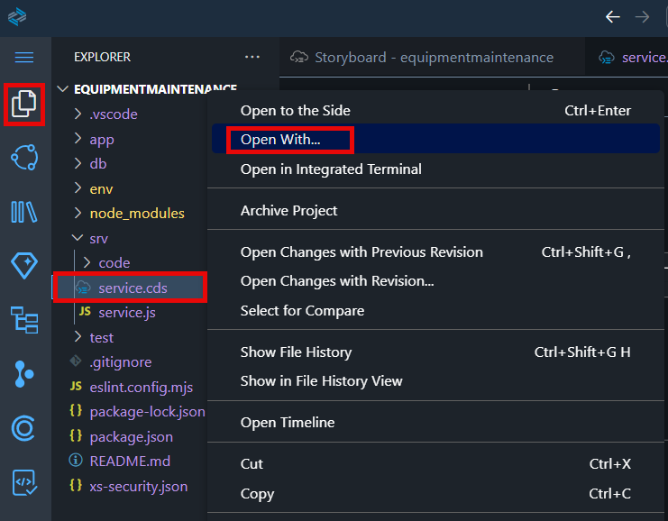
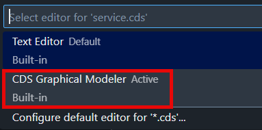
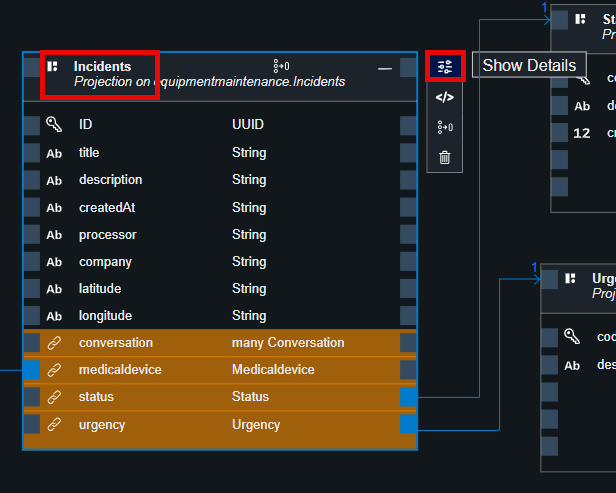

# Adapt the Service Domain 

## Remove Draft Handling for **Incident**, **Medicaldevice**, **Status**, and **Urgency** 

The Equipment Maintenance sample application serves as a read-mode application. Uncomment or remove **@odata.draft.enabled** from all exposed entities.

1. Choose **Explorer** icon in the main menu bar. Right click on the **service.cds** file, then choose **Open with**.

    

2. In the popup menu choose **CDS Graphic Modeler** option.

    

3. The current services model looks like on the screenshot below. You can pan and scale the view, and move entities to display the schema in the more convinient way.

    

4. Choose **Incidents** and then choose **Show Details** icon.

    

5. On the right pane choose **Settings** tab and disable **Draft Editing**.

    

6. Repeat the same steps for **Medicaldevice**, **Status** and **Urgency** entities.

## Add a Projection of **Conversation** to the Incident Service

1. Choose **service.cds** file and make sure that it's open in graphical modeler.

    

2. Choose **Add Entity**. 

    

3. Drop the empty projection somewhere in the editor.

    

4. In the **Projection** setting:
    1. In the dropdown, choose **equipmentmaintenance.Conversation**.
    2. Uncheck **Enable draft editing**.
    3. Choose **Save**.

    

5. This will project a **Conversation** entity and establish a composition relationship with incidents.

    

## Next Step

[Add UI to the Equipment Maintenance Application](../ui/README.md)

