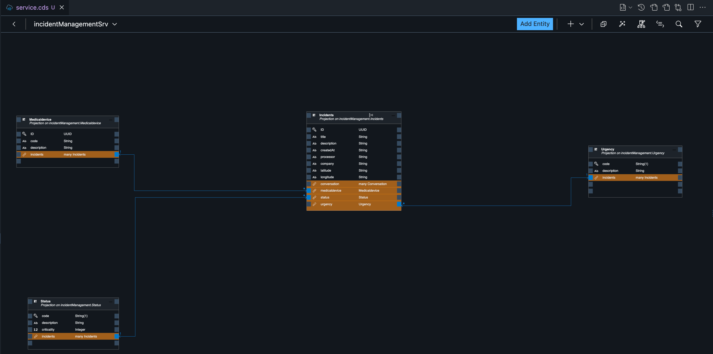
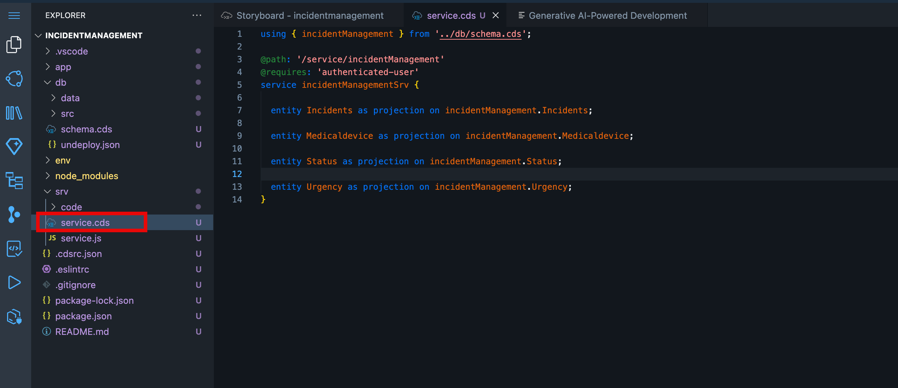

# Adapt the Service Domain 

1. Choose **Explorer** icon.



2. from your project , Open **srv** and then open **service.cds**.

3. As incident management application will serve as a read mode app, uncomment ot remove **@odata.draft.enabled** from all exposed entity. 



4. Expose conversation entity by adding below code .

```cs
entity Conversation as projection on incidentManagement.Conversation;
```


