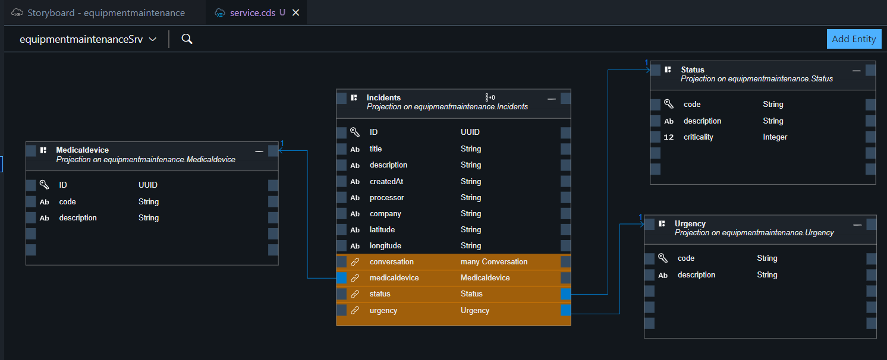
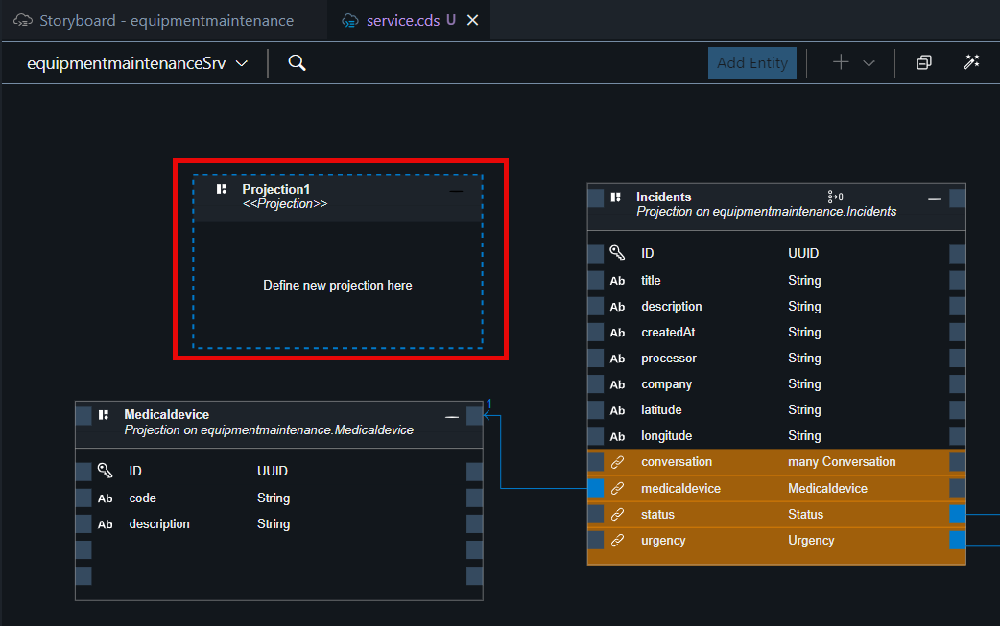
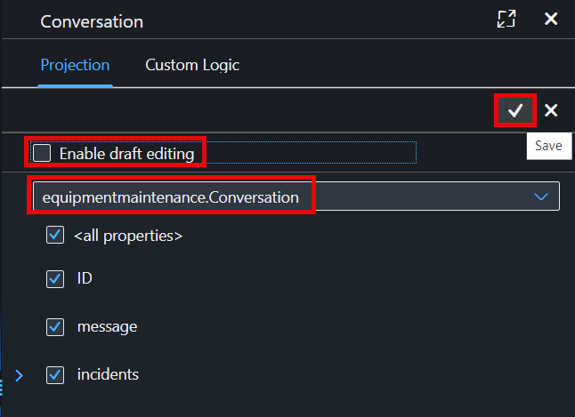

# Adapt the Service Domain 

## Remove Draft Handling for **Incident**, **Medicaldevice**, **Status** and **Urgency** .

Incident management application will serve as a read mode app, uncomment or remove **@odata.draft.enabled** from all exposed entity.

1. Choose **service.cds** file and make sure that it's open in graphical modeller   .

2. Click on **Incidents** . The popup will come showing the details.
    1. In the **Incidents** popup, choose **Settings**.
    2. Disable **Draft Editing**.

    

2. Click on **Medicaldevice** . The popup will come showing the details.
    1. In the **Medicaldevice** popup, choose **Settings**.
    2. Disable **Draft Editing**.

    

2. Click on **Status** . The popup will come showing the details.
    1. In the **Status** popup, choose **Settings**.
    2. Disable **Draft Editing**.

    

2. Click on **Urgency** . The popup will come showing the details.
    1. In the **Urgency** popup, choose **Settings**.
    2. Disable **Draft Editing**.

    

## Add a Projection of **Conversation** to Incident Service.

1. Choose **service.cds** file and make sure that it's open in graphical modeller.

2. Choose **Add Entity**. 

3. Drop the empty project in the editor.

4. In the Projection setting.
    1. Disable or Uncheck **Enable Draft Editing**.
    2. In the dropdown, choose **incidentManagement.Conversation**.
    3. Choose **ok**.

    

This will project a conversation entity and establish a composition relationship with incidents.

[Next: Add UI to the Incident Management Application](../ui/README.md)

