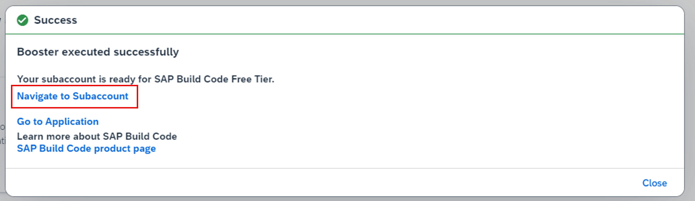
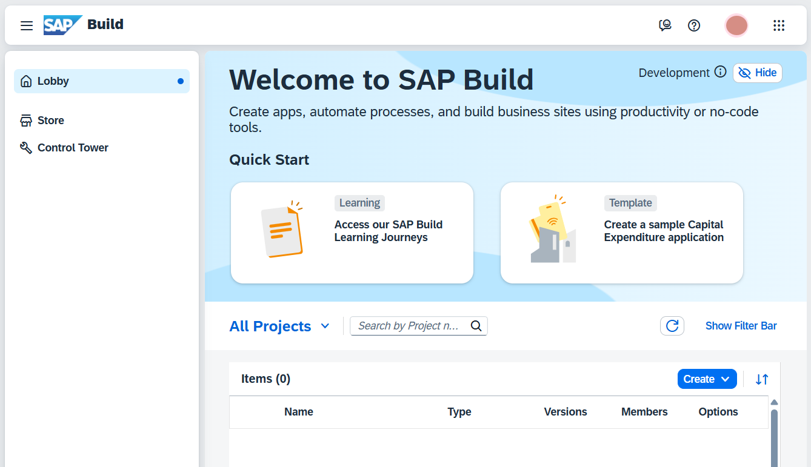

# Setup SAP Build Code in SAP BTP

## Prerequisites

You have a trial or an enterprise SAP BTP global account. In case of the trial account see [Trial Lifecycle](https://help.sap.com/docs/btp/sap-business-technology-platform/trial-accounts-and-free-tier#trial-lifecycle).

## Run the SAP Build Code Booster

1. In the SAP BTP cockpit, access your global account. It can be either trial or enterprise account.

2. In the navigation pane, choose **Boosters** and search for **SAP Build Code**.

  

> There is a booster for each of the SAP Build Code service plans. Make sure to select the one relevant to the plan you want to use.

3. Open the booster and go through the overview, components, and additional resources. Then, choose **Start**.

  

> The booster checks for required authorizations, compatible providers, and regions, as prerequisites for a successful execution.

4. After running the booster, in the popup window, choose **Navigate to Subaccount**.

  

## Verify Subscription

1. In SAP BTP Cockpit, in the navigation pane, select **Services > Instances and Subscriptions**.

  

2. Make sure you are subscribed to SAP Business Application Studio and SAP Build Code.

  

3. Choose **SAP Build Code**. The SAP Build lobby opens.

  

## Next Step

[Introduction to SAP Build Code](../intro/README.md)
