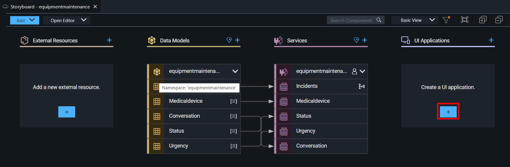
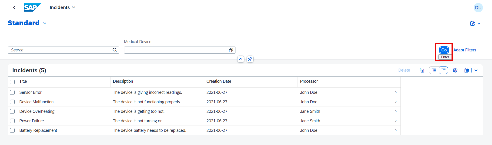
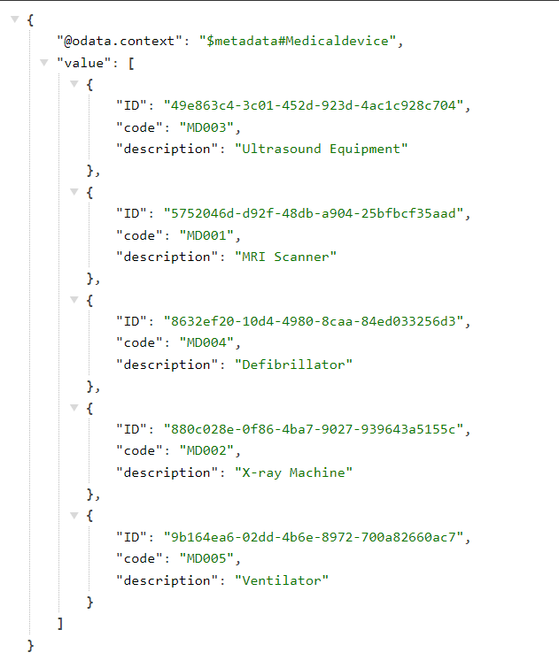

# Add UI to the Equipment Maintenance Application

To display and test the content you have created for the Equipment Maintenance application, you need to create an SAP Fiori elements UI.

1. Go to back to the **Storyboard** tab and add a UI to the Equipment Maintenance application.

  

2. Start with the user interface for the **Incidents** application. In the **Display Name** field, enter **Incidents** and in the **Description** field, enter **Equipment Maintenance**. Then, choose **Next**.

  

3. You use the Equipment Maintenance application in a browser, that's why choose **Template-Based Responsive Application** as the UI Application type, and choose **Next**.

  

4. Choose **List Report Page** as the UI application template, and then choose **Next**.

  

5. Choose **Incidents** as the Main entity, and then choose **Finish**. The page will be created now.

  

6. To preview your application, once the files have been generated, go to the upper-right corner, and choose **Preview (Run and Debug)**.

  

7. The application’s preview is displayed.

  

8. Choose the **Incidents** Web application and you will see the list view.

  

9. Choose any incident and view the object page.

  

10. You can also see the service for all the entities as well. This is the snapshot for **Medicaldevice** service:

  

## Next Step

[Deploy the Application Using One-Click Deployment](../deploy/README.md)

