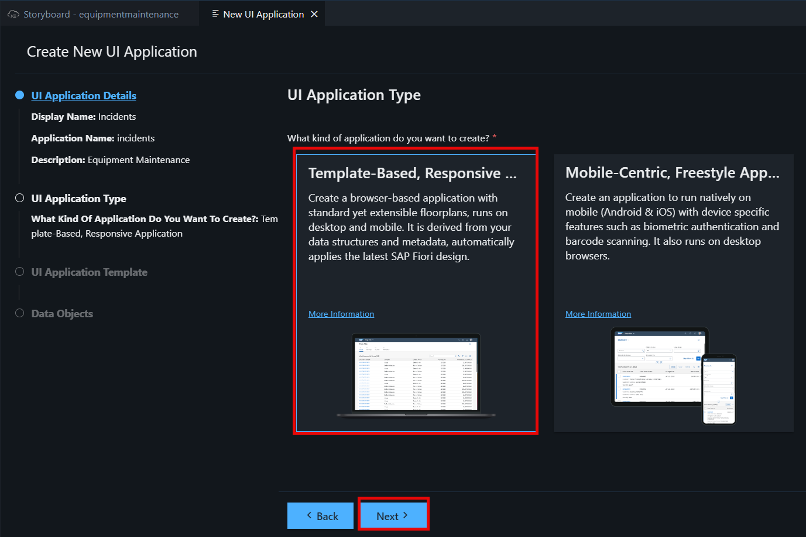
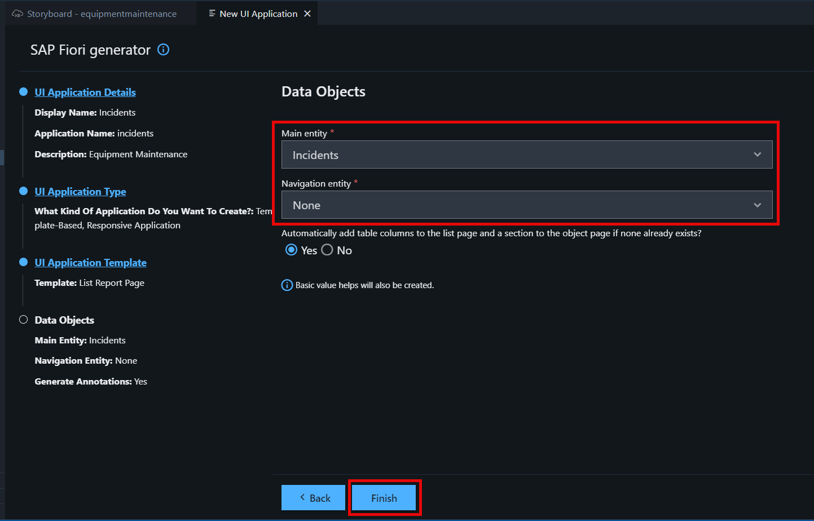
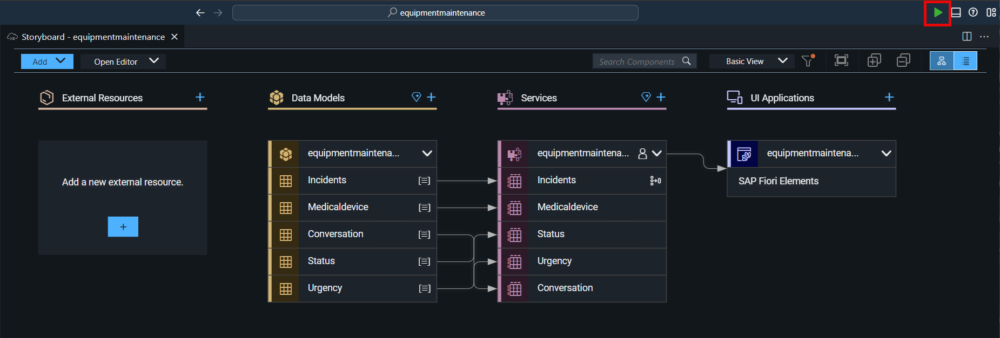

# Add UI to the Incident Management Application

To display and test the content we created for the incident management program, we need to create an SAP Fiori elements UI.

1. Go to back to the **Storyboard** and add a UI application.

2. We will start with the user interface for the **Incidents** data entity.Set the Display name to **Incidents** and the Description to **Incident Management**, and then choose **Next**.

3. We are using the browser, so we will select **Template-Based Responsive Application** as the UI Application type, and click **Next**.

4. Select **List Report Page** as the UI application template, and click **Next**.

5. Select **Incidents** as the Main entity, and click **Finish**. The page will be created now.

6. To preview your application, once the files have been generated, go to the upper-right corner, and **click preview (Run and Debug)**.

7. The application’s preview is displayed.

8. Choose Web application **Incidents** and you will see the list view.

9. Choose any incident and view the object page.

10. You can also see the service for all entity as well. Below is the snapshot for **Medicaldevic** service.

[Next: Deploy the Application Using One Click Deployment](../deploy/README.md)

