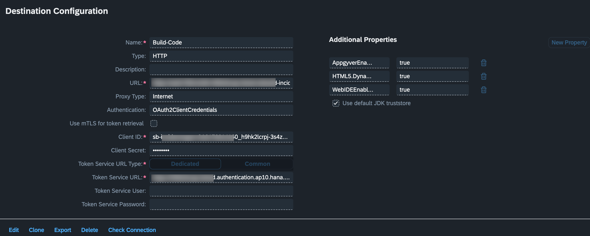

### Create CAP Destination on SAP BTP

1. Login to your SAP BTP subaccount where you are going to develop application using **SAP Build Apps**.
2. Create a new Destination
   1. Open the Connectivity entry and select Destination
   2. Choose **Create Destination**

3. Setup Destination - enter the following values

    * **Name**:  Build-Code  --> this destination is later used by SAP Build Apps to consume data from CAP application.
    * **Type**:  select HTTP
    * **URL**:  URL of the application with service . example: https://***.cfapps.ap10.hana.ondemand.com/service/incidentManagement
    > Please review the path by opening the base url of your service in the browser.
    * **Proxy Type**: Internet
    * **Authentication**: OAuth2ClientCredentials
    * **Client ID:**: You can find client id from xsuaa service instance credential under **uaa**
    * **Client Secret**: You can find client secret from xsuaa service instance credential under **uaa**
    * **Token Service URL**: <url from xsuaa service instance credential under **uaa**>/oauth/token
    >make sure to add **/oauth/token** after url.
    * Under Additional Properties choose `New Property`
    * Enter **AppgyverEnabled**   **true**
    * Enter **HTML5.DynamicDestination**  **true**
    * Enter **WebIDEEnabled**  **true**

   

4. Choose **Save** and then select **Check Connection**.

*[See also destination management on SAP BTP](https://help.sap.com/viewer/cca91383641e40ffbe03bdc78f00f681/Cloud/en-US/84e45e071c7646c88027fffc6a7bb787.html)*

## Summary

We have established a secure connection between the CAP Srvice and the SAP BTP subaccount and we're now ready for building web application using SAP Build Apps.
