# Add Behavior Artifacts

## Introduction 

To specify the business object's behavior, the behavior definition as the corresponding development object is used. A business object behavior definition (behavior definition for short) is an ABAP Repository object that describes the behavior of a business object in the context of the ABAP RESTful application programming model. A behavior specifies the operations and field properties of an individual business object in the ABAP RESTful programming model.

You will use a managed implementation type of the RAP object. It addresses use cases where all essential parts of an application must be developed from scratch. However, these new applications can highly benefit from out-of-the-box support for transactional processing. Standard operations (create, update, delete) must only be specified in the behavior definition to obtain a ready-to-run business object. The technical implementation aspects are taken over by the managed RAP business object provider. The interaction phase and the save sequence are implemented generically. The corresponding transactional engine manages the entire lifecycle of your business object and covers all aspects of your business application development. As an application developer, you only need to focus on business logic that is implemented using actions, validations and determinations, and user interaction. 

The additional business logic will include two methods:

- The first one is the **setGEOPoint** RAP determination which will convert the coordinates to the internal representation on any modify operation.

- The second one is the **getInRadius** OData function which will return the partner list within a radius around some point specified with a latitude and a longitude. For this RAP function, you have to define dictionary artifacts (CDS abstract entities) used as input and output parameters. 

Finally, you have to create a projection for the behavior definition. The projection can restrict the existing behavior, but you will leave it as it is.

## 1. Create Entity for RAP Function Input Parameters

1. Right-click your **ZGEO** package name.

2. Choose **New** &rarr; **Other ABAP Repository Object** in the context menu.

  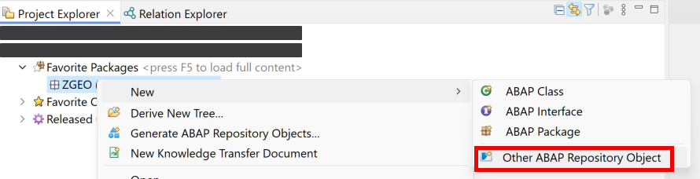 

3. Choose **Data Definition** in the **Core Data Services** folder and then choose **Next**.

  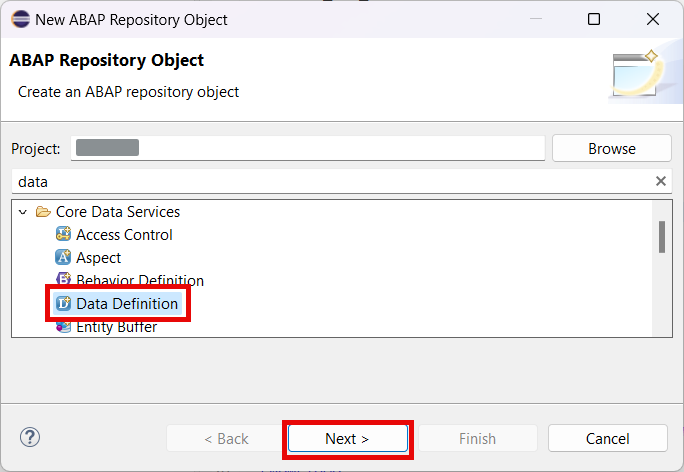

4. Enter the following data and then choose **Next**:

  - **ZD_GEO_PARAMETERS** in the **Name** field
  - **Parameters for function Get-in-Radius** in the **Description** field

  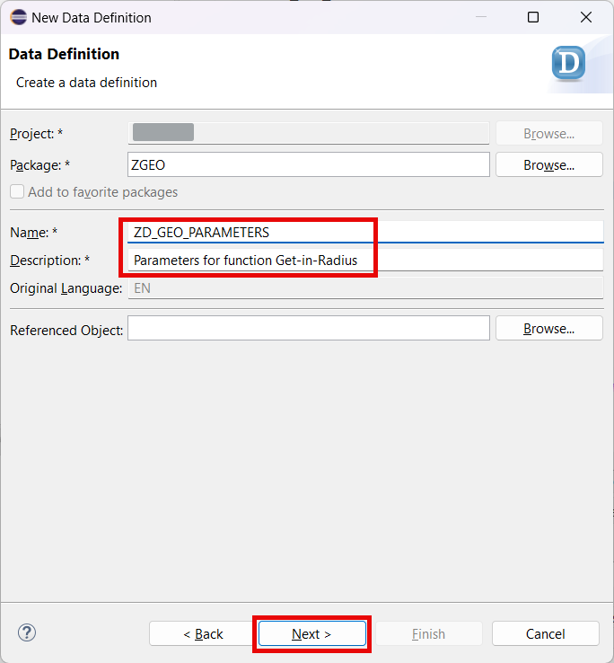 

5. Select your transport and choose **Next**.

6. Choose the **Define Abstract Entity with Parameters** template and then choose **Finish**.

  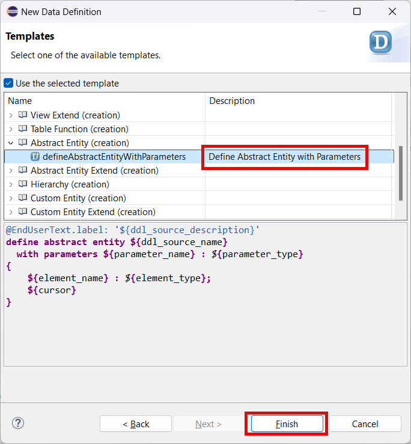 

7. Replace the code of the view with the one below:

~~~abap
@EndUserText.label: 'Parameters for function Get-in-Radius'
define abstract entity ZD_GEO_PARAMETERS  
 {
    radius: int4;
    point_lon: abap.char( 25 );
    point_lat: abap.char( 25 );
}
~~~

8. Choose **Activate**.
   
  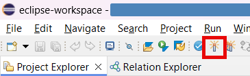

## 2. Create Entity for RAP Function Output Parameters

1. Right-click your **ZGEO** package name.

2. Choose **New** &rarr; **Other ABAP Repository Object** in the context menu.

   

3. Choose **Data Definition** in the **Core Data Services** folder and then choose **Next**.

  

4. Enter the following data and then choose **Next**:

  - **ZD_GETINRADIUS_RESULT** in the **Name** field
  - **Result of function Get-in-Radius** in the **Description** field

  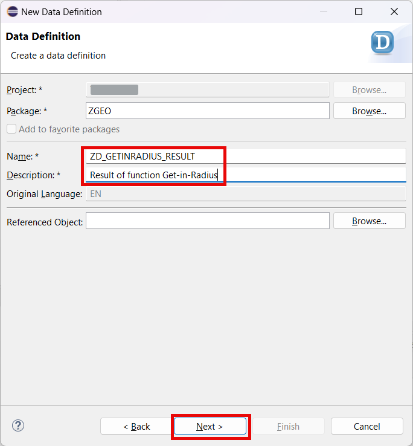 

5. Select your transport and choose **Next**.

6. Choose the **Define Abstract Entity with Parameters** template and then choose **Finish**.

   

7. Replace the code of the view with the one below:

~~~abap
@EndUserText.label: 'Result of function Get-in-Radius'
define abstract entity ZD_GETINRADIUS_RESULT
{
  key Partner: abap.char(10);
  PartnerName: abap.char(81);
  Latitude: abap.dec(16,13);
  Longitude: abap.dec(16,13);
  Distance: abap.int4;
}
~~~

8. Choose **Activate**.
   
  

## 3. Create Behavior Definition

1. Right-click your main **ZI_BUSINESSPARTNER** CDS view.

2. Choose **New Behavior Definition** in the popup menu.

  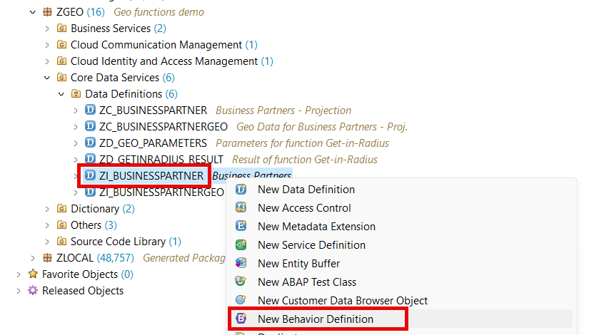

3. Enter the following data and then choose **Next**:

  - **Business Partners** in the **Description** field
  - **Managed** in the **Implementation Type**

  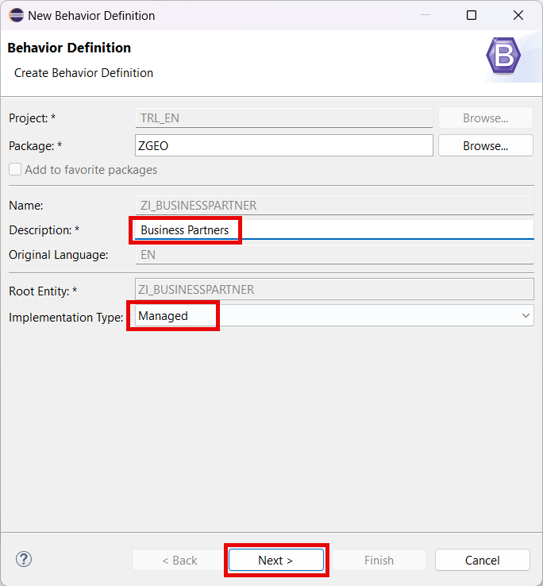 

4. Select your transport and choose **Finish**.

5. Replace the code of the behavior definition with the one below:

~~~abap
managed implementation in class zbp_i_businesspartner unique;
strict ( 2 );

define behavior for ZI_BusinessPartner
persistent table zbupa
lock master
authorization master ( instance )
{
  static function getInRadius
    parameter ZD_GEO_PARAMETERS
    result [0..*] ZD_GETINRADIUS_RESULT;

  create;
  update;
  delete;
  association _GeoData { create; }
  field (readonly:update) Partner;

  mapping for ZBUPA {
    Partner = partner;
    NameFirst = name_first;
    NameLast = name_last;
  }

}

define behavior for ZI_BusinessPartnerGeo
persistent table zbupageo
lock dependent by _BusinessPartner
authorization dependent by _BusinessPartner
{
  update;
  delete;
  field ( readonly ) Partner;
  association _BusinessPartner;

  mapping for zbupageo {
    Partner = partner;
    Latitude = latitude;
    Longitude = longitude;
    Location = location;
  }

  determination setGEOPoint on modify {create; field Latitude, Longitude; }
}
~~~

6. Choose **Activate**.
   
  

## 4. Create Behavior Implementation

1. Put your cursor on the **zbp_i_businesspartner** class in the code of your behavior definition.

2. Press **Ctrl+1** (or select **Quick Fix** option from the context menu after a right click)

3. Choose **Create behavior implementation class zbp_i_businesspartner** in the popup menu.

  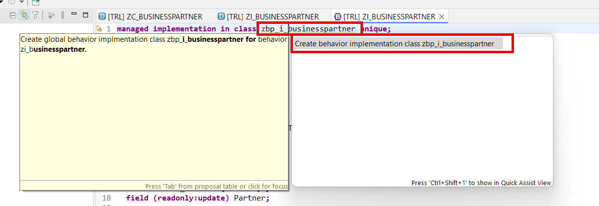

4. Enter the following data and then choose **Next**:

  - **Behavior Implementation for ZI_BUSINESSPARTNER** in the **Description** field

  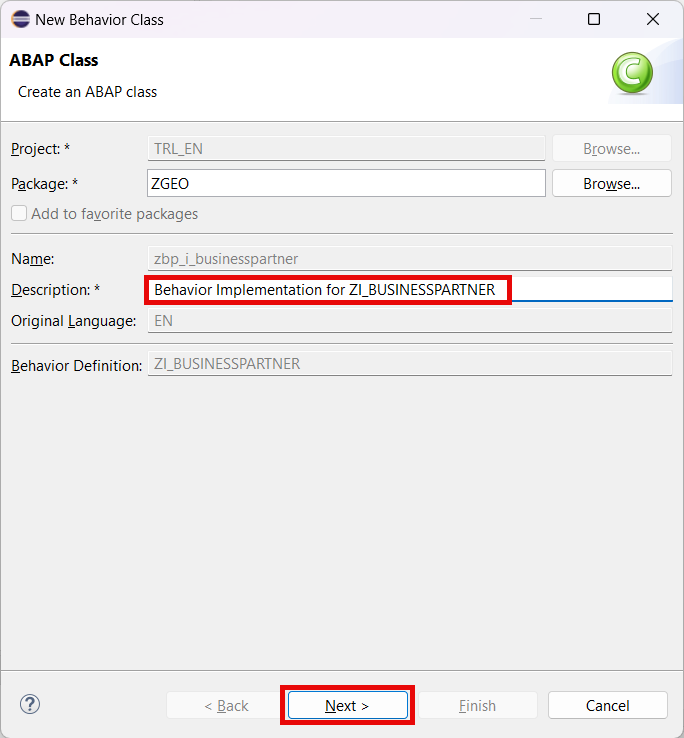 

5. Select your transport and choose **Finish**.

6. Replace the code of the behavior definition with the one below:

~~~abap
CLASS lhc_ZI_BusinessPartner DEFINITION INHERITING FROM cl_abap_behavior_handler.
  PRIVATE SECTION.

    METHODS get_instance_authorizations FOR INSTANCE AUTHORIZATION
      IMPORTING keys REQUEST requested_authorizations FOR ZI_BusinessPartner RESULT result.

    METHODS getInRadius FOR READ
      IMPORTING keys FOR FUNCTION ZI_BusinessPartner~getinradius RESULT result.
    METHODS setGEOPoint FOR DETERMINE ON MODIFY
      IMPORTING keys FOR ZI_BusinessPartnerGeo~setGEOPoint.

ENDCLASS.

CLASS lhc_ZI_BusinessPartner IMPLEMENTATION.

  METHOD get_instance_authorizations.
  ENDMETHOD.

  METHOD getInRadius.
    DATA: lt TYPE TABLE FOR READ RESULT ZI_BusinessPartner,
          lt_geo TYPE TABLE FOR READ RESULT ZI_BusinessPartnerGeo.

    DATA iv_latitude  TYPE zcl_geo_helper=>ty_coord.
    DATA iv_longitude TYPE zcl_geo_helper=>ty_coord.

    iv_latitude = keys[ 1 ]-%param-point_lat.
    iv_longitude = keys[ 1 ]-%param-point_lon.

    zcl_geo_helper=>get_partners_around(
      EXPORTING
        iv_latitude  = iv_latitude
        iv_longitude = iv_longitude
        iv_radius    = keys[ 1 ]-%param-radius
      IMPORTING
        et_partners = DATA(lt_ids)
    ).

    READ ENTITY IN LOCAL MODE ZI_BusinessPartner
      ALL FIELDS WITH CORRESPONDING #( lt_ids MAPPING Partner = partner )
      RESULT lt
      BY \_GeoData
      ALL FIELDS WITH CORRESPONDING #( lt_ids MAPPING Partner = partner )
      RESULT lt_geo.

    DATA ls_result TYPE zd_getinradius_result.
    LOOP AT lt ASSIGNING FIELD-SYMBOL(<ls>).
      READ TABLE lt_geo WITH KEY Partner = <ls>-Partner ASSIGNING FIELD-SYMBOL(<ls_geo>).
      IF sy-subrc IS INITIAL.
        MOVE-CORRESPONDING <ls_geo> TO ls_result.
      ENDIF.

      MOVE-CORRESPONDING <ls> TO ls_result.
      ls_result-Distance = lt_ids[ partner = <ls>-Partner ]-distance.
      CONCATENATE <ls>-NameFirst <ls>-NameLast INTO ls_result-PartnerName
                  SEPARATED BY space.

      APPEND VALUE #( %param = CORRESPONDING #( ls_result ) ) TO result.
    ENDLOOP.

  ENDMETHOD.

  METHOD setGEOPoint.
    DATA lt TYPE TABLE FOR READ RESULT ZI_BusinessPartnerGeo.

    READ ENTITY IN LOCAL MODE ZI_BusinessPartnerGeo
      ALL FIELDS WITH CORRESPONDING #( keys MAPPING Partner = Partner )
      RESULT lt.

    DATA lv_latitude TYPE zcl_geo_helper=>ty_coord.
    DATA lv_longitude TYPE zcl_geo_helper=>ty_coord.

    LOOP AT lt ASSIGNING FIELD-SYMBOL(<ls>).
      lv_latitude = <ls>-Latitude.
      lv_longitude = <ls>-Longitude.

      zcl_geo_helper=>get_geo_point(
        EXPORTING
          iv_latitude  = lv_latitude
          iv_longitude = lv_longitude
        IMPORTING
          et_points    = DATA(lt_points)
      ).

      <ls>-Location = lt_points[ 1 ]-point.
    ENDLOOP.

    MODIFY ENTITY IN LOCAL MODE ZI_BusinessPartnerGeo
      UPDATE
        FIELDS ( Location ) WITH CORRESPONDING #( lt MAPPING Partner = Partner ).
  ENDMETHOD.

ENDCLASS.
~~~

> You use EML in the method implementation part. The Entity Manipulation Language (EML) is a part of the ABAP language that enables access to RAP business objects. 

7. Choose **Activate**.
   
  

## 5. Create Projection for Behavior Definition

1. Right-click your main **ZC_BUSINESSPARTNER** CDS projection view.

2. Choose **New Behavior Definition** in the popup menu.

  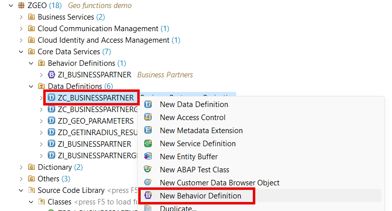

3. Enter the following data and then choose **Next**:

  - **Business Partners - Projection** in the **Description** field
  - **Projection** in the **Implementation Type**

  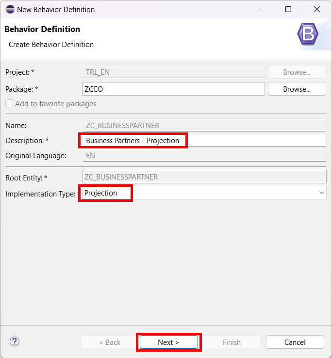 

4. Select your transport and choose **Finish**.

5. Replace the code of the behavior definition with the one below:

~~~abap
projection;
strict ( 2 );

define behavior for ZC_BusinessPartner
{
  use create;
  use update;
  use delete;

  use function getInRadius;

  use association _GeoData { create; }
}

define behavior for ZC_BusinessPartnerGeo
{
  use update;
  use delete;

  use association _BusinessPartner;
}
~~~

6. Choose **Activate**.
   
  

## Result

You have created the behavior for the business object. The behavior adds additional business logic to the object and enriches its functionality. Now it's time to fill the test data to the database tables.

## Next Step

[Fill In the Test Data](../fill-data/README.md)

## Reference Links

- [CDS Abstract Entities](https://help.sap.com/docs/abap-cloud/abap-data-models/cds-abstract-entities)
- [Business Object](https://help.sap.com/docs/ABAP_PLATFORM_NEW/fc4c71aa50014fd1b43721701471913d/a3ff9dcdb25a4f1a9408422b8ba5fa00.html)
- [RAP Determinations](https://help.sap.com/docs/abap-cloud/abap-rap/determinations)
- [Entity Manipulation Language](https://help.sap.com/docs/abap-cloud/abap-rap/entity-manipulation-language-eml)
