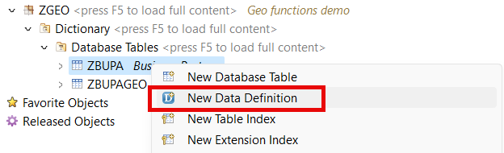
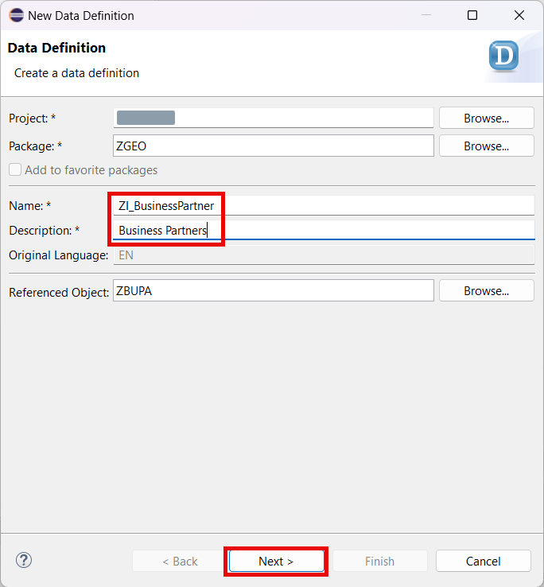
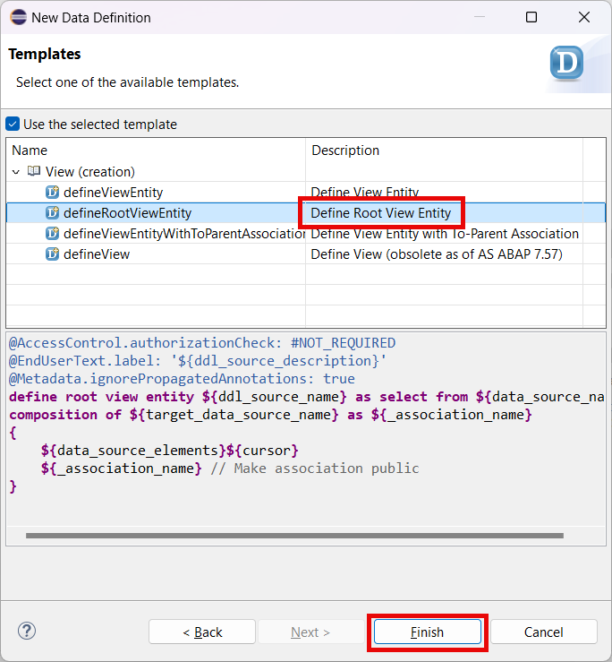
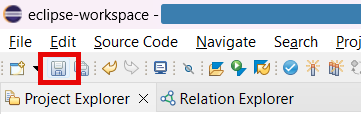
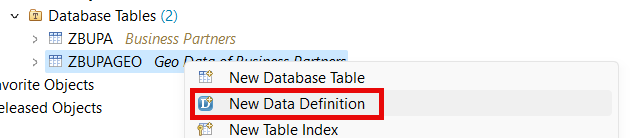
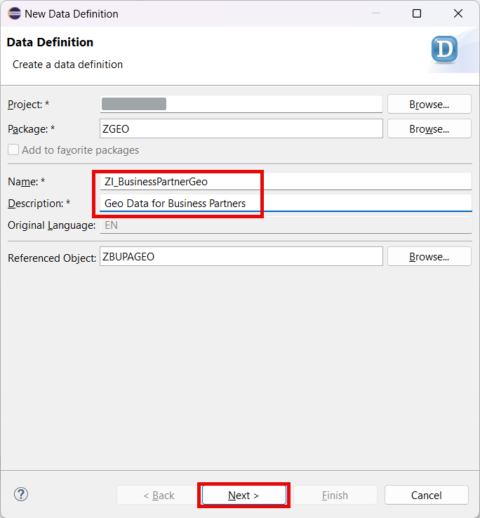
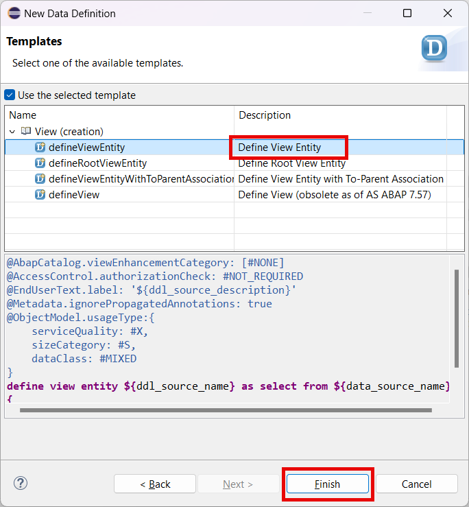
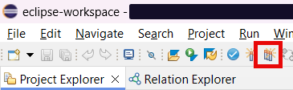
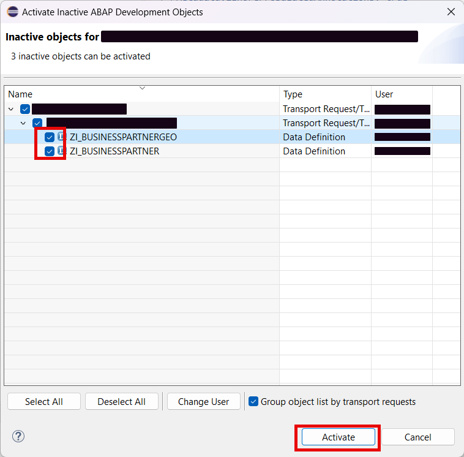

# Create Data Definition

## Introduction 

In this part, you will create a business object which will represent the data model of your service.

## 1. Create Root View Entity

1. Right-click the **ZBUPA** database table created in the previous part.

2. Choose **New Data Definition** in the context menu.

   

3. Enter the following data and then choose **Next**:
  - **ZI_BusinessPartner** in the **Name** field
  - **Business Partners** in the **Description** field

   

4. Select your transport and choose **Next**.

5. Choose the **Define Root View Entity** template and then choose **Finish**.

   

6. Replace the code of the view with the one below:

~~~abap
@AccessControl.authorizationCheck: #NOT_REQUIRED
@EndUserText.label: 'Business Partners'
define root view entity ZI_BusinessPartner as select from zbupa
composition [0..1] of ZI_BusinessPartnerGeo as _GeoData
{
    key partner as Partner,
    name_first as NameFirst,
    name_last as NameLast,
    
    _GeoData
}
~~~

> Note that the code has errors. It is ok now, you have to create another view first.

7. Choose **Save**.
   
  

## 2. Create Geo Location View Entity

1. Right-click the **ZBUPAGEO** database table created in the previous part.

2. Choose **New Data Definition** in the context menu.

   

3. Enter the following data and then choose **Next**:
  - **ZI_BusinessPartnerGeo** in the **Name** field
  - **Geo Data for Business Partners** in the **Description** field

   

4. Select your transport and choose **Next**.

5. Choose the **Define View Entity** template and then choose **Finish**.

   

6. Replace the code of the view with the one below:

~~~abap
@AbapCatalog.viewEnhancementCategory: [#NONE]
@AccessControl.authorizationCheck: #NOT_REQUIRED
@EndUserText.label: 'Geo Data for Business Partners'
@Metadata.ignorePropagatedAnnotations: true
@ObjectModel.usageType:{
    serviceQuality: #X,
    sizeCategory: #S,
    dataClass: #MIXED
}
define view entity ZI_BusinessPartnerGeo as select from zbupageo
association to parent ZI_BusinessPartner as _BusinessPartner on $projection.Partner = _BusinessPartner.Partner
{
    key partner as Partner,
    latitude as Latitude,
    longitude as Longitude,
    location as Location,
    
    _BusinessPartner
}
~~~

7. Choose **Save**.
   
  

## 3. Activate the Views

1. Choose **Activate inactive ABAP development objects**.

  

2. In the popup window, select the two new CDS views and then choose **Activate**.

  

## Result

You have created a business object. This object is now ready to be exposed as a service. You will add a projection layer for more flexibility in future.

## Next Step

[Create Business Object Projections](../projection/README.md)

## Reference Links

- [Naming convention](https://help.sap.com/docs/ABAP_PLATFORM_NEW/fc4c71aa50014fd1b43721701471913d/8b8f9d8f3cb948b2841d6045a255e503.html)
- [Developing Managed Transactional Apps](https://help.sap.com/docs/ABAP_PLATFORM_NEW/fc4c71aa50014fd1b43721701471913d/b5bba99612cf4637a8b72a3fc82c22d9.html)
