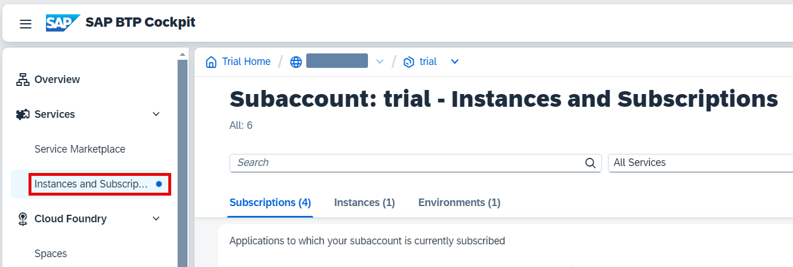
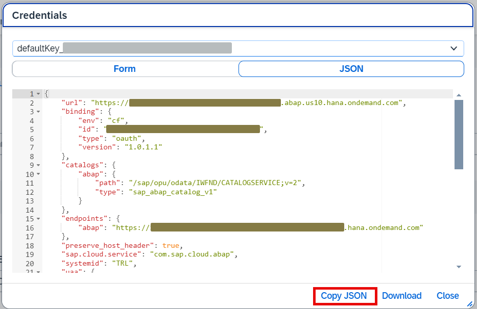
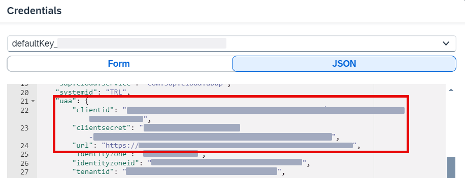
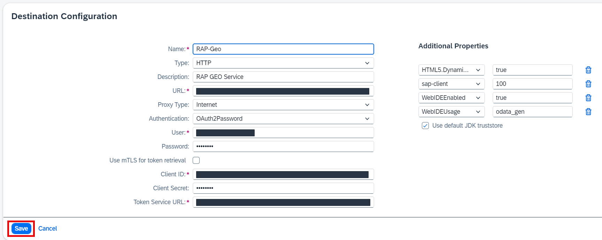

# Create destination for RESTful ABAP Service

## Introduction 

In this exercise, you will create a destination to consume the RESTful ABAP service created in the previous sections.

This tutorial shows how to connect to the ABAP environment that resides in the trial account. Trial accounts do not support communication management in the ABAP environment, so you cannot perform proper user propagation in this scenario. If your account has this feature you can proceed with more complex approach. Check the links below.

## 1. Get ABAP Environment service key data

1. Open your SAP BTP subaccount and select **Instances and Subscription** tab.

  

2. Find **ABAP Environment** instance in the **Instance** section.

3. Choose **1 key** in the **Credentials** column.

  

4. You can note the key data somewhere to use later for the destination creation.

  

5. Select **Close** button.

## 2. Create a destination

1. Login to your SAP BTP subaccount where you are going to develop application using **SAP Build Apps**.

2. Create a new Destination

   - Open the **Connectivity** entry and select **Destination**
   
   - Choose **Create Destination**

3. Setup Destination - enter the following values

    - **Name** = **RAP-Geo**
    - **Type** = **HTTP**
    - **Description** = **RAP GEO Service**
    - **URL** = base URL of the ABAP Environment found in the service key (field **url**) followed by **/sap/opu/odata/sap/ZAPI_GEO_O2**. Example: **https://xxxxxx-xxxx-xxxx-xxxx-xxxxxxxxx.abap.xx10.hana.ondemand.com/sap/opu/odata/sap/ZGEO_V2**
      
      

    - **Proxy Type** = **Internet**
    - **Authentication** = **OAuth2Password**
    - **User** = your user with which you login to the ABAP Environment
    - **Password** = your password with which you login to the ABAP Environment
    - **Client ID:**: You can find Client ID in the service key under **uaa** section (field **clientid**)
    - **Client Secret**: You can find Client Secret in the service key under **uaa** section (field **clientsecret**)
    - **Token Service URL**: You can find Token Service URL in the service key under **uaa** section (field **url**). Make sure to add **/oauth/token** after the url. Example: **https://XXXXXXXtrial.authentication.xx10.hana.ondemand.com/oauth/token**.
    
      

    Under Additional Properties choose **New Property**.

    - Enter **HTML5.DynamicDestination** = **true**
    - Enter **WebIDEEnabled** = **true**
    - Enter **WebIDEUsage** = **odata_gen**
    - Enter **sap-client** = your SAP client (normally **100** for Trial accounts)

   

4. Choose **Save** button.

## Result

You have created a destination to consume your RAP service from SAP Build Apps.

## Reference Links

- [Managing Destinations](https://help.sap.com/viewer/cca91383641e40ffbe03bdc78f00f681/Cloud/en-US/84e45e071c7646c88027fffc6a7bb787.html)
- [Principal propagation with SAP Build Apps and S/4HANA Cloud](https://community.sap.com/t5/technology-blogs-by-sap/principal-propagation-with-sap-build-apps-and-s-4hana-cloud/ba-p/13549435)

