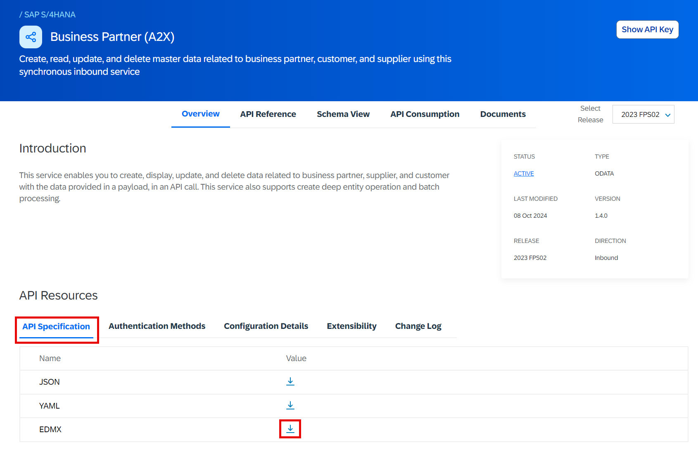
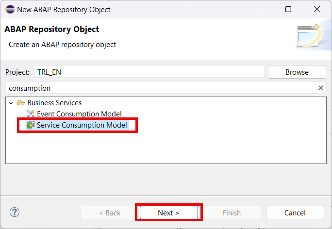
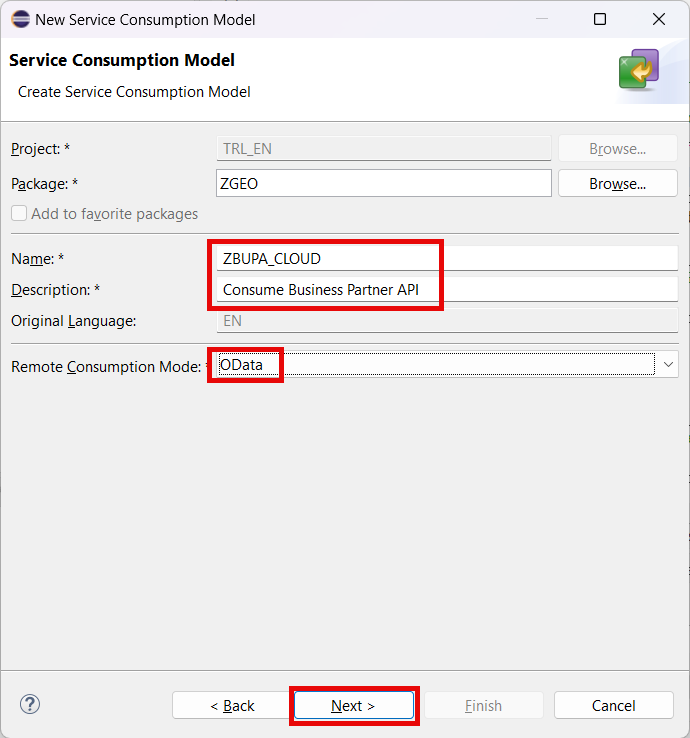
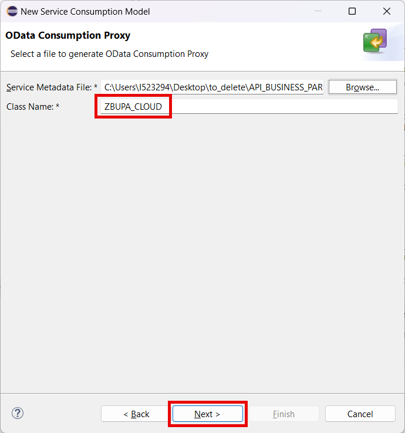
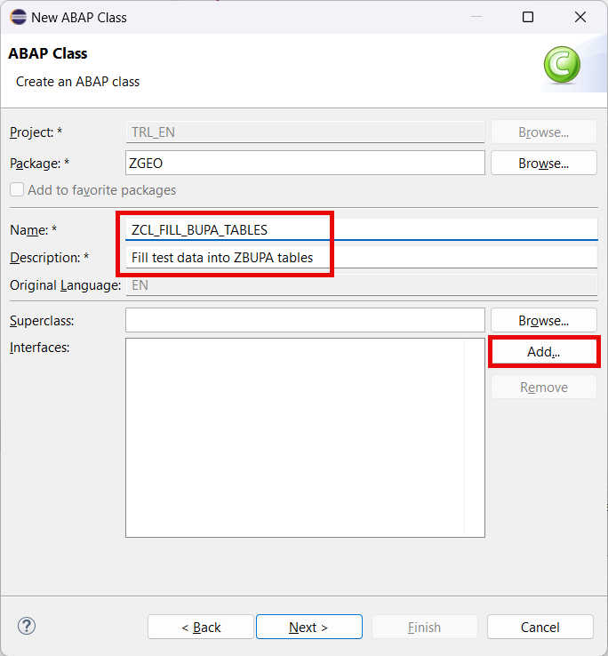
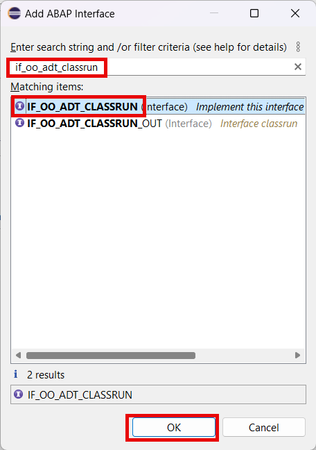
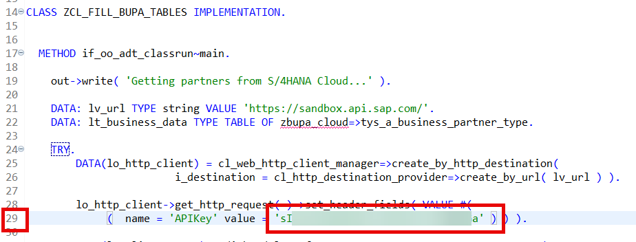
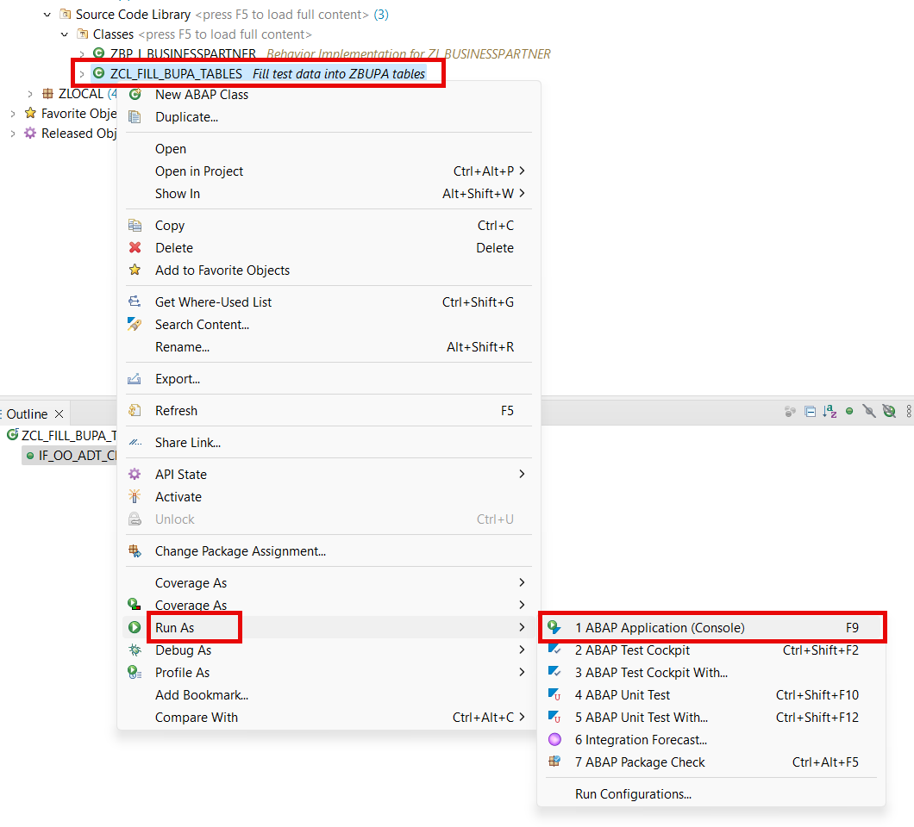

# Fill test data

## Introduction 

In this chapter we will prepare the test data by creating a console class. Note that we will fill the data not to the tables directly, but we will use the business object to garantee the data consistency (remember internal geo coordinates representation!).

The business partner data will be taken from the S/4HANA Cloud Sandbox provided by **SAP Business Accelerator Hub**. You can use the same approach later to integrate your S/4HANA Cloud instance.

The geo data will be taken from the list of the biggest cities in the world for every country (open data set). Later it's assumed that the geo data comes from special app (not covered yet in this tutorial).

## Content

### Task 1: Get API metadata

1. Open **SAP Business Accelerator Hub** in your browser following [this link](api.sap.com).

2. Select **Login** button and log in with your SAP credentials.

  

3. Enter **business partners** in the search field and then press **Enter**.

  

4. Select **Business Partners** API for **SAP S/4HANA**. You can use filter on the left side to restrict your search.

  

5. Select **API Specification** tab and then choose **Download** button in the **EDMX** section.

  

6. Additionally select **Show API Key** button and then select **Copy Key and Close** in the popup window. Note the copied key somewhere to use later.

  

### Task 2: Create a service consumption model

1. Right click on your package name created in the previous exercise.

2. Choose **New** &rarr; **Other ABAP Repository Object** option in the context menu.

   

3. Choose **Service Consumption Model** in the **Business Services** folder and then choose **Next**.

  

4. Enter the following data and then choose **Next** button:

  - **ZBUPA_CLOUD** in the **Name** field
  - **Consume Business Partner API** in the **Description** field
  - **OData** in the **Remote Consumption Mode** field

   

5. On the next screen select **Browse..** button and then select your EDMX file saved in the previous task.

6. Enter **ZBUPA_CLOUD** in the **Class Name** field and choose **Next**.

  

7. On the next screen **Components of OData Service** just choose **Next**.

8. On the next screen **ETag Support** just choose **Next**.

9. On the next screen select your transport (if applicable) and choose **Finish**.

10. Generation of the service consumption class will take some time. After it's finished choose **Activate** button.
   
  

### Task 3: Create a console class

> NOTE: You can ommit the steps from 1 to 8 if you cloned your code from GIT repository before.

1. Right click on your package name created in the previous exercise.

2. Choose **New** &rarr; **Other ABAP Repository Object** option in the context menu.

   

3. Choose **ABAP Class** in the **Source Code Library** folder and then choose **Next**.

   

4. Enter the following data and then choose **Add** in the **Interfaces** section:

  - **ZCL_FILL_BUPA_TABLES** in the **Name** field
  - **Fill test data into ZBUPA tables** in the **Description** field

   

5. On the next screen search for **if_oo_adt_classrun** interface. Select it and choose **OK** button.

  

6. Choose **Next** button.

7. On the next screen select your transport (if applicable) and choose **Finish**.

8. Replace the code of the class with the one below:

  
  
Expand to see the code...

  
~~~abap
CLASS zcl_fill_bupa_tables DEFINITION
  PUBLIC
  FINAL
  CREATE PUBLIC .

  PUBLIC SECTION.

    INTERFACES if_oo_adt_classrun .
  PROTECTED SECTION.
    TYPES:
      BEGIN OF ty_city,
        name TYPE c LENGTH 50,
        country TYPE c LENGTH 50,
        population TYPE i,
        latitude TYPE c LENGTH 15,
        longitude TYPE c LENGTH 15,
      END OF ty_city,
      ty_cities_t TYPE SORTED TABLE OF ty_city
                       WITH UNIQUE KEY country name.

    CLASS-METHODS get_cities_data
      RETURNING
        VALUE(rt_cities) TYPE ty_cities_t.
  PRIVATE SECTION.
ENDCLASS.

CLASS zcl_fill_bupa_tables IMPLEMENTATION.

  METHOD if_oo_adt_classrun~main.

    out->write( 'Getting partners from S/4HANA Cloud...' ).

    DATA: lv_url TYPE string VALUE 'https://sandbox.api.sap.com/'.
    DATA: lt_business_data TYPE TABLE OF zbupa_cloud=>tys_a_business_partner_type.
    DATA(lt_cities) = get_cities_data( ).

    TRY.
        DATA(lo_http_client) = cl_web_http_client_manager=>create_by_http_destination(
                        i_destination = cl_http_destination_provider=>create_by_url( lv_url ) ).

        lo_http_client->get_http_request( )->set_header_fields( VALUE #(
             (  name = 'APIKey' value = '{YOUR_API_KEY}' ) ) ).

        DATA(lo_client_proxy) = /iwbep/cl_cp_factory_remote=>create_v2_remote_proxy(
          EXPORTING
             is_proxy_model_key       = VALUE #( repository_id       = 'DEFAULT'
                                                 proxy_model_id      = 'ZBUPA_CLOUD'
                                                 proxy_model_version = '0001' )
            io_http_client             = lo_http_client
            iv_relative_service_root   = '/s4hanacloud/sap/opu/odata/sap/API_BUSINESS_PARTNER' ).

        DATA(lo_request) = lo_client_proxy->create_resource_for_entity_set( 'A_BUSINESS_PARTNER' )->create_request_for_read( ).

        "       Create the filter tree
        DATA(lo_filter_factory) = lo_request->create_filter_factory( ).
        DATA lt_range_partner TYPE RANGE OF zbupa_cloud=>tys_a_business_partner_type-first_name.
        DATA lo_filter_node      TYPE REF TO /iwbep/if_cp_filter_node.
        lt_range_partner = VALUE #( ( sign = 'E' option = 'EQ' low = '' high = '' ) ).
        lo_filter_node  = lo_filter_factory->create_by_range( iv_property_path     = 'FIRST_NAME'
                                                              it_range             = lt_range_partner ).

        out->write( |- getting { lines( lt_cities ) } partners | ).
        lo_request->set_top( lines( lt_cities ) )->set_skip( 0 )->set_filter( lo_filter_node ).

        DATA(lo_response) = lo_request->execute( ).
        lo_response->get_business_data( IMPORTING et_business_data = lt_business_data ).

      CATCH /iwbep/cx_cp_remote
            /iwbep/cx_gateway
            cx_web_http_client_error
            cx_http_dest_provider_error
            INTO DATA(lx_exc).

        out->write( lx_exc->if_message~get_longtext( ) ).

    ENDTRY.

    IF lt_business_data IS INITIAL.
      out->write( 'No partners found. Exit.' ).
      RETURN.
    ELSE.
      out->write( |Found partners: { lines( lt_business_data ) }| ).
    ENDIF.

    out->write( 'Starting to fill the test data...' ).

    out->write( 'Clearing the tables...' ).
    DELETE FROM zbupageo.
    DELETE FROM zbupa.
    COMMIT WORK.

    out->write( 'Adding the data...' ).
    DATA lt_create_bupa TYPE TABLE FOR CREATE zi_businesspartner.
    DATA lt_create_geo TYPE TABLE FOR CREATE zi_businesspartner\_geodata.
    DATA lv_current_index TYPE n LENGTH 4 VALUE 1.

    LOOP AT lt_business_data ASSIGNING FIELD-SYMBOL(<ls_partner>).
      READ TABLE lt_cities ASSIGNING FIELD-SYMBOL(<ls_city>) INDEX lv_current_index.

      APPEND INITIAL LINE TO lt_create_bupa ASSIGNING FIELD-SYMBOL(<ls_create_bupa>).
      <ls_create_bupa> = VALUE #(
         %cid = |cid{ lv_current_index }|
         Partner = <ls_partner>-business_partner
         NameFirst = <ls_partner>-first_name
         NameLast = |{ <ls_partner>-last_name } ({ <ls_city>-name })|
      ).

      APPEND INITIAL LINE TO lt_create_geo ASSIGNING FIELD-SYMBOL(<ls_create_geo>).
      <ls_create_geo> = VALUE #(
         %cid_ref = |cid{ lv_current_index }|
         %target = VALUE #( ( %cid = |geocid{ lv_current_index }|
                              Latitude = <ls_city>-latitude
                              Longitude = <ls_city>-longitude
                             )
                          )
      ).

      lv_current_index = lv_current_index + 1.
    ENDLOOP.

    MODIFY ENTITY ZI_BusinessPartner
           CREATE
           FIELDS ( Partner NameFirst NameLast )
           WITH lt_create_bupa
           CREATE BY \_GeoData
           FIELDS ( Latitude Longitude )
           WITH lt_create_geo
        FAILED   FINAL(fail_mod)
        REPORTED FINAL(rep_mod)
        MAPPED   FINAL(map_mod).
    COMMIT ENTITIES.

    IF sy-subrc <> 0.
      out->write( `An issue occurred in the RAP save sequence.` ).
    ENDIF.

    IF rep_mod-zi_businesspartner IS NOT INITIAL.
      out->write( 'REPORTED:' ).

      LOOP AT rep_mod-zi_businesspartner ASSIGNING FIELD-SYMBOL(<ls_rep>).
        out->write( |ZI_BUSINESSPARTNER, Partner = { <ls_rep>-Partner } | ).
        out->write( <ls_rep>-%msg->if_message~get_longtext( ) ).
      ENDLOOP.

      LOOP AT rep_mod-zi_businesspartnergeo ASSIGNING FIELD-SYMBOL(<ls_rep_geo>).
        out->write( |ZI_BUSINESSPARTNERGEO, Partner = { <ls_rep>-Partner } | ).
        out->write( <ls_rep_geo>-%msg->if_message~get_longtext( ) ).
      ENDLOOP.
    ENDIF.
*
    out->write( 'Finished.' ).

  ENDMETHOD.

  METHOD get_cities_data.
    rt_cities = VALUE #(
    ( name = 'Herāt' country = 'Afghanistan' population = 574300 latitude = '34.34817' longitude = '62.19967' )
    ( name = 'Kabul' country = 'Afghanistan' population = 4434550 latitude = '34.52813' longitude = '69.17233' )
    ( name = 'Mazār-e Sharīf' country = 'Afghanistan' population = 523300 latitude = '36.70904' longitude = '67.11087' )
    ( name = 'Durrës' country = 'Albania' population = 122034 latitude = '41.32355' longitude = '19.45469' )
    ( name = 'Elbasan' country = 'Albania' population = 100903 latitude = '41.1125' longitude = '20.08222' )
    ( name = 'Tirana' country = 'Albania' population = 418495 latitude = '41.3275' longitude = '19.81889' )
    ( name = 'Algiers' country = 'Algeria' population = 2364230 latitude = '36.73225' longitude = '3.08746' )
    ( name = 'Constantine' country = 'Algeria' population = 448028 latitude = '36.365' longitude = '6.61472' )
    ( name = 'Oran' country = 'Algeria' population = 803329 latitude = '35.69906' longitude = '-0.63588' )
    ( name = 'Huambo' country = 'Angola' population = 595304 latitude = '-12.77611' longitude = '15.73917' )
    ( name = 'Luanda' country = 'Angola' population = 2776168 latitude = '-8.83682' longitude = '13.23432' )
    ( name = 'Lubango' country = 'Angola' population = 600751 latitude = '-14.91717' longitude = '13.4925' )
    ( name = 'Buenos Aires' country = 'Argentina' population = 2891082 latitude = '-34.61315' longitude = '-58.37723' )
    ( name = 'Córdoba' country = 'Argentina' population = 1317298 latitude = '-31.4135' longitude = '-64.18105' )
    ( name = 'Rosario' country = 'Argentina' population = 948312 latitude = '-32.94682' longitude = '-60.63932' )
    ( name = 'Gyumri' country = 'Armenia' population = 148381 latitude = '40.7942' longitude = '43.84528' )
    ( name = 'Vanadzor' country = 'Armenia' population = 101098 latitude = '40.80456' longitude = '44.4939' )
    ( name = 'Yerevan' country = 'Armenia' population = 1093485 latitude = '40.18111' longitude = '44.51361' )
    ( name = 'Brisbane' country = 'Australia' population = 2582007 latitude = '-27.46794' longitude = '153.02809' )
    ( name = 'Darwin' country = 'Australia' population = 147255 latitude = '-12.46113' longitude = '130.84185' )
    ( name = 'Melbourne' country = 'Australia' population = 4917750 latitude = '-37.814' longitude = '144.96332' )
    ( name = 'Perth' country = 'Australia' population = 2192229 latitude = '-31.95224' longitude = '115.8614' )
    ( name = 'Sydney' country = 'Australia' population = 5231147 latitude = '-33.86785' longitude = '151.20732' )
    ( name = 'Graz' country = 'Austria' population = 295424 latitude = '47.06667' longitude = '15.45' )
    ( name = 'Linz' country = 'Austria' population = 204846 latitude = '48.30639' longitude = '14.28611' )
    ( name = 'Vienna' country = 'Austria' population = 1691468 latitude = '48.20849' longitude = '16.37208' )
    ( name = 'Baku' country = 'Azerbaijan' population = 1116513 latitude = '40.37767' longitude = '49.89201' )
    ( name = 'Ganja' country = 'Azerbaijan' population = 335600 latitude = '40.68278' longitude = '46.36056' )
    ( name = 'Sumqayıt' country = 'Azerbaijan' population = 358675 latitude = '40.58972' longitude = '49.66861' )
    ( name = 'Nassau' country = 'Bahamas' population = 227940 latitude = '25.05823' longitude = '-77.34306' )
    ( name = 'Ar Rifā‘' country = 'Bahrain' population = 195606 latitude = '26.13' longitude = '50.555' )
    ( name = 'Manama' country = 'Bahrain' population = 147074 latitude = '26.22787' longitude = '50.58565' )
    ( name = 'Chattogram' country = 'Bangladesh' population = 3920222 latitude = '22.3384' longitude = '91.83168' )
    ( name = 'Dhaka' country = 'Bangladesh' population = 10356500 latitude = '23.7104' longitude = '90.40744' )
    ( name = 'Khulna' country = 'Bangladesh' population = 1500689 latitude = '22.80979' longitude = '89.56439' )
    ( name = 'Homyel' country = 'Belarus' population = 526872 latitude = '52.4345' longitude = '30.9754' )
    ( name = 'Hrodna' country = 'Belarus' population = 373547 latitude = '53.6884' longitude = '23.8258' )
    ( name = 'Minsk' country = 'Belarus' population = 1742124 latitude = '53.9' longitude = '27.56667' )
    ( name = 'Antwerpen' country = 'Belgium' population = 529247 latitude = '51.22047' longitude = '4.40026' )
    ( name = 'Brussels' country = 'Belgium' population = 1019022 latitude = '50.85045' longitude = '4.34878' )
    ( name = 'Gent' country = 'Belgium' population = 265086 latitude = '51.05' longitude = '3.71667' )
    ( name = 'Abomey-Calavi' country = 'Benin' population = 385755 latitude = '6.44852' longitude = '2.35566' )
    ( name = 'Cotonou' country = 'Benin' population = 679012 latitude = '6.36536' longitude = '2.41833' )
    ( name = 'Porto-Novo' country = 'Benin' population = 264320 latitude = '6.49646' longitude = '2.60359' )
    ( name = 'Cochabamba' country = 'Bolivia' population = 841276 latitude = '-17.3895' longitude = '-66.1568' )
    ( name = 'La Paz' country = 'Bolivia' population = 2004652 latitude = '-16.5' longitude = '-68.15' )
    ( name = 'Santa Cruz de la Sierra' country = 'Bolivia' population = 1831434 latitude = '-17.78629' longitude = '-63.18117' )
    ( name = 'Banja Luka' country = 'Bosnia and Herzegovina' population = 221106 latitude = '44.77842' longitude = '17.19386' )
    ( name = 'Sarajevo' country = 'Bosnia and Herzegovina' population = 696731 latitude = '43.84864' longitude = '18.35644' )
    ( name = 'Zenica' country = 'Bosnia and Herzegovina' population = 164423 latitude = '44.20169' longitude = '17.90397' )
    ( name = 'Francistown' country = 'Botswana' population = 103417 latitude = '-21.17' longitude = '27.50778' )
    ( name = 'Gaborone' country = 'Botswana' population = 246325 latitude = '-24.65451' longitude = '25.90859' )
    ( name = 'Belo Horizonte' country = 'Brazil' population = 2721564 latitude = '-19.92083' longitude = '-43.93778' )
    ( name = 'Rio de Janeiro' country = 'Brazil' population = 6747815 latitude = '-22.90642' longitude = '-43.18223' )
    ( name = 'São Paulo' country = 'Brazil' population = 12400232 latitude = '-23.5475' longitude = '-46.63611' )
    ( name = 'Plovdiv' country = 'Bulgaria' population = 346893 latitude = '42.15' longitude = '24.75' )
    ( name = 'Sofia' country = 'Bulgaria' population = 1152556 latitude = '42.69751' longitude = '23.32415' )
    ( name = 'Varna' country = 'Bulgaria' population = 312770 latitude = '43.21667' longitude = '27.91667' )
    ( name = 'Bobo-Dioulasso' country = 'Burkina Faso' population = 904920 latitude = '11.17715' longitude = '-4.2979' )
    ( name = 'Koudougou' country = 'Burkina Faso' population = 160239 latitude = '12.25263' longitude = '-2.36272' )
    ( name = 'Ouagadougou' country = 'Burkina Faso' population = 2415266 latitude = '12.36566' longitude = '-1.53388' )
    ( name = 'Bujumbura' country = 'Burundi' population = 769317 latitude = '-3.38193' longitude = '29.36142' )
    ( name = 'Phnom Penh' country = 'Cambodia' population = 1573544 latitude = '11.56245' longitude = '104.91601' )
    ( name = 'Siem Reap' country = 'Cambodia' population = 139458 latitude = '13.36179' longitude = '103.86056' )
    ( name = 'Takeo' country = 'Cambodia' population = 843931 latitude = '10.99081' longitude = '104.78498' )
    ( name = 'Bamenda' country = 'Cameroon' population = 420445 latitude = '5.9597' longitude = '10.14597' )
    ( name = 'Douala' country = 'Cameroon' population = 1338082 latitude = '4.04827' longitude = '9.70428' )
    ( name = 'Yaoundé' country = 'Cameroon' population = 1299369 latitude = '3.86667' longitude = '11.51667' )
    ( name = 'Calgary' country = 'Canada' population = 1019942 latitude = '51.05011' longitude = '-114.08529' )
    ( name = 'Montréal' country = 'Canada' population = 1762949 latitude = '45.50884' longitude = '-73.58781' )
    ( name = 'Toronto' country = 'Canada' population = 2600000 latitude = '43.70643' longitude = '-79.39864' )
    ( name = 'Praia' country = 'Cape Verde' population = 137868 latitude = '14.93152' longitude = '-23.51254' )
    ( name = 'Bangui' country = 'Central African Republic' population = 812407 latitude = '4.36122' longitude = '18.55496' )
    ( name = 'Bégoua' country = 'Central African Republic' population = 264067 latitude = '4.45437' longitude = '18.53475' )
    ( name = 'Bimbo' country = 'Central African Republic' population = 348802 latitude = '4.25671' longitude = '18.41583' )
    ( name = 'Abéché' country = 'Chad' population = 139983 latitude = '13.82916' longitude = '20.8324' )
    ( name = 'Moundou' country = 'Chad' population = 196124 latitude = '8.57437' longitude = '16.07722' )
    ( name = 'N''Djamena' country = 'Chad' population = 1359526 latitude = '12.10672' longitude = '15.0444' )
    ( name = 'Antofagasta' country = 'Chile' population = 352638 latitude = '-23.65236' longitude = '-70.3954' )
    ( name = 'Puente Alto' country = 'Chile' population = 568106 latitude = '-33.61169' longitude = '-70.57577' )
    ( name = 'Santiago' country = 'Chile' population = 4837295 latitude = '-33.45694' longitude = '-70.64827' )
    ( name = 'Beijing' country = 'China' population = 18960744 latitude = '39.9075' longitude = '116.39723' )
    ( name = 'Harbin' country = 'China' population = 5242897 latitude = '45.75' longitude = '126.65' )
    ( name = 'Lanzhou' country = 'China' population = 3000000 latitude = '36.05701' longitude = '103.83987' )
    ( name = 'Shanghai' country = 'China' population = 22315474 latitude = '31.22222' longitude = '121.45806' )
    ( name = 'Shenzhen' country = 'China' population = 17494398 latitude = '22.54554' longitude = '114.0683' )
    ( name = 'Bogotá' country = 'Colombia' population = 7674366 latitude = '4.60971' longitude = '-74.08175' )
    ( name = 'Cali' country = 'Colombia' population = 2392877 latitude = '3.43722' longitude = '-76.5225' )
    ( name = 'Medellín' country = 'Colombia' population = 1999979 latitude = '6.25184' longitude = '-75.56359' )
    ( name = 'Brazzaville' country = 'Congo' population = 1982000 latitude = '-4.26613' longitude = '15.28318' )
    ( name = 'Dolisie' country = 'Congo' population = 121000 latitude = '-4.19834' longitude = '12.66664' )
    ( name = 'Pointe-Noire' country = 'Congo' population = 1032000 latitude = '-4.77609' longitude = '11.86352' )
    ( name = 'Kinshasa' country = 'Congo, Democratic Republic of the' population = 16000000 latitude = '-4.32758' longitude = '15.31357' )
    ( name = 'Lubumbashi' country = 'Congo, Democratic Republic of the' population = 2221925 latitude = '-11.66089' longitude = '27.47938' )
    ( name = 'Mbuji-Mayi' country = 'Congo, Democratic Republic of the' population = 2101332 latitude = '-6.13603' longitude = '23.58979' )
    ( name = 'San José' country = 'Costa Rica' population = 335007 latitude = '9.93333' longitude = '-84.08333' )
    ( name = 'Abidjan' country = 'Côte d''Ivoire' population = 6321017 latitude = '5.35444' longitude = '-4.00167' )
    ( name = 'Abobo' country = 'Côte d''Ivoire' population = 1340083 latitude = '5.41613' longitude = '-4.0159' )
    ( name = 'Bouaké' country = 'Côte d''Ivoire' population = 832371 latitude = '7.69385' longitude = '-5.03031' )
    ( name = 'Rijeka' country = 'Croatia' population = 107964 latitude = '45.32673' longitude = '14.44241' )
    ( name = 'Split' country = 'Croatia' population = 149830 latitude = '43.50891' longitude = '16.43915' )
    ( name = 'Zagreb' country = 'Croatia' population = 663592 latitude = '45.81444' longitude = '15.97798' )
    ( name = 'Camagüey' country = 'Cuba' population = 347562 latitude = '21.38083' longitude = '-77.91694' )
    ( name = 'Havana' country = 'Cuba' population = 2163824 latitude = '23.13302' longitude = '-82.38304' )
    ( name = 'Santiago de Cuba' country = 'Cuba' population = 555865 latitude = '20.02083' longitude = '-75.82667' )
    ( name = 'Limassol' country = 'Cyprus' population = 154000 latitude = '34.68406' longitude = '33.03794' )
    ( name = 'Nicosia' country = 'Cyprus' population = 200452 latitude = '35.17531' longitude = '33.3642' )
    ( name = 'Brno' country = 'Czech Republic' population = 379466 latitude = '49.19522' longitude = '16.60796' )
    ( name = 'Ostrava' country = 'Czech Republic' population = 279791 latitude = '49.83465' longitude = '18.28204' )
    ( name = 'Prague' country = 'Czech Republic' population = 1165581 latitude = '50.08804' longitude = '14.42076' )
    ( name = 'Århus' country = 'Denmark' population = 285273 latitude = '56.15674' longitude = '10.21076' )
    ( name = 'Copenhagen' country = 'Denmark' population = 1153615 latitude = '55.67594' longitude = '12.56553' )
    ( name = 'Odense' country = 'Denmark' population = 180863 latitude = '55.39594' longitude = '10.38831' )
    ( name = 'Djibouti' country = 'Djibouti' population = 626512 latitude = '11.58901' longitude = '43.14503' )
    ( name = 'Santiago de los Caballeros' country = 'Dominican Republic' population = 1200000 latitude = '19.4517' longitude = '-70.69703' )
    ( name = 'Santo Domingo' country = 'Dominican Republic' population = 2201941 latitude = '18.47186' longitude = '-69.89232' )
    ( name = 'Santo Domingo Oeste' country = 'Dominican Republic' population = 701269 latitude = '18.5' longitude = '-70.0' )
    ( name = 'Cuenca' country = 'Ecuador' population = 636996 latitude = '-2.90055' longitude = '-79.00453' )
    ( name = 'Guayaquil' country = 'Ecuador' population = 2723665 latitude = '-2.19616' longitude = '-79.88621' )
    ( name = 'Quito' country = 'Ecuador' population = 2781641 latitude = '-0.22985' longitude = '-78.52495' )
    ( name = 'Alexandria' country = 'Egypt' population = 5263542 latitude = '31.20176' longitude = '29.91582' )
    ( name = 'Cairo' country = 'Egypt' population = 9606916 latitude = '30.06263' longitude = '31.24967' )
    ( name = 'Giza' country = 'Egypt' population = 4367343 latitude = '30.00944' longitude = '31.20861' )
    ( name = 'San Miguel' country = 'El Salvador' population = 247126 latitude = '13.48333' longitude = '-88.18333' )
    ( name = 'San Salvador' country = 'El Salvador' population = 525990 latitude = '13.68935' longitude = '-89.18718' )
    ( name = 'Soyapango' country = 'El Salvador' population = 329708 latitude = '13.71024' longitude = '-89.13989' )
    ( name = 'Bata' country = 'Equatorial Guinea' population = 173046 latitude = '1.86391' longitude = '9.76582' )
    ( name = 'Malabo' country = 'Equatorial Guinea' population = 155963 latitude = '3.75578' longitude = '8.78166' )
    ( name = 'Asmara' country = 'Eritrea' population = 563930 latitude = '15.33805' longitude = '38.93184' )
    ( name = 'Tallinn' country = 'Estonia' population = 394024 latitude = '59.43696' longitude = '24.75353' )
    ( name = 'Addis Ababa' country = 'Ethiopia' population = 3860000 latitude = '9.02497' longitude = '38.74689' )
    ( name = 'Gonder' country = 'Ethiopia' population = 466000 latitude = '12.6' longitude = '37.46667' )
    ( name = 'Jijiga' country = 'Ethiopia' population = 483000 latitude = '9.35' longitude = '42.8' )
    ( name = 'Espoo' country = 'Finland' population = 256760 latitude = '60.2052' longitude = '24.6522' )
    ( name = 'Helsinki' country = 'Finland' population = 658864 latitude = '60.16952' longitude = '24.93545' )
    ( name = 'Tampere' country = 'Finland' population = 244315 latitude = '61.49911' longitude = '23.78712' )
    ( name = 'Lyon' country = 'France' population = 522969 latitude = '45.74846' longitude = '4.84671' )
    ( name = 'Marseille' country = 'France' population = 870731 latitude = '43.29695' longitude = '5.38107' )
    ( name = 'Paris' country = 'France' population = 2138551 latitude = '48.85341' longitude = '2.3488' )
    ( name = 'Franceville' country = 'Gabon' population = 132895 latitude = '-1.63333' longitude = '13.58357' )
    ( name = 'Libreville' country = 'Gabon' population = 846090 latitude = '0.39241' longitude = '9.45356' )
    ( name = 'Port-Gentil' country = 'Gabon' population = 164018 latitude = '-0.71933' longitude = '8.78151' )
    ( name = 'Serekunda' country = 'Gambia' population = 340000 latitude = '13.43833' longitude = '-16.67806' )
    ( name = 'Batumi' country = 'Georgia' population = 172100 latitude = '41.64228' longitude = '41.63392' )
    ( name = 'Kutaisi' country = 'Georgia' population = 135201 latitude = '42.26791' longitude = '42.69459' )
    ( name = 'Tbilisi' country = 'Georgia' population = 1049498 latitude = '41.69411' longitude = '44.83368' )
    ( name = 'Berlin' country = 'Germany' population = 3426354 latitude = '52.52437' longitude = '13.41053' )
    ( name = 'Hamburg' country = 'Germany' population = 1845229 latitude = '53.55073' longitude = '9.99302' )
    ( name = 'Munich' country = 'Germany' population = 1260391 latitude = '48.13743' longitude = '11.57549' )
    ( name = 'Walldorf' country = 'Germany' population = 14646 latitude = '49.29360' longitude = '8.64191' )
    ( name = 'Accra' country = 'Ghana' population = 1963264 latitude = '5.55602' longitude = '-0.1969' )
    ( name = 'Kumasi' country = 'Ghana' population = 2544530 latitude = '6.68848' longitude = '-1.62443' )
    ( name = 'Tamale' country = 'Ghana' population = 464316 latitude = '9.40079' longitude = '-0.8393' )
    ( name = 'Athens' country = 'Greece' population = 664046 latitude = '37.98376' longitude = '23.72784' )
    ( name = 'Pátra' country = 'Greece' population = 168034 latitude = '38.24444' longitude = '21.73444' )
    ( name = 'Thessaloníki' country = 'Greece' population = 317778 latitude = '40.64361' longitude = '22.93086' )
    ( name = 'Guatemala City' country = 'Guatemala' population = 994938 latitude = '14.64072' longitude = '-90.51327' )
    ( name = 'Mixco' country = 'Guatemala' population = 465773 latitude = '14.63077' longitude = '-90.60711' )
    ( name = 'Villa Nueva' country = 'Guatemala' population = 618397 latitude = '14.52512' longitude = '-90.58544' )
    ( name = 'Camayenne' country = 'Guinea' population = 1871242 latitude = '9.535' longitude = '-13.68778' )
    ( name = 'Conakry' country = 'Guinea' population = 1928389 latitude = '9.53795' longitude = '-13.67729' )
    ( name = 'Nzérékoré' country = 'Guinea' population = 226426 latitude = '7.75624' longitude = '-8.8179' )
    ( name = 'Bissau' country = 'Guinea-Bissau' population = 439704 latitude = '11.86357' longitude = '-15.59767' )
    ( name = 'Carrefour' country = 'Haiti' population = 442156 latitude = '18.54114' longitude = '-72.39922' )
    ( name = 'Delmas 73' country = 'Haiti' population = 382920 latitude = '18.54472' longitude = '-72.30278' )
    ( name = 'Port-au-Prince' country = 'Haiti' population = 1234742 latitude = '18.54349' longitude = '-72.33881' )
    ( name = 'La Ceiba' country = 'Honduras' population = 222055 latitude = '15.75971' longitude = '-86.78221' )
    ( name = 'San Pedro Sula' country = 'Honduras' population = 801259 latitude = '15.50417' longitude = '-88.025' )
    ( name = 'Tegucigalpa' country = 'Honduras' population = 850848 latitude = '14.0818' longitude = '-87.20681' )
    ( name = 'Hong Kong' country = 'Hong Kong, China' population = 7491609 latitude = '22.27832' longitude = '114.17469' )
    ( name = 'Budapest' country = 'Hungary' population = 1741041 latitude = '47.49835' longitude = '19.04045' )
    ( name = 'Debrecen' country = 'Hungary' population = 202402 latitude = '47.53167' longitude = '21.62444' )
    ( name = 'Szeged' country = 'Hungary' population = 160766 latitude = '46.253' longitude = '20.14824' )
    ( name = 'Reykjavík' country = 'Iceland' population = 118918 latitude = '64.13548' longitude = '-21.89541' )
    ( name = 'Bengaluru' country = 'India' population = 8443675 latitude = '12.97194' longitude = '77.59369' )
    ( name = 'Chennai' country = 'India' population = 4681087 latitude = '13.08784' longitude = '80.27847' )
    ( name = 'Delhi' country = 'India' population = 10927986 latitude = '28.65195' longitude = '77.23149' )
    ( name = 'Kolkata' country = 'India' population = 4631392 latitude = '22.56263' longitude = '88.36304' )
    ( name = 'Mumbai' country = 'India' population = 12691836 latitude = '19.07283' longitude = '72.88261' )
    ( name = 'Bekasi' country = 'Indonesia' population = 2564940 latitude = '-6.2349' longitude = '106.9896' )
    ( name = 'Jakarta' country = 'Indonesia' population = 8540121 latitude = '-6.21462' longitude = '106.84513' )
    ( name = 'Surabaya' country = 'Indonesia' population = 2874314 latitude = '-7.24917' longitude = '112.75083' )
    ( name = 'Isfahan' country = 'Iran, Islamic Rep. of' population = 1547164 latitude = '32.65246' longitude = '51.67462' )
    ( name = 'Mashhad' country = 'Iran, Islamic Rep. of' population = 2307177 latitude = '36.29807' longitude = '59.60567' )
    ( name = 'Tehran' country = 'Iran, Islamic Rep. of' population = 7153309 latitude = '35.69439' longitude = '51.42151' )
    ( name = 'Al Başrah al Qadīmah' country = 'Iraq' population = 2015483 latitude = '30.50316' longitude = '47.81507' )
    ( name = 'Al Mawşil al Jadīdah' country = 'Iraq' population = 2065597 latitude = '36.33271' longitude = '43.10555' )
    ( name = 'Baghdad' country = 'Iraq' population = 7216000 latitude = '33.34058' longitude = '44.40088' )
    ( name = 'Cork' country = 'Ireland' population = 190384 latitude = '51.89797' longitude = '-8.47061' )
    ( name = 'Dublin' country = 'Ireland' population = 1024027 latitude = '53.33306' longitude = '-6.24889' )
    ( name = 'South Dublin' country = 'Ireland' population = 278749 latitude = '53.29026' longitude = '-6.34151' )
    ( name = 'Jerusalem' country = 'Israel' population = 971800 latitude = '31.76904' longitude = '35.21633' )
    ( name = 'Tel Aviv' country = 'Israel' population = 432892 latitude = '32.08088' longitude = '34.78057' )
    ( name = 'West Jerusalem' country = 'Israel' population = 400000 latitude = '31.78199' longitude = '35.21961' )
    ( name = 'Milan' country = 'Italy' population = 1371498 latitude = '45.46427' longitude = '9.18951' )
    ( name = 'Naples' country = 'Italy' population = 909048 latitude = '40.85216' longitude = '14.26811' )
    ( name = 'Rome' country = 'Italy' population = 2318895 latitude = '41.89193' longitude = '12.51133' )
    ( name = 'Kingston' country = 'Jamaica' population = 937700 latitude = '17.99702' longitude = '-76.79358' )
    ( name = 'New Kingston' country = 'Jamaica' population = 583958 latitude = '18.00747' longitude = '-76.78319' )
    ( name = 'Spanish Town' country = 'Jamaica' population = 145018 latitude = '17.99107' longitude = '-76.95742' )
    ( name = 'Osaka' country = 'Japan' population = 2753862 latitude = '34.69379' longitude = '135.50107' )
    ( name = 'Tokyo' country = 'Japan' population = 8336599 latitude = '35.6895' longitude = '139.69171' )
    ( name = 'Yokohama' country = 'Japan' population = 3761630 latitude = '35.43333' longitude = '139.65' )
    ( name = 'Amman' country = 'Jordan' population = 1275857 latitude = '31.95522' longitude = '35.94503' )
    ( name = 'Irbid' country = 'Jordan' population = 569068 latitude = '32.55556' longitude = '35.85' )
    ( name = 'Zarqa' country = 'Jordan' population = 792665 latitude = '32.07275' longitude = '36.08796' )
    ( name = 'Aktobe' country = 'Kazakhstan' population = 500757 latitude = '50.27969' longitude = '57.20718' )
    ( name = 'Almaty' country = 'Kazakhstan' population = 1977011 latitude = '43.25' longitude = '76.91667' )
    ( name = 'Shymkent' country = 'Kazakhstan' population = 1200000 latitude = '42.3' longitude = '69.6' )
    ( name = 'Kakamega' country = 'Kenya' population = 1867579 latitude = '0.28422' longitude = '34.75229' )
    ( name = 'Mombasa' country = 'Kenya' population = 1208333 latitude = '-4.05466' longitude = '39.66359' )
    ( name = 'Nairobi' country = 'Kenya' population = 4397073 latitude = '-1.28333' longitude = '36.81667' )
    ( name = 'Hamhŭng' country = 'Korea, Dem. People''s Rep. of' population = 559056 latitude = '39.91833' longitude = '127.53639' )
    ( name = 'Namp’o' country = 'Korea, Dem. People''s Rep. of' population = 455000 latitude = '38.7375' longitude = '125.40778' )
    ( name = 'Pyongyang' country = 'Korea, Dem. People''s Rep. of' population = 3222000 latitude = '39.03385' longitude = '125.75432' )
    ( name = 'Busan' country = 'Korea, Republic of' population = 3678555 latitude = '35.10168' longitude = '129.03004' )
    ( name = 'Incheon' country = 'Korea, Republic of' population = 2954955 latitude = '37.45646' longitude = '126.70515' )
    ( name = 'Seoul' country = 'Korea, Republic of' population = 10349312 latitude = '37.566' longitude = '126.9784' )
    ( name = 'Al Aḩmadī' country = 'Kuwait' population = 637411 latitude = '29.07694' longitude = '48.08389' )
    ( name = 'As Sālimīyah' country = 'Kuwait' population = 147649 latitude = '29.33389' longitude = '48.07611' )
    ( name = 'Ḩawallī' country = 'Kuwait' population = 164212 latitude = '29.33278' longitude = '48.02861' )
    ( name = 'Bishkek' country = 'Kyrgyzstan' population = 900000 latitude = '42.87' longitude = '74.59' )
    ( name = 'Jalal-Abad' country = 'Kyrgyzstan' population = 123239 latitude = '40.93333' longitude = '73.0' )
    ( name = 'Osh' country = 'Kyrgyzstan' population = 322164 latitude = '40.52828' longitude = '72.7985' )
    ( name = 'Savannakhet' country = 'Lao People''s Dem. Rep.' population = 125760 latitude = '16.5703' longitude = '104.7622' )
    ( name = 'Vientiane' country = 'Lao People''s Dem. Rep.' population = 196731 latitude = '17.96667' longitude = '102.6' )
    ( name = 'Daugavpils' country = 'Latvia' population = 111564 latitude = '55.88333' longitude = '26.53333' )
    ( name = 'Riga' country = 'Latvia' population = 742572 latitude = '56.946' longitude = '24.10589' )
    ( name = 'Beirut' country = 'Lebanon' population = 1916100 latitude = '33.89332' longitude = '35.50157' )
    ( name = 'Ra’s Bayrūt' country = 'Lebanon' population = 1251739 latitude = '33.9' longitude = '35.48333' )
    ( name = 'Tripoli' country = 'Lebanon' population = 229398 latitude = '34.43352' longitude = '35.84415' )
    ( name = 'Maseru' country = 'Lesotho' population = 359753 latitude = '-29.31667' longitude = '27.48333' )
    ( name = 'Monrovia' country = 'Liberia' population = 1542549 latitude = '6.30054' longitude = '-10.7969' )
    ( name = 'Benghazi' country = 'Libyan Arab Jamahiriya' population = 757490 latitude = '32.11486' longitude = '20.06859' )
    ( name = 'Misratah' country = 'Libyan Arab Jamahiriya' population = 355657 latitude = '32.37535' longitude = '15.09254' )
    ( name = 'Tripoli' country = 'Libyan Arab Jamahiriya' population = 1302947 latitude = '32.88743' longitude = '13.18733' )
    ( name = 'Kaunas' country = 'Lithuania' population = 289380 latitude = '54.90272' longitude = '23.90961' )
    ( name = 'Klaipėda' country = 'Lithuania' population = 172292 latitude = '55.7068' longitude = '21.13912' )
    ( name = 'Vilnius' country = 'Lithuania' population = 542366 latitude = '54.68916' longitude = '25.2798' )
    ( name = 'Macau' country = 'Macau, China' population = 649335 latitude = '22.20056' longitude = '113.54611' )
    ( name = 'Taipa' country = 'Macau, China' population = 112051 latitude = '22.15583' longitude = '113.55694' )
    ( name = 'Skopje' country = 'Macedonia, The former Yugoslav Rep. of' population = 474889 latitude = '41.99646' longitude = '21.43141' )
    ( name = 'Antananarivo' country = 'Madagascar' population = 1349501 latitude = '-18.91368' longitude = '47.53613' )
    ( name = 'Antsirabe' country = 'Madagascar' population = 260907 latitude = '-19.86586' longitude = '47.03333' )
    ( name = 'Toamasina' country = 'Madagascar' population = 345107 latitude = '-18.1492' longitude = '49.40234' )
    ( name = 'Blantyre' country = 'Malawi' population = 902588 latitude = '-15.78499' longitude = '35.00854' )
    ( name = 'Lilongwe' country = 'Malawi' population = 1115815 latitude = '-13.96692' longitude = '33.78725' )
    ( name = 'Mzuzu' country = 'Malawi' population = 249564 latitude = '-11.46556' longitude = '34.02071' )
    ( name = 'Klang' country = 'Malaysia' population = 879867 latitude = '3.03667' longitude = '101.44333' )
    ( name = 'Kuala Lumpur' country = 'Malaysia' population = 1453975 latitude = '3.1412' longitude = '101.68653' )
    ( name = 'Petaling Jaya' country = 'Malaysia' population = 902086 latitude = '3.10726' longitude = '101.60671' )
    ( name = 'Male' country = 'Maldives' population = 103693 latitude = '4.17521' longitude = '73.50916' )
    ( name = 'Bamako' country = 'Mali' population = 4227569 latitude = '12.65' longitude = '-8.0' )
    ( name = 'Koutiala' country = 'Mali' population = 218031 latitude = '12.39173' longitude = '-5.46421' )
    ( name = 'Sikasso' country = 'Mali' population = 349324 latitude = '11.31755' longitude = '-5.66654' )
    ( name = 'Nouadhibou' country = 'Mauritania' population = 146048 latitude = '20.94188' longitude = '-17.03842' )
    ( name = 'Nouakchott' country = 'Mauritania' population = 1184530 latitude = '18.08581' longitude = '-15.9785' )
    ( name = 'Beau Bassin-Rose Hill' country = 'Mauritius' population = 111355 latitude = '-20.23325' longitude = '57.46609' )
    ( name = 'Port Louis' country = 'Mauritius' population = 155226 latitude = '-20.16194' longitude = '57.49889' )
    ( name = 'Vacoas' country = 'Mauritius' population = 115289 latitude = '-20.29806' longitude = '57.47833' )
    ( name = 'Iztapalapa' country = 'Mexico' population = 1815786 latitude = '19.35529' longitude = '-99.06224' )
    ( name = 'Mexico City' country = 'Mexico' population = 12294193 latitude = '19.42847' longitude = '-99.12766' )
    ( name = 'Tijuana' country = 'Mexico' population = 1922523 latitude = '32.5027' longitude = '-117.00371' )
    ( name = 'Bălţi' country = 'Moldova, Republic of' population = 125000 latitude = '47.76314' longitude = '27.92932' )
    ( name = 'Chisinau' country = 'Moldova, Republic of' population = 635994 latitude = '47.00556' longitude = '28.8575' )
    ( name = 'Tiraspol' country = 'Moldova, Republic of' population = 157000 latitude = '46.84274' longitude = '29.62909' )
    ( name = 'Ulan Bator' country = 'Mongolia' population = 844818 latitude = '47.90771' longitude = '106.88324' )
    ( name = 'Podgorica' country = 'Montenegro' population = 236852 latitude = '42.44111' longitude = '19.26361' )
    ( name = 'Casablanca' country = 'Morocco' population = 3665954 latitude = '33.58831' longitude = '-7.61138' )
    ( name = 'Fes' country = 'Morocco' population = 1191905 latitude = '34.03313' longitude = '-5.00028' )
    ( name = 'Rabat' country = 'Morocco' population = 1655753 latitude = '34.01325' longitude = '-6.83255' )
    ( name = 'Maputo' country = 'Mozambique' population = 1254837 latitude = '-25.96553' longitude = '32.58322' )
    ( name = 'Matola' country = 'Mozambique' population = 1198988 latitude = '-25.96222' longitude = '32.45889' )
    ( name = 'Nampula' country = 'Mozambique' population = 770379 latitude = '-15.11646' longitude = '39.2666' )
    ( name = 'Mandalay' country = 'Myanmar' population = 1208099 latitude = '21.97473' longitude = '96.08359' )
    ( name = 'Nay Pyi Taw' country = 'Myanmar' population = 925000 latitude = '19.745' longitude = '96.12972' )
    ( name = 'Yangon' country = 'Myanmar' population = 4477638 latitude = '16.80528' longitude = '96.15611' )
    ( name = 'Windhoek' country = 'Namibia' population = 386219 latitude = '-22.55941' longitude = '17.08323' )
    ( name = 'Bharatpur' country = 'Nepal' population = 369377 latitude = '27.6768' longitude = '84.43589' )
    ( name = 'Kathmandu' country = 'Nepal' population = 1442271 latitude = '27.70169' longitude = '85.3206' )
    ( name = 'Pātan' country = 'Nepal' population = 299283 latitude = '27.67658' longitude = '85.31417' )
    ( name = 'Amsterdam' country = 'Netherlands' population = 741636 latitude = '52.37403' longitude = '4.88969' )
    ( name = 'Rotterdam' country = 'Netherlands' population = 598199 latitude = '51.9225' longitude = '4.47917' )
    ( name = 'The Hague' country = 'Netherlands' population = 474292 latitude = '52.07667' longitude = '4.29861' )
    ( name = 'Auckland' country = 'New Zealand' population = 417910 latitude = '-36.84853' longitude = '174.76349' )
    ( name = 'Christchurch' country = 'New Zealand' population = 363926 latitude = '-43.53333' longitude = '172.63333' )
    ( name = 'Wellington' country = 'New Zealand' population = 381900 latitude = '-41.28664' longitude = '174.77557' )
    ( name = 'León' country = 'Nicaragua' population = 144538 latitude = '12.43787' longitude = '-86.87804' )
    ( name = 'Managua' country = 'Nicaragua' population = 973087 latitude = '12.13282' longitude = '-86.2504' )
    ( name = 'Masaya' country = 'Nicaragua' population = 130113 latitude = '11.97444' longitude = '-86.09417' )
    ( name = 'Maradi' country = 'Niger' population = 361702 latitude = '13.5' longitude = '7.10174' )
    ( name = 'Niamey' country = 'Niger' population = 1323691 latitude = '13.51366' longitude = '2.1098' )
    ( name = 'Zinder' country = 'Niger' population = 318874 latitude = '13.80716' longitude = '8.9881' )
    ( name = 'Ibadan' country = 'Nigeria' population = 3649000 latitude = '7.37756' longitude = '3.90591' )
    ( name = 'Kano' country = 'Nigeria' population = 4910000 latitude = '12.00012' longitude = '8.51672' )
    ( name = 'Lagos' country = 'Nigeria' population = 15388000 latitude = '6.45407' longitude = '3.39467' )
    ( name = 'Bergen' country = 'Norway' population = 285911 latitude = '60.39299' longitude = '5.32415' )
    ( name = 'Oslo' country = 'Norway' population = 580000 latitude = '59.91273' longitude = '10.74609' )
    ( name = 'Trondheim' country = 'Norway' population = 212660 latitude = '63.43049' longitude = '10.39506' )
    ( name = 'Bawshar' country = 'Oman' population = 383257 latitude = '23.57769' longitude = '58.39982' )
    ( name = 'Muscat' country = 'Oman' population = 797000 latitude = '23.58413' longitude = '58.40778' )
    ( name = 'Seeb' country = 'Oman' population = 470878 latitude = '23.67027' longitude = '58.18911' )
    ( name = 'Faisalabad' country = 'Pakistan' population = 2506595 latitude = '31.41554' longitude = '73.08969' )
    ( name = 'Karachi' country = 'Pakistan' population = 11624219 latitude = '24.8608' longitude = '67.0104' )
    ( name = 'Lahore' country = 'Pakistan' population = 6310888 latitude = '31.558' longitude = '74.35071' )
    ( name = 'Juan Díaz' country = 'Panama' population = 100636 latitude = '9.04059' longitude = '-79.44083' )
    ( name = 'Panamá' country = 'Panama' population = 408168 latitude = '8.9936' longitude = '-79.51973' )
    ( name = 'San Miguelito' country = 'Panama' population = 321501 latitude = '9.05032' longitude = '-79.47068' )
    ( name = 'Port Moresby' country = 'Papua New Guinea' population = 283733 latitude = '-9.47723' longitude = '147.15089' )
    ( name = 'Asunción' country = 'Paraguay' population = 1482200 latitude = '-25.28646' longitude = '-57.647' )
    ( name = 'Capiatá' country = 'Paraguay' population = 198553 latitude = '-25.3552' longitude = '-57.44545' )
    ( name = 'Ciudad del Este' country = 'Paraguay' population = 301815 latitude = '-25.50972' longitude = '-54.61111' )
    ( name = 'Fernando de la Mora' country = 'Paraguay' population = 120167 latitude = '-25.3386' longitude = '-57.52167' )
    ( name = 'Lambaré' country = 'Paraguay' population = 126377 latitude = '-25.34682' longitude = '-57.60647' )
    ( name = 'San Lorenzo' country = 'Paraguay' population = 227876 latitude = '-25.33968' longitude = '-57.50879' )
    ( name = 'Arequipa' country = 'Peru' population = 1008290 latitude = '-16.39889' longitude = '-71.535' )
    ( name = 'Callao' country = 'Peru' population = 1300000 latitude = '-12.05659' longitude = '-77.11814' )
    ( name = 'Lima' country = 'Peru' population = 7737002 latitude = '-12.04318' longitude = '-77.02824' )
    ( name = 'Davao' country = 'Philippines' population = 1776949 latitude = '7.07306' longitude = '125.61278' )
    ( name = 'Manila' country = 'Philippines' population = 1600000 latitude = '14.6042' longitude = '120.9822' )
    ( name = 'Quezon City' country = 'Philippines' population = 2761720 latitude = '14.6488' longitude = '121.0509' )
    ( name = 'Kraków' country = 'Poland' population = 755050 latitude = '50.06143' longitude = '19.93658' )
    ( name = 'Łódź' country = 'Poland' population = 768755 latitude = '51.77058' longitude = '19.47395' )
    ( name = 'Warsaw' country = 'Poland' population = 1702139 latitude = '52.22977' longitude = '21.01178' )
    ( name = 'Amadora' country = 'Portugal' population = 178858 latitude = '38.75382' longitude = '-9.23083' )
    ( name = 'Lisbon' country = 'Portugal' population = 517802 latitude = '38.71667' longitude = '-9.13333' )
    ( name = 'Porto' country = 'Portugal' population = 249633 latitude = '41.14961' longitude = '-8.61099' )
    ( name = 'Bayamón' country = 'Puerto Rico' population = 203499 latitude = '18.39856' longitude = '-66.15572' )
    ( name = 'Carolina' country = 'Puerto Rico' population = 170404 latitude = '18.38078' longitude = '-65.95739' )
    ( name = 'San Juan' country = 'Puerto Rico' population = 418140 latitude = '18.46633' longitude = '-66.10572' )
    ( name = 'Ar Rayyān' country = 'Qatar' population = 272465 latitude = '25.29194' longitude = '51.42444' )
    ( name = 'Doha' country = 'Qatar' population = 344939 latitude = '25.28545' longitude = '51.53096' )
    ( name = 'Saint-Denis' country = 'Réunion' population = 154765 latitude = '-20.88231' longitude = '55.4504' )
    ( name = 'Saint-Paul' country = 'Réunion' population = 105240 latitude = '-21.00961' longitude = '55.27134' )
    ( name = 'Bucharest' country = 'Romania' population = 1877155 latitude = '44.43225' longitude = '26.10626' )
    ( name = 'Iaşi' country = 'Romania' population = 378954 latitude = '47.16667' longitude = '27.6' )
    ( name = 'Sector 3' country = 'Romania' population = 385439 latitude = '44.4234' longitude = '26.16874' )
    ( name = 'Chelyabinsk' country = 'Russian Federation' population = 1202371 latitude = '55.15402' longitude = '61.42915' )
    ( name = 'Moscow' country = 'Russian Federation' population = 10381222 latitude = '55.75222' longitude = '37.61556' )
    ( name = 'Novosibirsk' country = 'Russian Federation' population = 1612833 latitude = '55.0415' longitude = '82.9346' )
    ( name = 'Saint Petersburg' country = 'Russian Federation' population = 5351935 latitude = '59.93863' longitude = '30.31413' )
    ( name = 'Vladivostok' country = 'Russian Federation' population = 604901 latitude = '43.10562' longitude = '131.87353' )
    ( name = 'Gisenyi' country = 'Rwanda' population = 172357 latitude = '-1.70278' longitude = '29.25639' )
    ( name = 'Kigali' country = 'Rwanda' population = 1132686 latitude = '-1.94995' longitude = '30.05885' )
    ( name = 'Jeddah' country = 'Saudi Arabia' population = 4697000 latitude = '21.49012' longitude = '39.18624' )
    ( name = 'Mecca' country = 'Saudi Arabia' population = 1578722 latitude = '21.42664' longitude = '39.82563' )
    ( name = 'Riyadh' country = 'Saudi Arabia' population = 4205961 latitude = '24.68773' longitude = '46.72185' )
    ( name = 'Dakar' country = 'Senegal' population = 2646503 latitude = '14.6937' longitude = '-17.44406' )
    ( name = 'Pikine' country = 'Senegal' population = 874062 latitude = '14.76457' longitude = '-17.39071' )
    ( name = 'Touba' country = 'Senegal' population = 753315 latitude = '14.85' longitude = '-15.88333' )
    ( name = 'Belgrade' country = 'Serbia' population = 1273651 latitude = '44.80401' longitude = '20.46513' )
    ( name = 'Niš' country = 'Serbia' population = 250000 latitude = '43.32472' longitude = '21.90333' )
    ( name = 'Novi Sad' country = 'Serbia' population = 215400 latitude = '45.25167' longitude = '19.83694' )
    ( name = 'Bo' country = 'Sierra Leone' population = 174354 latitude = '7.96472' longitude = '-11.73833' )
    ( name = 'Freetown' country = 'Sierra Leone' population = 802639 latitude = '8.48714' longitude = '-13.2356' )
    ( name = 'Kenema' country = 'Sierra Leone' population = 143137 latitude = '7.87687' longitude = '-11.19025' )
    ( name = 'Jurong Town' country = 'Singapore' population = 262730 latitude = '1.33417' longitude = '103.72278' )
    ( name = 'Singapore' country = 'Singapore' population = 5638700 latitude = '1.28967' longitude = '103.85007' )
    ( name = 'Woodlands' country = 'Singapore' population = 254730 latitude = '1.43801' longitude = '103.78877' )
    ( name = 'Bratislava' country = 'Slovakia' population = 423737 latitude = '48.14816' longitude = '17.10674' )
    ( name = 'Košice' country = 'Slovakia' population = 228249 latitude = '48.71395' longitude = '21.25808' )
    ( name = 'Ljubljana' country = 'Slovenia' population = 272220 latitude = '46.05108' longitude = '14.50513' )
    ( name = 'Borama' country = 'Somalia' population = 597842 latitude = '9.93611' longitude = '43.18278' )
    ( name = 'Hargeysa' country = 'Somalia' population = 477876 latitude = '9.56' longitude = '44.065' )
    ( name = 'Mogadishu' country = 'Somalia' population = 2587183 latitude = '2.03711' longitude = '45.34375' )
    ( name = 'Cape Town' country = 'South Africa' population = 4710000 latitude = '-33.92584' longitude = '18.42322' )
    ( name = 'Durban' country = 'South Africa' population = 3120282 latitude = '-29.8579' longitude = '31.0292' )
    ( name = 'Johannesburg' country = 'South Africa' population = 5635127 latitude = '-26.20227' longitude = '28.04363' )
    ( name = 'Juba' country = 'South Sudan, The Republic of' population = 450000 latitude = '4.85165' longitude = '31.58247' )
    ( name = 'Winejok' country = 'South Sudan, The Republic of' population = 300000 latitude = '9.01222' longitude = '27.57081' )
    ( name = 'Yei' country = 'South Sudan, The Republic of' population = 260720 latitude = '4.09444' longitude = '30.67639' )
    ( name = 'Barcelona' country = 'Spain' population = 1620343 latitude = '41.38879' longitude = '2.15899' )
    ( name = 'Madrid' country = 'Spain' population = 3255944 latitude = '40.4165' longitude = '-3.70256' )
    ( name = 'Valencia' country = 'Spain' population = 792492 latitude = '39.47391' longitude = '-0.37966' )
    ( name = 'Colombo' country = 'Sri Lanka' population = 648034 latitude = '6.93548' longitude = '79.84868' )
    ( name = 'Dehiwala-Mount Lavinia' country = 'Sri Lanka' population = 219827 latitude = '6.84019' longitude = '79.87116' )
    ( name = 'Maharagama' country = 'Sri Lanka' population = 195355 latitude = '6.848' longitude = '79.9265' )
    ( name = 'Khartoum' country = 'Sudan, The Republic of' population = 1974647 latitude = '15.55177' longitude = '32.53241' )
    ( name = 'Nyala' country = 'Sudan, The Republic of' population = 565734 latitude = '12.04888' longitude = '24.88069' )
    ( name = 'Omdurman' country = 'Sudan, The Republic of' population = 1200000 latitude = '15.64453' longitude = '32.47773' )
    ( name = 'Paramaribo' country = 'Suriname' population = 223757 latitude = '5.86638' longitude = '-55.16682' )
    ( name = 'Manzini' country = 'Swaziland' population = 110537 latitude = '-26.49884' longitude = '31.38004' )
    ( name = 'Göteborg' country = 'Sweden' population = 587549 latitude = '57.70716' longitude = '11.96679' )
    ( name = 'Malmö' country = 'Sweden' population = 351749 latitude = '55.60587' longitude = '13.00073' )
    ( name = 'Stockholm' country = 'Sweden' population = 1515017 latitude = '59.32938' longitude = '18.06871' )
    ( name = 'Basel' country = 'Switzerland' population = 164488 latitude = '47.55839' longitude = '7.57327' )
    ( name = 'Genève' country = 'Switzerland' population = 183981 latitude = '46.20222' longitude = '6.14569' )
    ( name = 'Zürich' country = 'Switzerland' population = 341730 latitude = '47.36667' longitude = '8.55' )
    ( name = 'Aleppo' country = 'Syrian Arab Republic' population = 2098210 latitude = '36.20124' longitude = '37.16117' )
    ( name = 'Damascus' country = 'Syrian Arab Republic' population = 1569394 latitude = '33.5102' longitude = '36.29128' )
    ( name = 'Homs' country = 'Syrian Arab Republic' population = 775404 latitude = '34.72682' longitude = '36.72339' )
    ( name = 'Kaohsiung' country = 'Taiwan, China' population = 1519711 latitude = '22.61626' longitude = '120.31333' )
    ( name = 'Taichung' country = 'Taiwan, China' population = 1040725 latitude = '24.1469' longitude = '120.6839' )
    ( name = 'Taipei' country = 'Taiwan, China' population = 7871900 latitude = '25.04776' longitude = '121.53185' )
    ( name = 'Dushanbe' country = 'Tajikistan' population = 679400 latitude = '38.53575' longitude = '68.77905' )
    ( name = 'Isfara' country = 'Tajikistan' population = 274000 latitude = '40.12649' longitude = '70.62526' )
    ( name = 'Istaravshan' country = 'Tajikistan' population = 273500 latitude = '39.9142' longitude = '69.00328' )
    ( name = 'Arusha' country = 'Tanzania, United Republic of' population = 617631 latitude = '-3.36667' longitude = '36.68333' )
    ( name = 'Dar es Salaam' country = 'Tanzania, United Republic of' population = 5383728 latitude = '-6.82349' longitude = '39.26951' )
    ( name = 'Mwanza' country = 'Tanzania, United Republic of' population = 1104521 latitude = '-2.51667' longitude = '32.9' )
    ( name = 'Bangkok' country = 'Thailand' population = 5104476 latitude = '13.75398' longitude = '100.50144' )
    ( name = 'Mueang Nonthaburi' country = 'Thailand' population = 254375 latitude = '13.86075' longitude = '100.51477' )
    ( name = 'Samut Prakan' country = 'Thailand' population = 388920 latitude = '13.5976' longitude = '100.5972' )
    ( name = 'Dili' country = 'Timor-Leste' population = 150000 latitude = '-8.55861' longitude = '125.57361' )
    ( name = 'Kara' country = 'Togo' population = 104207 latitude = '9.55111' longitude = '1.18611' )
    ( name = 'Lomé' country = 'Togo' population = 749700 latitude = '6.12874' longitude = '1.22154' )
    ( name = 'Sokodé' country = 'Togo' population = 117811 latitude = '8.98333' longitude = '1.13333' )
    ( name = 'Sfax' country = 'Tunisia' population = 277278 latitude = '34.74056' longitude = '10.76028' )
    ( name = 'Sousse' country = 'Tunisia' population = 164123 latitude = '35.82539' longitude = '10.63699' )
    ( name = 'Tunis' country = 'Tunisia' population = 693210 latitude = '36.81897' longitude = '10.16579' )
    ( name = 'Ankara' country = 'Turkey' population = 3517182 latitude = '39.91987' longitude = '32.85427' )
    ( name = 'Bursa' country = 'Turkey' population = 3101833 latitude = '40.19559' longitude = '29.06013' )
    ( name = 'Istanbul' country = 'Turkey' population = 14804116 latitude = '41.01384' longitude = '28.94966' )
    ( name = 'Ashgabat' country = 'Turkmenistan' population = 727700 latitude = '37.95' longitude = '58.38333' )
    ( name = 'Daşoguz' country = 'Turkmenistan' population = 166500 latitude = '41.83625' longitude = '59.96661' )
    ( name = 'Türkmenabat' country = 'Turkmenistan' population = 234817 latitude = '39.07328' longitude = '63.57861' )
    ( name = 'Gulu' country = 'Uganda' population = 146858 latitude = '2.77457' longitude = '32.29899' )
    ( name = 'Kampala' country = 'Uganda' population = 1353189 latitude = '0.31628' longitude = '32.58219' )
    ( name = 'Lira' country = 'Uganda' population = 119323 latitude = '2.2499' longitude = '32.89985' )
    ( name = 'Kharkiv' country = 'Ukraine' population = 1433886 latitude = '49.98081' longitude = '36.25272' )
    ( name = 'Kyiv' country = 'Ukraine' population = 2797553 latitude = '50.45466' longitude = '30.5238' )
    ( name = 'Odesa' country = 'Ukraine' population = 1015826 latitude = '46.48572' longitude = '30.74383' )
    ( name = 'Abu Dhabi' country = 'United Arab Emirates' population = 1807000 latitude = '24.45118' longitude = '54.39696' )
    ( name = 'Dubai' country = 'United Arab Emirates' population = 3478300 latitude = '25.07725' longitude = '55.30927' )
    ( name = 'Sharjah' country = 'United Arab Emirates' population = 1274749 latitude = '25.33737' longitude = '55.41206' )
    ( name = 'Birmingham' country = 'United Kingdom' population = 1144919 latitude = '52.48142' longitude = '-1.89983' )
    ( name = 'Liverpool' country = 'United Kingdom' population = 864122 latitude = '53.41058' longitude = '-2.97794' )
    ( name = 'London' country = 'United Kingdom' population = 8961989 latitude = '51.50853' longitude = '-0.12574' )
    ( name = 'Atlanta' country = 'United States' population = 463878 latitude = '33.749' longitude = '-84.38798' )
    ( name = 'Chicago' country = 'United States' population = 2696555 latitude = '41.85003' longitude = '-87.65005' )
    ( name = 'Houston' country = 'United States' population = 2304580 latitude = '29.76328' longitude = '-95.36327' )
    ( name = 'Kansas City' country = 'United States' population = 475378 latitude = '39.09973' longitude = '-94.57857' )
    ( name = 'Los Angeles' country = 'United States' population = 3898747 latitude = '34.05223' longitude = '-118.24368' )
    ( name = 'New York City' country = 'United States' population = 8804190 latitude = '40.71427' longitude = '-74.00597' )
    ( name = 'Phoenix' country = 'United States' population = 1608139 latitude = '33.44838' longitude = '-112.07404' )
    ( name = 'Seattle' country = 'United States' population = 737015 latitude = '47.60621' longitude = '-122.33207' )
    ( name = 'Montevideo' country = 'Uruguay' population = 1270737 latitude = '-34.90328' longitude = '-56.18816' )
    ( name = 'Namangan' country = 'Uzbekistan' population = 1010000 latitude = '40.9983' longitude = '71.67257' )
    ( name = 'Samarkand' country = 'Uzbekistan' population = 513572 latitude = '39.65417' longitude = '66.95972' )
    ( name = 'Tashkent' country = 'Uzbekistan' population = 1978028 latitude = '41.26465' longitude = '69.21627' )
    ( name = 'Caracas' country = 'Venezuela, Bolivarian Rep. of' population = 3000000 latitude = '10.48801' longitude = '-66.87919' )
    ( name = 'Maracaibo' country = 'Venezuela, Bolivarian Rep. of' population = 2225000 latitude = '10.66663' longitude = '-71.61245' )
    ( name = 'Maracay' country = 'Venezuela, Bolivarian Rep. of' population = 1754256 latitude = '10.23535' longitude = '-67.59113' )
    ( name = 'Da Nang' country = 'Viet Nam' population = 988561 latitude = '16.06778' longitude = '108.22083' )
    ( name = 'Hanoi' country = 'Viet Nam' population = 8053663 latitude = '21.0245' longitude = '105.84117' )
    ( name = 'Ho Chi Minh City' country = 'Viet Nam' population = 8993082 latitude = '10.82302' longitude = '106.62965' )
    ( name = 'East Jerusalem' country = 'West Bank and Gaza Strip' population = 428304 latitude = '31.78336' longitude = '35.23388' )
    ( name = 'Gaza' country = 'West Bank and Gaza Strip' population = 410000 latitude = '31.50161' longitude = '34.46672' )
    ( name = 'Khān Yūnis' country = 'West Bank and Gaza Strip' population = 173183 latitude = '31.34018' longitude = '34.30627' )
    ( name = 'Laayoune' country = 'Western Sahara' population = 196331 latitude = '27.1418' longitude = '-13.18797' )
    ( name = 'Aden' country = 'Yemen' population = 863000 latitude = '12.77944' longitude = '45.03667' )
    ( name = 'Al Ḩudaydah' country = 'Yemen' population = 617871 latitude = '14.79781' longitude = '42.95452' )
    ( name = 'Sanaa' country = 'Yemen' population = 1937451 latitude = '15.35472' longitude = '44.20667' )
    ( name = 'Kitwe' country = 'Zambia' population = 400914 latitude = '-12.80243' longitude = '28.21323' )
    ( name = 'Lusaka' country = 'Zambia' population = 1267440 latitude = '-15.40669' longitude = '28.28713' )
    ( name = 'Ndola' country = 'Zambia' population = 451246 latitude = '-12.95867' longitude = '28.63659' )
    ( name = 'Bulawayo' country = 'Zimbabwe' population = 1200337 latitude = '-20.15' longitude = '28.58333' )
    ( name = 'Chitungwiza' country = 'Zimbabwe' population = 371244 latitude = '-18.01274' longitude = '31.07555' )
    ( name = 'Harare' country = 'Zimbabwe' population = 1542813 latitude = '-17.82772' longitude = '31.05337' )
    ).
  ENDMETHOD.
ENDCLASS.
~~~

9. In the line 44 replace **{YOUR_API_KEY}** with the API key that you've got before in the Task 1.

  

10. Choose **Activate** button.
   
  

### Task 4: Fill the data

1. Right-click your class **ZCL_FILL_BUPA_TABLES** and select **Run As** &rarr; **ABAP Application (Console)** or select your class and press **F9**.

  

2. You should see the following log:

~~~
Getting partners from S/4HANA Cloud...
- getting 459 partners 
Found partners: 459
Starting to fill the test data...
Clearing the tables...
Adding the data...
Finished.
~~~

## Result

You have successfully filled the database tables with the test data. Now you can test the service.

[Next Tutorial: Test the service](../test/README.md)

## Further reading / Reference Links

- [Create Your First ABAP Console Application](https://developers.sap.com/tutorials/abap-environment-console-application.html)
