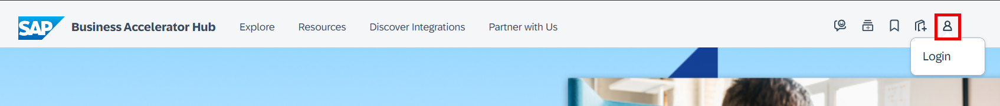
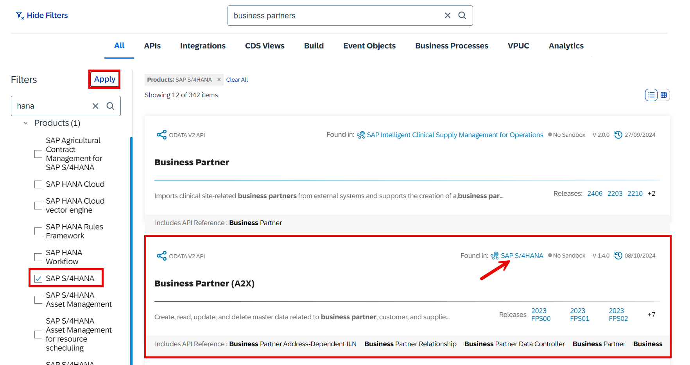
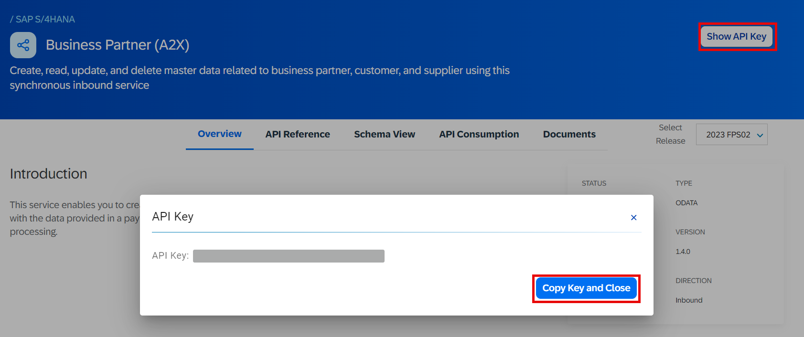
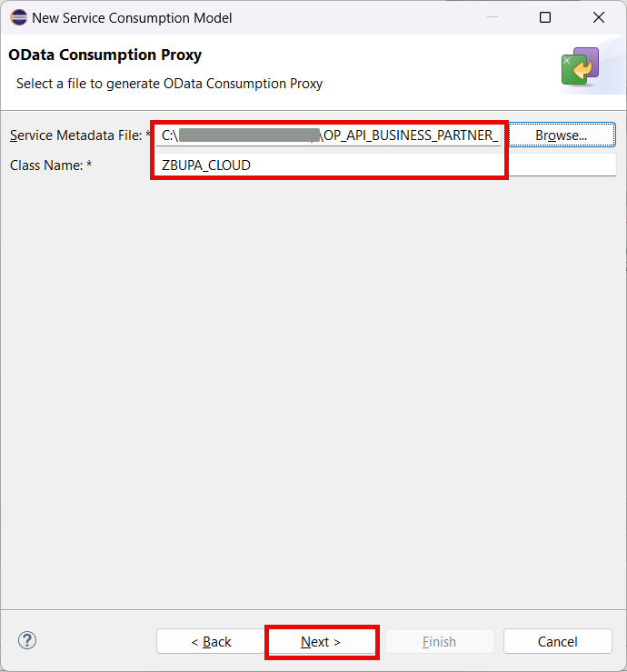

# Fill test data

## Introduction 

In this chapter we will prepare the test data by creating a console class. Note that we will fill the data not to the tables directly, but we will use the business object to garantee the data consistency (remember internal geo coordinates representation!).

The business partner data will be taken from the S/4HANA Cloud Sandbox provided by **SAP Business Accelerator Hub**. You can use the same approach later to integrate your S/4HANA Cloud instance.

The geo data will be taken from the list of the biggest cities in the world for every country (open data set). Later it's assumed that the geo data comes from special app (not covered yet in this tutorial).

## Content

### Task 1: Get API metadata

1. Open **SAP Business Accelerator Hub** in your browser following [this link](api.sap.com).

2. Select **Login** button and log in with your SAP credentials.

  

3. Enter **business partners** in the search field and then press **Enter**.

  

4. Select **Business Partners** API for **SAP S/4HANA**. You can use filter on the left side to restrict your search.

  

5. Select **API Specification** tab and then choose **Download** button in the **EDMX** section.

  

6. Additionally select **Show API Key** button and then select **Copy Key and Close** in the popup window. Note the copied key somewhere to use later.

  

### Task 2: Create a service consumption model

1. Right click on your package name created in the previous exercise.

2. Choose **New** &rarr; **Other ABAP Repository Object** option in the context menu.

   

3. Choose **Service Consumption Model** in the **Business Services** folder and then choose **Next**.

  

4. Enter the following data and then choose **Next** button:

  - **ZBUPA_CLOUD** in the **Name** field
  - **Consume Business Partner API** in the **Description** field
  - **OData** in the **Remote Consumption Mode** field

   

5. On the next screen select **Browse..** button and then select your EDMX file saved in the previous task.

6. Enter **ZBUPA_CLOUD** in the **Class Name** field and choose **Next**.

  

7. On the next screen **Components of OData Service** just choose **Next**.

8. On the next screen **ETag Support** just choose **Next**.

9. On the next screen select your transport (if applicable) and choose **Finish**.

10. Generation of the service consumption class will take some time. After it's finished choose **Activate** button.
   
  

### Task 3: Create a console class

> NOTE: You can ommit the steps from 1 to 8 if you cloned your code from GIT repository before.

1. Right click on your package name created in the previous exercise.

2. Choose **New** &rarr; **Other ABAP Repository Object** option in the context menu.

   

3. Choose **ABAP Class** in the **Source Code Library** folder and then choose **Next**.

   

4. Enter the following data and then choose **Add** in the **Interfaces** section:

  - **ZCL_FILL_BUPA_TABLES** in the **Name** field
  - **Fill test data into ZBUPA tables** in the **Description** field

   

5. On the next screen search for **if_oo_adt_classrun** interface. Select it and choose **OK** button.

  

6. Choose **Next** button.

7. On the next screen select your transport (if applicable) and choose **Finish**.

8. Replace the code of the class with the one below:

~~~abap
CLASS zcl_fill_bupa_tables DEFINITION
  PUBLIC
  FINAL
  CREATE PUBLIC .

  PUBLIC SECTION.

    INTERFACES if_oo_adt_classrun .
  PROTECTED SECTION.
  PRIVATE SECTION.
ENDCLASS.

CLASS ZCL_FILL_BUPA_TABLES IMPLEMENTATION.

  METHOD if_oo_adt_classrun~main.

    out->write( 'Getting partners from S/4HANA Cloud...' ).

    DATA: lv_url TYPE string VALUE 'https://sandbox.api.sap.com/'.
    DATA: lt_business_data TYPE TABLE OF zbupa_cloud=>tys_a_business_partner_type.

    TRY.
        DATA(lo_http_client) = cl_web_http_client_manager=>create_by_http_destination(
                        i_destination = cl_http_destination_provider=>create_by_url( lv_url ) ).

        lo_http_client->get_http_request( )->set_header_fields( VALUE #(
             (  name = 'APIKey' value = '{YOUR_API_KEY}' ) ) ).

        DATA(lo_client_proxy) = /iwbep/cl_cp_factory_remote=>create_v2_remote_proxy(
          EXPORTING
             is_proxy_model_key       = VALUE #( repository_id       = 'DEFAULT'
                                                 proxy_model_id      = 'ZBUPA_CLOUD'
                                                 proxy_model_version = '0001' )
            io_http_client             = lo_http_client
            iv_relative_service_root   = '/s4hanacloud/sap/opu/odata/sap/API_BUSINESS_PARTNER' ).

        DATA(lo_request) = lo_client_proxy->create_resource_for_entity_set( 'A_BUSINESS_PARTNER' )->create_request_for_read( ).

"       Create the filter tree
        DATA(lo_filter_factory) = lo_request->create_filter_factory( ).
        DATA lt_range_partner TYPE RANGE OF zbupa_cloud=>tys_a_business_partner_type-first_name.
        DATA lo_filter_node      TYPE REF TO /iwbep/if_cp_filter_node.
        lt_range_partner = VALUE #( ( sign = 'E' option = 'EQ' low = '' high = '' ) ).
        lo_filter_node  = lo_filter_factory->create_by_range( iv_property_path     = 'FIRST_NAME'
                                                              it_range             = lt_range_partner ).

        lo_request->set_top( 50 )->set_skip( 0 )->set_filter( lo_filter_node ).

        DATA(lo_response) = lo_request->execute( ).
        lo_response->get_business_data( IMPORTING et_business_data = lt_business_data ).

    CATCH /iwbep/cx_cp_remote
          /iwbep/cx_gateway
          cx_web_http_client_error
          cx_http_dest_provider_error
          INTO DATA(lx_exc).

        out->write( lx_exc->if_message~get_longtext( ) ).

    ENDTRY.

    IF lt_business_data IS INITIAL.
        out->write( 'No partners found. Exit.' ).
        RETURN.
    ELSE.
        out->write( |Found partners: { lines( lt_business_data ) }| ).
    ENDIF.

    out->write( 'Starting to fill the test data...' ).

    out->write( 'Clearing the tables...' ).
    DELETE FROM zgeo.
    DELETE FROM zbupa.
    COMMIT WORK.

    out->write( 'Adding the data...' ).
    DATA lt_create_bupa TYPE TABLE FOR CREATE zi_businesspartner.
    DATA lt_create_geo TYPE TABLE FOR CREATE zi_businesspartner\_geodata.
    DATA lv_current_index TYPE n LENGTH 4 VALUE 1.
    DATA(lo_random_latitude) = cl_abap_random_packed_dec13=>create( seed = CONV i( sy-uzeit ) min = '43.0' max = '54.3' ).
    DATA(lo_random_longitude) = cl_abap_random_packed_dec13=>create( seed = CONV i( sy-uzeit ) + 333 min = '1.5' max = '50.0' ).
    LOOP AT lt_business_data ASSIGNING FIELD-SYMBOL(<ls_partner>).
       APPEND INITIAL LINE TO lt_create_bupa ASSIGNING FIELD-SYMBOL(<ls_create_bupa>).
       <ls_create_bupa> = VALUE #(
          %cid = |cid{ lv_current_index }|
          Partner = <ls_partner>-business_partner
          NameFirst = <ls_partner>-first_name
          NameLast = <ls_partner>-last_name
       ).

       APPEND INITIAL LINE TO lt_create_geo ASSIGNING FIELD-SYMBOL(<ls_create_geo>).
       <ls_create_geo> = VALUE #(
          %cid_ref = |cid{ lv_current_index }|
          %target = VALUE #( ( %cid = |geocid{ lv_current_index }|
                               Latitude = lo_random_latitude->get_next( )
                               Longitude = lo_random_longitude->get_next( )
                              )
                           )
       ).

       lv_current_index = lv_current_index + 1.
    ENDLOOP.

    MODIFY ENTITY ZI_BusinessPartner
           CREATE
           FIELDS ( Partner NameFirst NameLast )
           WITH lt_create_bupa
           CREATE BY \_GeoData
           FIELDS ( Latitude Longitude )
           WITH lt_create_geo
        FAILED   FINAL(fail_mod)
        REPORTED FINAL(rep_mod)
        MAPPED   FINAL(map_mod).
    COMMIT ENTITIES.

    IF sy-subrc <> 0.
      out->write( `An issue occurred in the RAP save sequence.` ).
    ENDIF.

    IF rep_mod-zi_businesspartner IS NOT INITIAL.
        out->write( 'REPORTED:' ).

        LOOP AT rep_mod-zi_businesspartner ASSIGNING FIELD-SYMBOL(<ls_rep>).
           out->write( |ZI_BUSINESSPARTNER, Partner = { <ls_rep>-Partner } | ).
           out->write( <ls_rep>-%msg->if_message~get_longtext( ) ).
        ENDLOOP.

        LOOP AT rep_mod-zi_businesspartnergeo ASSIGNING FIELD-SYMBOL(<ls_rep_geo>).
           out->write( |ZI_BUSINESSPARTNERGEO, Partner = { <ls_rep>-Partner } | ).
           out->write( <ls_rep_geo>-%msg->if_message~get_longtext( ) ).
        ENDLOOP.
    ENDIF.
*
    out->write( 'Finished.' ).

  ENDMETHOD.
ENDCLASS.
~~~

8. In the line 29 replace **{YOUR_API_KEY}** with the API key that you've got before in the Task 1.

  

9. Choose **Activate** button.
   
  

### Task 4: Fill the data

1. Right-click your class **ZCL_FILL_BUPA_TABLES** and select **Run As** &rarr; **ABAP Application (Console)** or select your class and press **F9**.

  

2. You should see the following log:

~~~
Getting partners from S/4HANA Cloud...
Found partners: 50
Starting to fill the test data...
Clearing the tables...
Adding the data...
Finished.
~~~

## Result

You have successfully filled the database tables with the test data. Now you can test the service.

[Next Tutorial: Test the service](../test/README.md)

## Further reading / Reference Links

- [Create Your First ABAP Console Application](https://developers.sap.com/tutorials/abap-environment-console-application.html)